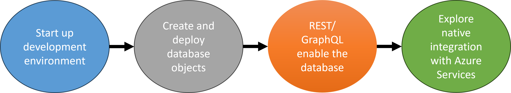

# Azure SQL Database Developer Workshop Overview

## Workshop Goals

* Learn how to create a full development environment locally or via codespace
* Deploy a database and create tables with Visual Studio Code or in a codespace
* Utilize a Database Project for deployment into Azure SQL Database and CI/CD flows
* Expose data in your database via REST and GraphQL with Data API Builder
* Native integration with Azure Functions and other Azure Services from within the Azure SQL Database

## What you will be building

In today's workshop, you will be creating an environment for database application development. This environment will consist of a database, a framework to expose the database, and an application front end. You can accomplish this task in two ways. First, you can run every component locally on your laptop/desktop. In fact, you might even have most of the required components already installed and are using daily. The second method is to run this development environment in a GitHub codespace. By forking the sample repository, you can create a codespace will all the necessary development tools preinstalled for you. Codespace even will allow docker in docker so that a development database can be created with a single command.

The first lab will begin with database development. You will be creating tables and stored procedures to be used by our application. These tables will be created to include best practices such as primary keys/identity columns, correct data types, and foreign key relationships. By starting with a sound and well thought out data model, you can avoid costly mistakes as your application grows.

In the second lab, you will be using the new Data API builder to create REST and GraphQL APIs into the database with a single command. You will then test these APIs with various code samples to see how simple it is to expose the database layer to applications.

We will then expand our local development environments with Azure Functions and Static Web Applications. These frameworks will be installed and used locally but can be easily deployed into Azure. The Static Web Applications framework will provide us with a mock deployment platform locally so we can utilize features such as authentication, functions and database integration to simulate deploying our application and use the REST APIs made with Data API builder.

The last lab will be highlighting how integration with other Azure services such as OpenAI, communications or Functions can be accomplished with REST Endpoint Invocation. These examples will show how data from an Azure SQL Database can be sent or received from other Azure Services utilizing authentication and REST endpoints.

Click [here](./docs/1-Getting-started.md) to get started!
