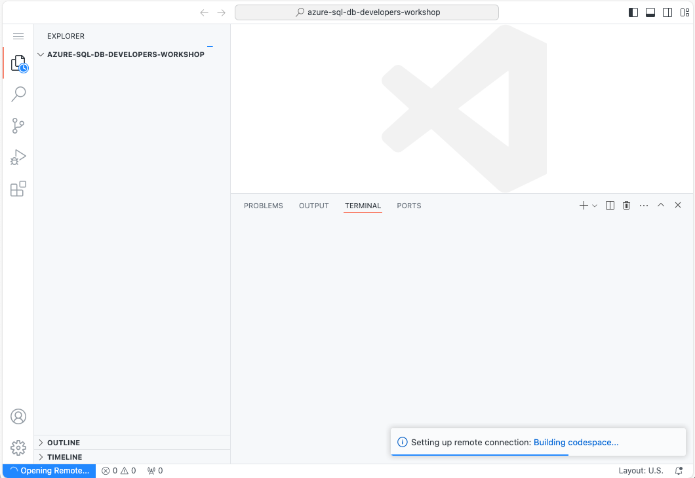

# Getting started with your development environment

For this workshop, we will be using GitHub codespaces. This environment will provide us with all the necessary tools to run this lab completely in a cloud development space.

## Clone/fork repository with necessary files

* Repository at https://github.com/Azure-Samples/azure-sql-db-developers-workshop/

### Repository Contents

1. .devcontainer
    1. Codespace docker config
1. client
    1. contains the Todo application for use with Data API builder and SWA
1. app
    1. contains the sample JavaScript test application for use with Data API builder and SWA
1. docs
    1. Has all the chapters/lessons of the workshop
1. scripts
    1. Installs all the needed dev tools
1. labFiles
    1. contains files to be used with the workshop in various chapters

### Free accounts needed for the workshop

1. GitHub account
1. Azure account
    1. Free Azure SQL Database

## Install necessary software components or start codespaces with specialized container

### If using codespaces:

1. Start/Create a codespace from the forked repository. Click on the **green Code button**, then click the **Create codespace on master** button.

    

    and the codespace will start setting itself up

    

1. After the codespace editor window and terminal appears,  

    

    in a minute or so, the post-scripts will start installing the necessary extensions, plugins and software needed for this workshop.

    

1. Once the scripts have finished, you will be brought back to a prompt in the codespace terminal

    

#### Utility Version Checks

To check to ensure all major utilities are installed, you can run the following version checks:

for function core tools:

```bash
func --version
```

for Data API builder

```bash
dab --version
```

for sqlcmd

```bash
sqlcmd --version
```

for swa

```bash
swa --version
```

### If on the desktop/local environment

1. If using your local machine for this workshop, please ensure you have all the listed software installed and the repository cloned/downloaded.

* [VS Code](https://code.visualstudio.com/)
* [git](https://git-scm.com/downloads)
* [Azure Data Studio](https://learn.microsoft.com/sql/azure-data-studio/download-azure-data-studio)
* [Azure Functions Core Tools](https://learn.microsoft.com/azure/azure-functions/functions-run-local?tabs=v4%2Cwindows%2Ccsharp%2Cportal%2Cbash#install-the-azure-functions-core-tools)
* [.NET SDK 6+](https://dotnet.microsoft.com/download/dotnet/7.0)
* [Go-sqlcmd](https://github.com/microsoft/go-sqlcmd)
* [SqlPackage](https://learn.microsoft.com/sql/tools/sqlpackage/sqlpackage-download)
* [Data API Builder](https://github.com/Azure/data-api-builder)
* [Docker desktop](https://www.docker.com/products/docker-desktop/)
