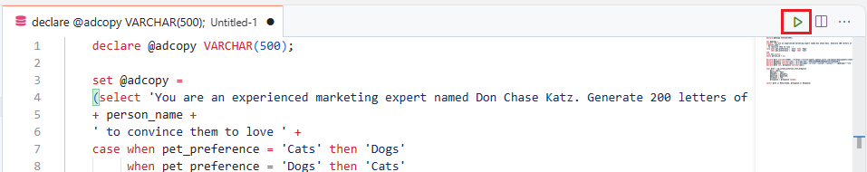
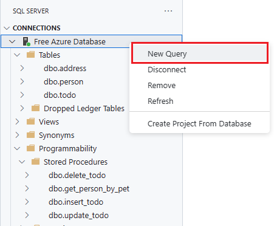
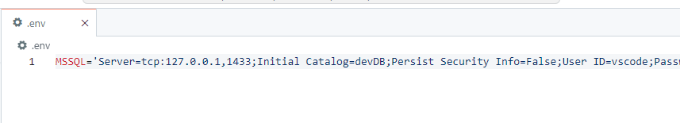
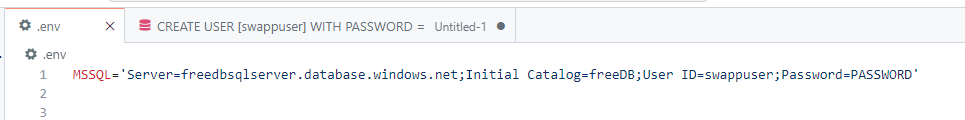
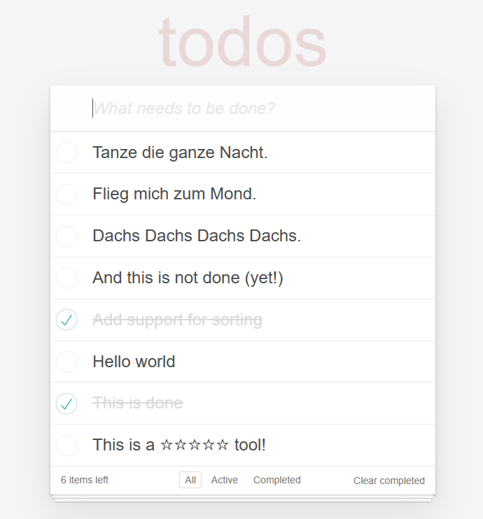

# Using Azure OpenAI Service


## Azure OpenAI Service

Azure OpenAI Service provides REST API access to OpenAI's powerful language models including the GPT-4, GPT-4 Turbo with Vision, GPT-3.5-Turbo, and Embeddings model series. In addition, the new GPT-4 and GPT-3.5-Turbo model series have now reached general availability. These models can be easily adapted to your specific task including but not limited to content generation, summarization, image understanding, semantic search, and natural language to code translation. Users can access the service through REST APIs, Python SDK, or our web-based interface in the Azure OpenAI Studio.

Azure OpenAI Service is powered by a diverse set of models with different capabilities:


|Models	|Description|
--------|-----------|
|GPT-4o & GPT-4 Turbo [NEW!]| The latest most capable Azure OpenAI models with multimodal versions, which can accept both text and images as input.|
|GPT-4 | A set of models that improve on GPT-3.5 and can understand and generate natural language and code.|
|GPT-3.5 | A set of models that improve on GPT-3 and can understand and generate natural language and code.|
|Embeddings	| A set of models that can convert text into numerical vector form to facilitate text similarity.|
|DALL-E	| A series of models that can generate original images from natural language.|
|Whisper | A series of models in preview that can transcribe and translate speech to text.|
|Text to speech (Preview) |	A series of models in preview that can synthesize text to speech.|

**Table 1:** Azure OpenAI Models

## Azure OpenAI Embeddings

An embedding is a special format of data representation that machine learning models and algorithms can easily use. The embedding is an information dense representation of the semantic meaning of a piece of text. Each embedding is a vector of floating-point numbers, such that the distance between two embeddings in the vector space is correlated with semantic similarity between two inputs in the original format. For example, if two texts are similar, then their vector representations should also be similar.

1. Open a new query sheet

    

1. Copy the following SQL and paste it into the SQL query editor. You can see from the T-SQL that we are going to create an embedding for a text string.

    ```SQL
    declare @url nvarchar(4000) = N'https://dm-dev-workshop-ai.openai.azure.com/openai/deployments/text-embedding-3-large/embeddings?api-version=2024-02-01';
    declare @headers nvarchar(300) = N'{"api-key": "OPENAI_KEY"}';
    declare @payload nvarchar(max);
    set @payload = json_object(
        'input': 'Its me Hi Im the problem, its me At teatime Everybody agrees I''ll stare directly at the sun but never in the mirror It must be exhausting always rooting for the anti-hero',
        'dimensions': 1536
    );

    declare @ret int, @response nvarchar(max);

    exec @ret = sp_invoke_external_rest_endpoint 
        @url = @url,
        @method = 'POST',
        @headers = @headers,
        @payload = @payload,
        @timeout = 230,
        @response = @response output;

    select @ret as ReturnCode, @response as Response;
    select count(*) from openjson(@response, '$.result.data[0].embedding') -- check that the embedding is 1536 dimensions
    ```

1. Replace the **OPENAI_KEY** text with the AI Language Key that was returned to you in the previous chapter when testing connectivity.

1. Execute the SQL statement with the run button.

1. View the return message. It contains the vector representation of our product name input that can now be easily consumed by machine learning models and other algorithms. It can even be stored locally in the Azure SQL Database for vector similarity searches.

    ```JSON
    "result": {
    "object": "list",
    "data": [
        {
        "object": "embedding",
        "index": 0,
        "embedding": [
            -0.0023090523,
            -0.009229573,
            0.00032222227,
            -0.010138597,
            -0.01567236,
            -0.0010989562,
            0.010609697,
            -0.04028898,
            -0.0047508087,
            -0.03452962,
            0.01954732,
            0.032167487,
            ...
    ```

## Azure OpenAI DALL-E 3

The image generation API creates an image from a text prompt.

1. Copy the following SQL and paste it into the SQL query editor. We are going to use a product description from the adventure works dataset which will be sent to the DALL-E 3 text to image endpoint.

    ```SQL
    declare @url nvarchar(4000) = N'https://dm-dev-workshop-ai.openai.azure.com/openai/deployments/dall-e-3/images/generations?api-version=2024-02-01';
    declare @headers nvarchar(300) = N'{"api-key": "OPENAI_KEY"}';
    declare @message nvarchar(max);
    SET @message = N'{
        "prompt": "This bike is ridden by race winners. Developed with the Adventure Works Cycles professional race team, it has a extremely light heat-treated aluminum frame, and steering that allows precision control.",
        "size": "1024x1024",
        "n": 1,
        "quality": "hd", 
        "style": "vivid"
    }';

    declare @ret int, @response nvarchar(max);

    exec @ret = sp_invoke_external_rest_endpoint 
        @url = @url,
        @method = 'POST',
        @headers = @headers,
        @payload = @message,
        @timeout = 230,
        @response = @response output;

    select @ret as ReturnCode, @response as Response;
    ```

1. Replace the **OPENAI_KEY** text with the Azure OpenAI Key that was returned to you in the previous chapter when testing connectivity.

1. Execute the SQL statement with the run button.

1. View the return message. The message contains a revised prompt and a URL to the image it has created. Copy and paste the image URL into a browser to see something wonderful.

    ```JSON
    "result": {
        "created": 1715370756,
        "data": [
            {
                "revised_prompt": "Visualize a high-performance bicycle ridden by champions in professional races. This bike has been developed in partnership with the Adventure Works Cycles racing team. It boasts an extremely lightweight frame constructed from heat-treated aluminum, combined with a steering mechanism that allows for precision control. Show the bike standing alone, showcasing its design and technology.",
                "url": "LONG_URL_HERE"
            }
        ]
    }
    ```

    

1. Now, you are in charge. Either select a new product description ID or try creating an image yourself! Here is some inspiration:

    

## Azure OpenAI GPT-4o

Let's use the new GPT-4o model for this next call. We are going to ask it to describe a picture you make using the above DALL-E 3 endpoint. So to start, go wild and ask it to create you some fantastical image. Once you have that URL, we are going to use it in our REST call.

1. Copy the following SQL and paste it into the SQL query editor. 

    ```SQL
    declare @url nvarchar(4000) = N'https://dm-dev-workshop-ai.openai.azure.com/openai/deployments/gpt-4o-mini/chat/completions?api-version=2023-03-15-preview';
    declare @headers nvarchar(102) = N'{"api-key":"OPENAI_KEY"}';
    declare @payload nvarchar(max) = N'{
        "messages": [
            {
                "role": "system",
                "content": "You are an AI assistant that helps people find information."
            },
            {
                "role": "user",
                "content": [
                    {
                        "type": "text",
                        "text": "what is this an image of?"
                    },
                    {
                        "type": "image_url",
                        "image_url": {
                            "url": "DALLE3_IMAGE_URL"
                        }
                    }
                ]
            }
        ]
    }';
    declare @ret int, @response nvarchar(max);
    exec @ret = sp_invoke_external_rest_endpoint
    @url = @url,
    @method = 'POST',
    @headers = @headers,
    @payload = @payload,
    @timeout = 230,
    @response = @response output;
    select @ret as ReturnCode, @response as Response;
    ```
1. Replace the **OPENAI_KEY** text with the Azure OpenAI Key that was returned to you in the previous chapter when testing connectivity if not already filled in for you. Also, replace the **DALLE3_IMAGE_URL** with the URL of the fantastical image you just created.

1. Execute the SQL statement with the run button.

1. View the return message and see if the new GPT-4o model was able to describe it.

    ```JSON
    "result": {
        "id": "chatcmpl-10011000",
        "object": "chat.completion",
        "created": 1715809421,
        "model": "gpt-4o preview",
        "choices": [
            {
                "index": 0,
                "message": {
                    "role": "assistant",
                    "content": "This image is a surreal digital artwork that shows a fun and imaginative concoction. It depicts a large insect, resembling a cicada, positioned on a pancake that appears to be floating over a grassy landscape, against a bright blue sky with scattered clouds. The way it's presented makes it look like it's flying above the landscape, creating a whimsical and surreal effect."
                },
    ```

### Using Azure OpenAI Service and Relational Data

The scenario is as follows: using the data we have in the person table, we will ask ChatGPT to provide us some marketing material for switching a pet preference. If a person indicated they like cats, the example will prompt ChatGPT to create ad copy from a marketing executive on why they should love dogs. If they indicated dogs, this will provide copy for loving cats. The example will provide the prompt with Cues and Supporting Content to help guide the response to what was asked.  Cues act as the "jumpstart" for the output of the model, helping to direct the model to the desired output. Supporting content is information that the model can utilize to influence the output in some way such as the current date, the name of the user, and user preferences.

Additional Best Practices from the documentation:

* **Be Specific**. Leave as little to interpretation as possible. Restrict the operational space.
* **Be Descriptive**. Use analogies.
* **Double Down**. Sometimes you may need to repeat yourself to the model. Give instructions before and after your primary content, use an instruction and a cue, etc.
* **Order Matters**. The order in which you present information to the model may impact the output. Whether you put instructions before your content (“summarize the following…”) or after (“summarize the above…”) can make a difference in output. Even the order of few-shot examples can matter. This is referred to as recency bias.
* **Give the model an "out"**. It can sometimes be helpful to give the model an alternative path if it is unable to complete the assigned task. For example, when asking a question over a piece of text you might include something like "respond with ‘not found’ if the answer is not present". This can help the model avoid generating false responses.

### What prompt text will be sent

1. The chat REST API is expecting some text for the prompt so ChatGPT knows how to respond. The following query will dynamically create this prompt based on the person_id we supply it. Looking at the adcopy variable, this is used to dynamically create the prompt text by using the person's name and pet perference.

    ```SQL
    select 'You are an experienced marketing expert named Don Chase Katz. Generate 200 letters of ad copy to '
    + person_name + 
    ' to convince them to love ' + 
    case when pet_preference = 'Cats' then 'Dogs' 
         when pet_preference = 'Dogs' then 'Cats' 
    end
    from person
    where person_id = 1;
    ```

    The resulting prompt is the following for person_id 1, which is Bill who has a pet preference of Dogs:

    ```quote
    "You are an experienced marketing expert named Don Chase Katz. Generate 200 letters of ad copy to Bill to convince them to love Cats"
    ```

### Sending the prompt text with External REST Endpoint Invocation


1. Open a new query sheet

    

    and paste the following T-SQL code into a new query editor sheet in the codespace.

    ```SQL
    declare @adcopy VARCHAR(500);
    
    set @adcopy =
    (select 'You are an experienced marketing expert named Don Chase Katz. Generate 200 letters of ad copy to '
    + person_name + 
    ' to convince them to love ' + 
    case when pet_preference = 'Cats' then 'Dogs' 
         when pet_preference = 'Dogs' then 'Cats' 
    end
    from person
    where person_id = 1);
    
    declare @url nvarchar(4000) = N'https://dm-dev-workshop-ai.openai.azure.com/openai/deployments/gpt-4o-mini/chat/completions?api-version=2023-03-15-preview';
    declare @headers nvarchar(102) = N'{"api-key":"OPENAI_KEY"}'
    declare @payload nvarchar(max) = N'{"messages":[{"role":"system","content":"'+(@adcopy)+'"}]}'
    declare @ret int, @response nvarchar(max);
    
    exec @ret = sp_invoke_external_rest_endpoint 
    	@url = @url,
    	@method = 'POST',
    	@headers = @headers,
    	@payload = @payload,
        @timeout = 230,
    	@response = @response output;
    	
    select @ret as ReturnCode, @response as Response;

    select json_value(@response, '$.result.choices[0].message.content') as [Message];
    ```

1. Replace the **OPENAI_KEY** text with the Azure OpenAI Key that was returned to you in the previous chapter when testing connectivity.

1. Once the code is in the codespace query editor sheet, run it with the green run arrow in the upper right.

    

    The response message will be similar to the following:

    ```JSON
    {
        "response": {
            "status": {
                "http": {
                    "code": 200,
                    "description": ""
                }
            },
            "headers": {
                "Cache-Control": "no-cache, must-revalidate",
                "Date": "Fri, 23 Jun 2023 23:11:30 GMT",
                "Content-Length": "2316",
                "Content-Type": "application/json",
                "access-control-allow-origin": "*",
                "apim-request-id": "a310d17f-427b-43ea-b34a-b80511715cfd",
                "openai-model": "gpt-35-turbo",
                "x-content-type-options": "nosniff",
                "openai-processing-ms": "9617.2848",
                "x-ms-region": "East US",
                "x-accel-buffering": "no",
                "x-request-id": "7300e59f-f78b-4f4c-97f2-f006374dbcba",
                "x-ms-client-request-id": "a310d17f-427b-43ea-b34a-b80511715cfd",
                "strict-transport-security": "max-age=31536000; includeSubDomains; preload",
                "azureml-model-session": "aoai-gpt35-05242023-2",
                "azureml-model-group": "online"
            }
        },
        "result": {
            "id": "chatcmpl-7UkDxMvX7fVNdepjViHIkpahuNsQv",
            "object": "chat.completion",
            "created": 1687561881,
            "model": "gpt-35-turbo",
            "prompt_annotations": [
                {
                    "prompt_index": 0,
                    "content_filter_results": {
                        "hate": {
                            "filtered": false,
                            "severity": "safe"
                        },
                        "self_harm": {
                            "filtered": false,
                            "severity": "safe"
                        },
                        "sexual": {
                            "filtered": false,
                            "severity": "safe"
                        },
                        "violence": {
                            "filtered": false,
                            "severity": "safe"
                        }
                    }
                }
            ],
            "choices": [
                {
                    "index": 0,
                    "finish_reason": "stop",
                    "message": {
                        "role": "assistant",
                        "content": "Dear Bill,
    As a marketing expert, I know the power of persuasion. So allow me to persuade you about the wonders of cats.
    First off, cats are independent creatures. They don’t require constant attention, like dogs do. This makes them the perfect companion for those leading busy lives. Plus, they’re great for introverted people who prefer the company of a quiet, yet loyal animal.
    Secondly, cats are incredibly clean animals. They groom themselves, eliminating the need for constant baths. Plus, they’re pretty skilled at using the litter box, meaning minimal mess for you.
    Thirdly, cats are incredible hunters. They possess incredible instincts, which allow them to hunt mice and other rodents that might invade your home. This makes them the perfect pest control alternative to toxic chemicals.
    Fourthly, cats are amazing stress-relievers. Petting a cat has been shown to release endorphins in your brain, which produces feelings of calmness and relaxation. Plus, the sound of a purring cat has a soothing effect on one's psyche.
    Fifthly, cats are low-maintenance. Unlike dogs, they don’t require you to take them on walks. They are happy to lounge in the sun, in your lap, or on their own.
    Finally, cats are adorable creatures. Their playful antics, cute meows, and affectionate nature will make your heart melt.
    In conclusion, Bill, I urge you to give cats a chance. They are low-maintenance, great hunters, calming, and beautiful creatures. They will fill your life with love and companionship. 
    Sincerely,
    Don Chase Katz"
                    },
                    "content_filter_results": {
                        "hate": {
                            "filtered": false,
                            "severity": "safe"
                        },
                        "self_harm": {
                            "filtered": false,
                            "severity": "safe"
                        },
                        "sexual": {
                            "filtered": false,
                            "severity": "safe"
                        },
                        "violence": {
                            "filtered": false,
                            "severity": "safe"
                        }
                    }
                }
            ],
            "usage": {
                "completion_tokens": 325,
                "prompt_tokens": 34,
                "total_tokens": 359
            }
        }
    }

    ```

### The Todo application, SWA, and External REST Endpoint Invocation

In this next section, we will be using the Todo application against our Free Azure SQL Database. Then, we will be adding to the insert_todo stored procedure to call OpenAI via External REST endpoint invocation. We will be asking OpenAI to translate the Todo task's title into German and then insert that value into the table.

1. Back in the **SQL Server Connections extension**, right click the database profile name,**Free Azure Database**, and select **New Query**. This will bring up a new query sheet.

    

1. To avoid using an administrative account to allow the application to access the database, we will create a new user and grant it the necessary permissions. Copy and paste the following code into the query sheet, replacing `PASSWORD` with a password of your choice, then run it in the Query editor.

    ```SQL
    CREATE USER [swaappuser] WITH PASSWORD = 'PASSWORD';

    ALTER ROLE db_datareader ADD MEMBER [swaappuser];
    ALTER ROLE db_datawriter ADD MEMBER [swaappuser];
    GRANT EXECUTE ON SCHEMA::dbo TO [swaappuser];

    GRANT EXECUTE ANY EXTERNAL ENDPOINT TO [swaappuser];
    ```

1. Then, copy and paste the following code, then run it in the Query editor.

    ```SQL
    ALTER PROCEDURE dbo.insert_todo
        @title nvarchar(1000),
        @owner_id [varchar](128),
        @order int
    AS
    
        declare @translated_task VARCHAR(1000);
        declare @url nvarchar(4000) = N'https://dm-dev-workshop-ai.openai.azure.com/openai/deployments/gpt-35-turbo/chat/completions?api-version=2024-04-01-preview';
        declare @headers nvarchar(102) = N'{"api-key":"OPENAI_KEY"}'
        declare @payload nvarchar(max) = N'{"messages":[{"role":"system","content":"Translate \"'+(@title)+'\" into German, only respond with the translation"}]}'
        declare @ret int, @response nvarchar(max);
    
    BEGIN
    
        exec @ret = sp_invoke_external_rest_endpoint 
            @url = @url,
            @headers = @headers,
            @method = 'POST',
            @payload = @payload,
            @timeout = 230,
            @response = @response output;
    
        set @translated_task = 
        (SELECT [translated_task]
        FROM OPENJSON(@response,'$.result.choices')
        WITH ([translated_task] NVARCHAR(100) '$.message.content'));
    
        insert into dbo.todo (title, owner_id, position)
        OUTPUT INSERTED.*
        values (ISNULL(@translated_task,@title), @owner_id, @order);
    
    END;
    GO
    ```

1. Replace the **OPENAI_KEY** text with the Azure OpenAI Key that was returned to you in the previous chapter when testing connectivity.

> [!CAUTION]  
> Putting your authentication keys in plain text in a procedure is **NOT** a best practice. We are only doing it here as an example but **managed identies should be used**.

5. Now we need to change the database connection in the **.env** file to use our Free Azure SQL Database. Select the file in codespace and on the top, find the **MSSQL** variable that contains the connection string.

    

1. Change the connection string value to reflect the server name, database name of `freedb`, User ID of `swaappuser` (if you used a different user name in the previous step), and the password you used when you created the database. It should look similar to the following:

    ```bash
    MSSQL='Server=freedbsqlserver.database.windows.net;Initial Catalog=freedb;User ID=swaappuser;Password=PASSWORD;'
    ```

    and **save the file**.

    


1. Next, build the project

    ```bash
    swa build
    ```

1. Then, start swa cli again at the terminal

    ```bash
    swa start
    ```

1. Open the Todo application in a browser if not already opened or refresh the current browser page where it was running.

1. Enter a task name and see the title instantly transformed into German.
 
    

## Continue to chapter 11

Click [here](./11-sql-bindings.md) to continue to chapter 11, Azure SQL Bindings for Azure Functions!
