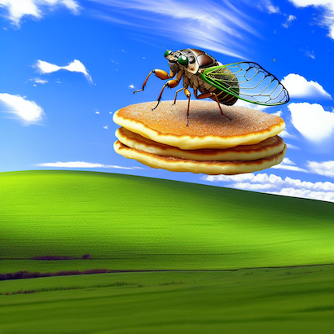

# Using Azure OpenAI Service


## Azure OpenAI Service

Azure OpenAI Service provides REST API access to OpenAI's powerful language models including the GPT-4, GPT-4 Turbo with Vision, GPT-3.5-Turbo, and Embeddings model series. In addition, the new GPT-4 and GPT-3.5-Turbo model series have now reached general availability. These models can be easily adapted to your specific task including but not limited to content generation, summarization, image understanding, semantic search, and natural language to code translation. Users can access the service through REST APIs, Python SDK, or our web-based interface in the Azure OpenAI Studio.

Azure OpenAI Service is powered by a diverse set of models with different capabilities:


|Models	|Description|
--------|-----------|
|GPT-4o & GPT-4 Turbo [NEW!]| The latest most capable Azure OpenAI models with multimodal versions, which can accept both text and images as input.|
|GPT-4 | A set of models that improve on GPT-3.5 and can understand and generate natural language and code.|
|GPT-3.5 | A set of models that improve on GPT-3 and can understand and generate natural language and code.|
|Embeddings	| A set of models that can convert text into numerical vector form to facilitate text similarity.|
|DALL-E	| A series of models that can generate original images from natural language.|
|Whisper | A series of models in preview that can transcribe and translate speech to text.|
|Text to speech (Preview) |	A series of models in preview that can synthesize text to speech.|

**Table 1:** Azure OpenAI Models

## Azure OpenAI Embeddings

An embedding is a special format of data representation that machine learning models and algorithms can easily use. The embedding is an information dense representation of the semantic meaning of a piece of text. Each embedding is a vector of floating-point numbers, such that the distance between two embeddings in the vector space is correlated with semantic similarity between two inputs in the original format. For example, if two texts are similar, then their vector representations should also be similar.

1. Copy the following SQL and paste it into the SQL query editor. You can see from the T-SQL that we are going to create an embedding for a product name from data in the Azure SQL Database. The query `SELECT [Name] FROM [SalesLT].[Product] WHERE ProductID = 846` returns "**Taillights - Battery-Powered**" and will be sent to the OpenAI REST endpoint.

    ```SQL
    declare @url nvarchar(4000) = N'https://build2024openai.openai.azure.com/openai/deployments/build2024-embeddings/embeddings?api-version=2024-02-01';
    declare @headers nvarchar(300) = N'{"api-key": "OPENAI_KEY"}';
    declare @message nvarchar(max);
    SET @message = (SELECT [Description]
                    FROM [SalesLT].[ProductDescription]
                    WHERE ProductDescriptionID = 457);
    declare @payload nvarchar(max) = N'{"input": "' + @message + '"}';

    declare @ret int, @response nvarchar(max);

    exec @ret = sp_invoke_external_rest_endpoint 
        @url = @url,
        @method = 'POST',
        @headers = @headers,
        @payload = @payload,
        @timeout = 230,
        @response = @response output;

    select @ret as ReturnCode, @response as Response;
    ```

1. Replace the **OPENAI_KEY** text with the AI Language Key that was returned to you in the previous chapter when testing connectivity.

1. Execute the SQL statement with the run button.

1. View the return message. It contains the vector representation of our product name input that can now be easily consumed by machine learning models and other algorithms. It can even be stored locally in the Azure SQL Database for vector similarity searches.

    ```JSON
    "result": {
    "object": "list",
    "data": [
        {
        "object": "embedding",
        "index": 0,
        "embedding": [
            -0.0023090523,
            -0.009229573,
            0.00032222227,
            -0.010138597,
            -0.01567236,
            -0.0010989562,
            0.010609697,
            -0.04028898,
            -0.0047508087,
            -0.03452962,
            0.01954732,
            0.032167487,
            ...
    ```

## Azure OpenAI DALL-E 3

The image generation API creates an image from a text prompt.

1. Copy the following SQL and paste it into the SQL query editor. Like the previous example, the query here 'SELECT [Description] FROM [SalesLT].[ProductDescription] WHERE ProductDescriptionID = 457' returns a product description "**This bike is ridden by race winners. Developed with the Adventure Works Cycles professional race team, it has a extremely light heat-treated aluminum frame, and steering that allows precision control.**" which will be sent to the DALL-E 3 text to image endpoint.

    ```SQL
    declare @url nvarchar(4000) = N'https://build2024openai.openai.azure.com/openai/deployments/build2024-dalle3/images/generations?api-version=2023-12-01-preview';
    declare @headers nvarchar(300) = N'{"api-key": "OPENAI_KEY"}';
    declare @message nvarchar(max);
    SET @message = (SELECT [Description]
                    FROM [SalesLT].[ProductDescription]
                    WHERE ProductDescriptionID = 457);
    declare @payload nvarchar(max) = N'{
        "prompt": "' + @message + '",
        "size": "1024x1024",
        "n": 1,
        "quality": "hd", 
        "style": "vivid"
    }';

    declare @ret int, @response nvarchar(max);

    exec @ret = sp_invoke_external_rest_endpoint 
        @url = @url,
        @method = 'POST',
        @headers = @headers,
        @payload = @payload,
        @timeout = 230,
        @response = @response output;

    select @ret as ReturnCode, @response as Response;
    ```

1. Replace the **OPENAI_KEY** text with the AI Language Key that was returned to you in the previous chapter when testing connectivity.

1. Execute the SQL statement with the run button.

1. View the return message. The message contains a revised prompt and a URL to the image it has created. Copy and paste the image URL into a browser to see something wonderful.

    ```JSON
    "result": {
        "created": 1715370756,
        "data": [
            {
                "revised_prompt": "Visualize a high-performance bicycle ridden by champions in professional races. This bike has been developed in partnership with the Adventure Works Cycles racing team. It boasts an extremely lightweight frame constructed from heat-treated aluminum, combined with a steering mechanism that allows for precision control. Show the bike standing alone, showcasing its design and technology.",
                "url": "LONG_URL_HERE"
            }
        ]
    }
    ```

    

1. Now, you are in charge. Either select a new product description ID or try creating an image yourself! Here is some inspiration:

    

## Azure OpenAI GPT-4o

Let's use the new GPT-4o model for this next call. We are going to ask it to describe a picture you make using the above DALL-E 3 endpoint. So to start, go wild and ask it to create you some fantastical image. Once you have that URL, we are going to use it in our REST call.

1. Copy the following SQL and paste it into the SQL query editor. 

    ```SQL
    declare @url nvarchar(4000) = N'https://build2024openai.openai.azure.com/openai/models/2024-05-13/chat/completions?api-version=2024-05-13-preview';
    declare @headers nvarchar(102) = N'{"api-key":"OPENAI_KEY"}';
    declare @payload nvarchar(max) = N'{
        "messages": [
            {
                "role": "system",
                "content": "You are an AI assistant that helps people find information."
            },
            {
                "role": "user",
                "content": [
                    {
                        "type": "text",
                        "text": "what is this an image of?"
                    },
                    {
                        "type": "image_url",
                        "image_url": {
                            "url": "DALLE3_IMAGE_URL"
                        }
                    }
                ]
            }
        ]
    }';
    declare @ret int, @response nvarchar(max);
    exec @ret = sp_invoke_external_rest_endpoint
    @url = @url,
    @method = 'POST',
    @headers = @headers,
    @payload = @payload,
    @timeout = 230,
    @response = @response output;
    select @ret as ReturnCode, @response as Response;
    ```
1. Replace the **OPENAI_KEY** text with the AI Language Key that was returned to you in the previous chapter when testing connectivity if not already filled in for you. Also, replace the **DALLE3_IMAGE_URL** with the url of the fantastical image you just created.

1. Execute the SQL statement with the run button.

1. View the return message and see if the new GPT-4o model was able to describe it.

    ```JSON
    "result": {
        "id": "chatcmpl-10011000",
        "object": "chat.completion",
        "created": 1715809421,
        "model": "gpt-4o preview",
        "choices": [
            {
                "index": 0,
                "message": {
                    "role": "assistant",
                    "content": "This image is a surreal digital artwork that shows a fun and imaginative concoction. It depicts a large insect, resembling a cicada, positioned on a pancake that appears to be floating over a grassy landscape, against a bright blue sky with scattered clouds. The way it's presented makes it look like it's flying above the landscape, creating a whimsical and surreal effect."
                },
    ```
