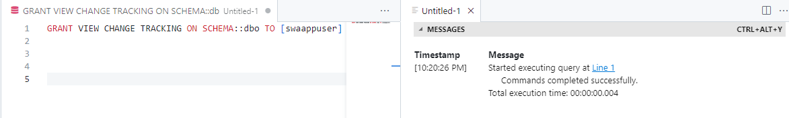
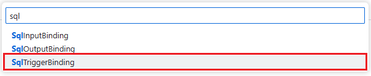

# Azure SQL bindings for Azure Functions

In this section, you will create a change data stream using Change Tracking, the Azure SQL Database, and the Azure SQL bindings for Azure Functions. The trigger will fire when an insert, update or delete is done on a table in the database. Once that change happens, the SQL binding will pick up the row and pass it to our Azure Function. In this lab, it will just display the row to the console log, but you can see how other Azure services like Event Hub, Blob storage, or Stream Processing can be used for event-based architecture application development.

## SQL Bindings workshop tasks

### Enable change tracking

1. In the SQL Server extension, right click on the Free Azure Database connection profile and select New Query.

    

1. The person table needs change tracking enabled for the SQL bindings trigger to work correctly.
    The first command to be run will enable change tracking in the database.

    ```SQL
    ALTER DATABASE CURRENT
    SET CHANGE_TRACKING = ON;
    GO
    ```

    

    then enable change tracking on the person table:

    ```SQL
    ALTER TABLE [dbo].[person] ENABLE CHANGE_TRACKING;
    GO
    ```

    

1. The user used by the application to connect to database must also be granted the permission to read the change tracking information. Run the following command to grant the permission to the user:

    ```SQL
    GRANT VIEW CHANGE TRACKING ON SCHEMA::dbo TO [swaappuser]
    GO
    ```

    

1. To keep track of that changes have been already notified, the Azure Functions needs to create some tables, and therefore needs to have permission to run Data Definition Language statements. Run the following command to grant the permission to the user:

    ```SQL
    ALTER ROLE db_ddladmin ADD MEMBER [swaappuser]
    GO
    ```

    

### Create an Azure Function

1. Back in the terminal at the bottom of the page,

      

    issue the following command to change the directory back to the top level of this project:

    ```bash
    cd /workspaces/azure-sql-db-developers-workshop
    ```

1. Next, issue the following command to start the function creation process:

    ```bash
    func init triggerBinding --worker-runtime dotnet
    ```

1. When this process is finished, click the File Explorer extension to see the new files that were created.

      

### Adding libraries to the project

1. Next, we need to add a package reference to the project (for Azure SQL Bindings). The following command will add this reference to the triggerBinding.csproj file.

    Run the following command in the terminal:

    ```bash
    cd triggerBinding
    ```

    then

    ```bash
    dotnet add package Microsoft.Azure.WebJobs.Extensions.Sql
    ```

### Create the SQL trigger function

1. The next step is to create an Azure Function. Start by **pressing F1 or Shift-Ctrl-P** to bring up the command palette.

      

1. Enter **create function** into the text field and then select **Azure Functions: Create Function**.

      

1. If you get a modal window asking you to initialize the project for VS Code, select **Yes**.

1. A dialog box will appear asking to **“Select a template for your function”**. Go to the bottom of the list and select **"Change template filter"**.

    

1. In the **“Select a template filter”** dialog box, **"All"**.

    

1. Returning to the **“Select a template for your function”** dialog box, enter **"sql"** into the text field and select **SqlTriggerBinding**

    

1. On the next step, "Create new SqlTriggerBinding (2/5)", keep the default value of **SqlTriggerBindingCSharp1** and press enter.

    

1. On step 3 of the Create new SqlTriggerBinding flow, keep the default namespace of **"Company.Function"** and press enter.

    

1. On step 4 of the Create new SqlTriggerBinding flow, use the value of **"connection-string"** for the app setting name for the SQL database connection and press enter.

    

1. And in step 5, use the value of **"[dbo].[person]"** for the database table name that the SQL Binding trigger will watch (and the table that Change Tracking was enabled previously). Then press enter.

    ![A picture of use the value of [dbo].[person] for the database table name then pressing enter](./media/ch11/bind17.png)

1. The `SqlTriggerBindingCSharp1.cs` file has been created and is in the editor for review.

    

1. There are a few quick changes we need to make in this file. The boilerplate code that has been created has a ToDoItem class. We need to change this to the **`Person` class object**.

    Replace the `ToDoItem` class

    ```c#
    public class ToDoItem
    {
        public string Id { get; set; }
        public int Priority { get; set; }
        public string Description { get; set; }
    }
    ```

    with the **`Person`** class

    ```c#
    public class Person
    {
        public int person_id { get; set; }
        public string person_name { get; set; }
        public string person_email { get; set; }      
        public string pet_preference { get; set; }
    }
    ```

1. Another edit is on this line

    ```c#
        public static void Run(
                [SqlTrigger("[dbo].[person]", "connection-string")] IReadOnlyList<SqlChange<ToDoItem>> changes,
                ILogger log)
    ```

    again, the boilerplate has the ToDoItem class referenced.

    Just change the `ToDoItem` with **`Person`**

    ```c#
        public static void Run(
                [SqlTrigger("[dbo].[person]", "connection-string")] IReadOnlyList<SqlChange<Person>> changes,
                ILogger log)
    ```

    

    and **save the file**.

1. One quick item to check is at the top of the file.

    ```C#
    using System;
    using System.Collections.Generic;
    using Microsoft.AspNetCore.Http;
    using Microsoft.AspNetCore.Mvc;
    using Microsoft.Azure.WebJobs;
    using Microsoft.Azure.WebJobs.Extensions.Sql
    using Microsoft.Extensions.Logging;
    using Newtonsoft.Json;
    ```

    You may see that the **using Microsoft.Azure.WebJobs.Extensions.Sql** line is missing a semicolon (;). Please add a semicolon at the end of that line (**using Microsoft.Azure.WebJobs.Extensions.Sql;**) so it looks like the following:

    ```C#
    using System;
    using System.Collections.Generic;
    using Microsoft.AspNetCore.Http;
    using Microsoft.AspNetCore.Mvc;
    using Microsoft.Azure.WebJobs;
    using Microsoft.Azure.WebJobs.Extensions.Sql;
    using Microsoft.Extensions.Logging;
    using Newtonsoft.Json;
    ```

    and **save the file**.

1. If you didn't already, **save the file**.

### Testing the trigger

1. Now that the function code is done, we need to provide it a value for the `connection-string` Azure Function setting. If you remember, back in the `.env` in the root directory,

    

    we stored the connection string for our Free Azure SQL Database connection. Open the `.env` file and copy the connection string entry

    ```text
    Server=freedbsqlserver.database.windows.net;Initial Catalog=freedb;User ID=swaappuser;Password=PASSWORD
    ```

    in the clipboard.

1. The connection string can now be placed in the `local.settings.json` file in the functions project directory. Open the `local.settings.json` file in the `triggerBinding` directory.

    

1. Paste the connection string entry copied from the `.env` into the `connection-string` property that you have to manually add to the opened JSON file, just below the **“Values”: {** section in the `local.settings.json` file

    ```JSON
    "connection-string": "Server=freedbsqlserver.database.windows.net;Database=freedb;User ID=swaappuser;Password=PASSWORD;"
    ```

    

    and **save the file**.

1. If you didn't already, **save the file**.

1. Back in the terminal, run the following command to start the Azure Function:

    ```bash
    func host start
    ```

    and once the function is started, right click on the Free Azure Database connection profile and select New Query.

    

1. Issue the following SQL insert statement:

    ```SQL
    insert into dbo.person values(N'Ellie', N'ellie@contoso.com', N'Cats');
    ```

    You should see the following in the terminal window indicating the trigger binding did see the change:

    ```bash
    [2023-10-23T21:39:06.343Z] Executing 'SqlTriggerBindingCSharp1' (Reason='New change detected on table '[dbo].[person]' at 2023-10-23T21:39:06.3169380Z.', Id=89d5f873-9535-4658-a69f-01e2f0d80fe1)
    [2023-10-23T21:39:06.359Z] SQL Changes: [{"Operation":0,"Item":{"person_id":6,"person_name":"Ellie","person_email":"ellie@contoso.com","pet_preference":"Cats"}}]
    [2023-10-23T21:39:06.376Z] Executed 'SqlTriggerBindingCSharp1' (Succeeded, Id=89d5f873-9535-4658-a69f-01e2f0d80fe1, Duration=48ms)
    ```

1. Stop the local function in the terminal in the codespace with a Ctrl-C.
