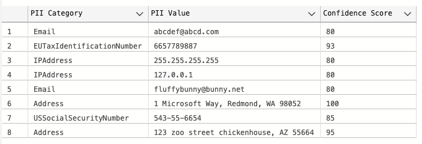

# Extend your knowledge

## JSON, Azure SQL, and AI Language

In all the example REST calls, we looked at the response message as a JSON document. What if this response was part of a larger process where we only wanted key pieces of information and not the entire document? We can use the built in JSON functions of the Azure SQL Database to do just that.

### Available JSON Functions

T-SQL supports various functions and operators that can be used to work with JSON documents in the Azure SQL database. The available functions are:

1. **[ISJSON](https://learn.microsoft.com/sql/t-sql/functions/isjson-transact-sql)**: Tests whether a string contains valid JSON.
1. **[JSON_PATH_EXISTS](https://learn.microsoft.com/sql/t-sql/functions/json-path-exists-transact-sql)**: Tests whether a specified SQL/JSON path exists in the input JSON string.
1. **[JSON_MODIFY](https://learn.microsoft.com/sql/t-sql/functions/json-modify-transact-sql)**: Updates the value of a property in a JSON string and returns the updated JSON string.
1. ANSI SQL JSON functions
    * **[JSON_VALUE](https://learn.microsoft.com/sql/t-sql/functions/json-value-transact-sql)**: Extracts a scalar value from a JSON string.
    * **[JSON_QUERY](https://learn.microsoft.com/sql/t-sql/functions/json-query-transact-sql)**: Extracts an object or an array from a JSON string.
1. ANSI SQL JSON constructors
    * **[JSON_OBJECT](https://learn.microsoft.com/sql/t-sql/functions/json-object-transact-sql)**: Constructs JSON object text from zero or more expressions.
    * **[JSON_ARRAY](https://learn.microsoft.com/sql/t-sql/functions/json-array-transact-sql)**: Constructs JSON array text from zero or more expressions.

The available operators are:

1. **[FOR JSON](https://learn.microsoft.com/sql/relational-databases/json/how-for-json-converts-sql-server-data-types-to-json-data-types-sql-server)**: Converts SQL Server data types to JSON types.
1. **[OPENJSON](https://learn.microsoft.com/sql/relational-databases/json/convert-json-data-to-rows-and-columns-with-openjson-sql-server)**: Converts JSON text into a set of rows and columns.

### Extracting values using JSON Functions

Let's start with the first REST call made, the PII detection and redaction endpoint:

```SQL
declare @url nvarchar(4000) = N'https://vslive2024language.cognitiveservices.azure.com/language/:analyze-text?api-version=2023-04-01';
declare @headers nvarchar(300) = N'{"Ocp-Apim-Subscription-Key":"LANGUAGE_KEY"}';
declare @payload nvarchar(max) = N'{
    "kind": "PiiEntityRecognition",
    "analysisInput":
    {
        "documents":
        [
            {
                "id":"1",
                "language": "en",
                "text": "abcdef@abcd.com, this is my phone is 6657789887, and my IP: 255.255.255.255 127.0.0.1 fluffybunny@bunny.net, My Addresses are 1 Microsoft Way, Redmond, WA 98052, SSN 543-55-6654, 123 zoo street chickenhouse, AZ 55664"
            }
        ]
    }
}';

declare @ret int, @response nvarchar(max);

exec @ret = sp_invoke_external_rest_endpoint 
    @url = @url,
    @method = 'POST',
    @headers = @headers,
    @payload = @payload,
    @timeout = 230,
    @response = @response output;

select @ret as ReturnCode, @response as Response;
```

Can we add to this T-SQL block to pull out just the redacted text? Taking a look at the response message, we have:

```JSON
"result": {
    "kind": "PiiEntityRecognitionResults",
    "results": {
        "documents": [
            {
                "redactedText": "***************, this is my phone is **********, and my IP: *************** ********* *********************, My Addresses are **********************************, SSN ***********, *************************************",
                "id": "1",
                "entities": [
                    {
                        "text": "abcdef@abcd.com",
                        "category": "Email",
                        "offset": 0,
                        "length": 15,
                        "confidenceScore": 0.8
                    },
```

We can replace the `SQL select @ret as ReturnCode, @response as Response;` query with a JSON function to extract pieces of this JSON document.


Replace it with the following SQL and rerun the REST call:

```SQL
SELECT D.[value] as "Redacted Text"
FROM OPENJSON(@response,'$.result.results.documents') AS D
```

The result is a more concise JSON document but more than we need. 

```JSON
{
"redactedText": "***************, this is my phone is **********, and my IP: *************** ********* *********************, My Addresses are **********************************, SSN ***********, *************************************",
"id": "1",
"entities": [
    {
        "text": "abcdef@abcd.com",
        "category": "Email",
        "offset": 0,
        "length": 15,
        "confidenceScore": 0.8
    },
    {
        "text": "6657789887",
        "category": "EUTaxIdentificationNumber",
        "offset": 37,
        "length": 10,
        "confidenceScore": 0.93
    },
```

We can use the JSON_VALUE ( expression , path )  function to take just the redactedText value.

### Try It Out!

Use the JSON_VALUE ( expression , path ) with the following statement to just get the redactedText value

```SQL
SELECT D.[value] as "Redacted Text"
FROM OPENJSON(@response,'$.result.results.documents') AS D
```

<details>
    <summary>(<i>Click for the answer</i>)</summary>
    <!-- have to be followed by an empty line! -->

Using the JSON_VALUE function, we take the result from OPENJSON and pass the redactedText path to get just that value:

```SQL
SELECT JSON_VALUE(D.[value],'$.redactedText') as "Redacted Text"
FROM OPENJSON(@response,'$.result.results.documents') AS D
```

```TEXT
***************, this is my phone is **********, and my IP: *************** ********* *********************, My Addresses are **********************************, SSN ***********, *************************************
```

</details>

What about pulling out multiple values? We see the entity values in the message:

```JSON
    "entities": [
        {
            "text": "abcdef@abcd.com",
            "category": "Email",
            "offset": 0,
            "length": 15,
            "confidenceScore": 0.8
        }...
```

Can we use the JSON functions to pull them all out and display as a result set? We can use CROSS APPLY with OPENJSON to get the entities array as a result set:

```SQL
SELECT A.[value]
FROM OPENJSON(@response,'$.result.results.documents') AS D
CROSS APPLY OPENJSON([value]) AS A 
where A.[key] = 'entities'
```

which gives us:

```JSON
[
    {
        "text": "abcdef@abcd.com",
        "category": "Email",
        "offset": 0,
        "length": 15,
        "confidenceScore": 0.8
    },
    {
        "text": "6657789887",
        "category": "EUTaxIdentificationNumber",
        "offset": 37,
        "length": 10,
        "confidenceScore": 0.93
    },
    {
        "text": "255.255.255.255",
        "category": "IPAddress",
        "offset": 60,
        "length": 15,
        "confidenceScore": 0.8
    }...
```
Next, we need to select the values in this array. We can use the above statement as a table we want to select with by nesting it with OPENJSON:

```SQL
select *
from OPENJSON(
(
    SELECT A.[value]
FROM OPENJSON(@response,'$.result.results.documents') AS D
CROSS APPLY OPENJSON([value]
) AS A 
where A.[key] = 'entities'
), '$') AS B
```

Close, but now we need to get the individual values out for text, category, and confidenceScore. 

### Try It Out!

Using what you learned in the previous example with JSON_VALUE, can you write this SQL query?

<details>
    <summary>(<i>Click for the answer</i>)</summary>
    <!-- have to be followed by an empty line! -->

Using the JSON_VALUE function, we can extract the values by using the path:

```SQL
SELECT JSON_VALUE(B.[value],'$.category') as "PII Category",
       JSON_VALUE(B.[value],'$.text') as "PII Value",
       CONVERT(FLOAT,JSON_VALUE(B.[value],'$.confidenceScore'))*100 as "Confidence Score"
 FROM OPENJSON(
(
     SELECT A.[value]
       FROM OPENJSON(@response,'$.result.results.documents') AS D
CROSS APPLY OPENJSON([value]
) AS A 
WHERE A.[key] = 'entities'
), '$') AS B
```



</details>

## Create a stored procedure

Can we make a stored procedure that takes in say the authentication key and content we want to send to a set of endpoints? Maybe a parameter that sets the endpoint we want to use?

If we look at the AI Content Safety URLs, they start with "https://vslive2024language.cognitiveservices.azure.com/contentsafety/text:". The URL also ends with the API version "?api-version=2024-02-15-preview". What is different is what is after text:. The 3 options we can use that have a similar payload are analyze, detectJailbreak, and detectProtectedMaterial.

With that said, it seems we have 3 parameters for the stored procedure: Auth key, operation, and message.

### Try It Out!

Can you create a stored procedure that takes in 3 parameters and calls the 3 AI Content Safety REST endpoints?
(Have the output just be the return JSON message)

<details>
    <summary>(<i>Click for the answer</i>)</summary>
    <!-- have to be followed by an empty line! -->

```SQL
CREATE PROCEDURE aiContentSafety @operation nvarchar(100), @safetykey nvarchar(100), @message nvarchar(max)
AS
declare @url nvarchar(4000) = N'https://vslive2024language.cognitiveservices.azure.com/contentsafety/text:' + @operation + '?api-version=2024-02-15-preview';
declare @headers nvarchar(300) = N'{"Ocp-Apim-Subscription-Key":"'+ @safetykey +'"}';
declare @payload nvarchar(max) = N'{
"text": "'+ @message +'"
}';

declare @ret int, @response nvarchar(max);
exec @ret = sp_invoke_external_rest_endpoint
@url = @url,
@method = 'POST',
@headers = @headers,
@payload = @payload,
@timeout = 230,
@response = @response output;

select @ret as ReturnCode, @response as Response;

GO
```

</details>

## Putting it all together

Now that you have some experience using the JSON functions and have created a stored procedure, can you combine the 2 and extract just key pieces of information from the responce message from an AI Content Safety call? The analyze, detectJailbreak, and detectProtectedMaterial have similar payloads so we will need some logic to decide how to extract the key information. The payloads are as follows:

**analyze**

```JSON
"result": {
    "blocklistsMatch": [],
    "categoriesAnalysis": [
        {
            "category": "Hate",
            "severity": 0
        },
        {
            "category": "SelfHarm",
            "severity": 0
        },
        {
            "category": "Sexual",
            "severity": 0
        },
        {
            "category": "Violence",
            "severity": 4
        }
    ]
}
```

**detectJailbreak**

```JSON
"result": {
    "jailbreakAnalysis": {
        "detected": true
    }
}
```

**detectProtectedMaterial**

```JSON
"result": {
    "protectedMaterialAnalysis": {
        "detected": true
    }
}
```

Looking at the payloads, detectJailbreak and detectProtectedMaterial are very similar so is there a way to use a JSON function to extract just detected without having to specify jailbreakAnalysis or protectedMaterialAnalysis? Can OPENJSON work? Let's set some requirements for detectJailbreak and detectProtectedMaterial. When using these 2 endpoints, let's look at taking the key value (detectJailbreak and detectProtectedMaterial) as content_type and the detected value (true/false) as detected.

Here is a hint. Start by using the following as your T-SQL query with detectJailbreak and detectProtectedMaterial:

```SQL
SELECT *
FROM OPENJSON(@response,'$.result') AS D
```

After this, can you get the values for categoriesAnalysis into a table format when analyze is passed into the procedure?

And finally, can you add logic to use one T-SQL statement over the other by looking at the operation parameter?

### Try It Out!

Can you add logic and JSON functions to the stored procedure to extract information based on operation?

<details>
    <summary>(<i>Click for the answer</i>)</summary>
    <!-- have to be followed by an empty line! -->

```SQL
CREATE PROCEDURE aiContentSafety @operation nvarchar(100), @safetykey nvarchar(100), @message nvarchar(max)
AS
declare @url nvarchar(4000) = N'https://vslive2024language.cognitiveservices.azure.com/contentsafety/text:' + @operation + '?api-version=2024-02-15-preview';
declare @headers nvarchar(300) = N'{"Ocp-Apim-Subscription-Key":"'+ @safetykey +'"}';
declare @payload nvarchar(max) = N'{
"text": "'+ @message +'"
}';

declare @ret int, @response nvarchar(max);
exec @ret = sp_invoke_external_rest_endpoint
@url = @url,
@method = 'POST',
@headers = @headers,
@payload = @payload,
@timeout = 230,
@response = @response output;

IF (@operation = 'detectJailbreak' or @operation = 'detectProtectedMaterial')

    SELECT D.[key] as content_type, JSON_VALUE(D.[value],'$.detected') as detected
    FROM OPENJSON(@response,'$.result') AS D
ELSE
    SELECT JSON_VALUE(D.[value],'$.category') as "Category",
    JSON_VALUE(D.[value],'$.severity') as "Severity"
    FROM OPENJSON(@response,'$.result.categoriesAnalysis') AS D

GO
```

Try it out!

```SQL
exec aiContentSafety N'detectProtectedMaterial', N'SAFETY_KEY', N'A seasoned witch could call you From the depths of your disgrace And rearrange your liver To the solid mental grace And achieve it all with music That came quickly from afar Then taste the fruit of man Recorded losing all against the hour And assessing points to nowhere Leading every single one A dewdrop can exalt us Like the music of the sun And take away the plain In which we move and choose the course youre running'
```
Remember to replace SAFETY_KEY with your content safety key!

</details>