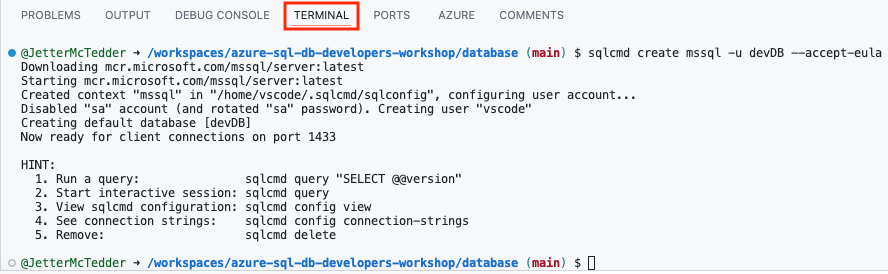
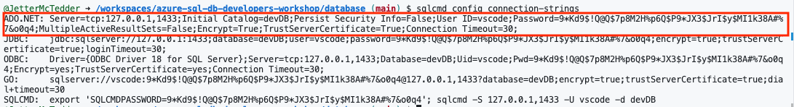
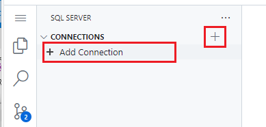
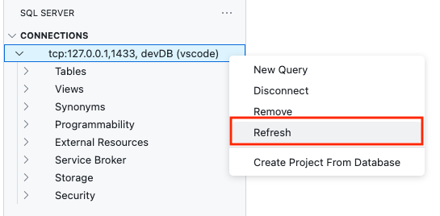
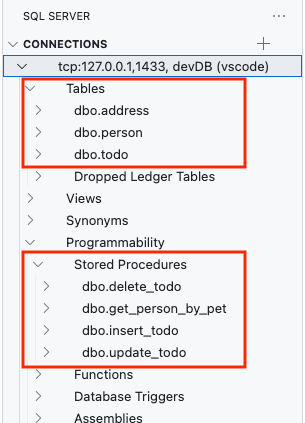
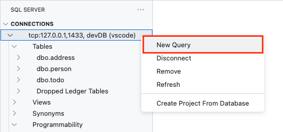

# Database tasks

## Using Azure SQL Database and Visual Studio Code

This workshop will use SQL Server 2022 and the Azure SQL Database for the backend database. We can create a full instance of SQL Server 2022 locally with docker for free as well as create a free Azure SQL Database in the Azure Cloud; we will use both and seamlessly deploy our database objects with Database Projects from our local docker instance to the cloud.

The SQL Database gives us the ability to store data not only in the traditional relational database format (tables/rows/columns), but also in JSON as well as graph relationships. This flexibility of data storage and deployment options, all while being free to use gives developers a compelling option for their backend database. Azure SQL Database goes beyond a basic cloud database by being a modern, fully managed platform as a service (PaaS) that handles database management functions such as upgrading, patching, backups, and monitoring without developer involvement.

### SQL Database Projects and CI/CD

The SQL Database Projects extension is an Azure Data Studio and Visual Studio Code extension for developing SQL databases in a project-based development environment that sets you up for full CI/CD workflows. These database projects can be deployed into a new database creating development/test environments or in existing databases applying only the changes found in a particular deployment version or branch. Combine SQL Database Projects with GitHub actions to create a CI/CD flow for testing changes and correcting issues before they get into production environments by applying the changes to a database upon every commit or pull request.

## Database Workshop Tasks

### Create a SQL Database Project

1. Using the codespace termnal, source the .bashrc file to uptake any changes the install may have made to the path

    ```bash
    . ~/.bashrc
    ```

1. Create the project directory in the terminal using the following command:

    ```bash
    mkdir database
    ```

1. Enter the directory

    ```bash
    cd database
    ```

1. And create a Database Project using a new templates via .NET

    ```bash
    dotnet new sqlproj -n "devDB" -tp "SqlAzureV12"
    ```

1. Use the side extensions panel in VS Code and select **SQL Database Projects**

    

    If your project is not automatically opened in the Database Projects extension, you can find it by clicking the **Open existing** green button

    

    and then selecting the devDB.sqlproj file located at /workspaces/azure-sql-db-developers-workshop/database/devDB/ using the find file modal.

    

1. Next, using the terminal again, create a database locally with go-sqlcmd and Docker. This command will download the image from the Microsoft container repository and create a full SQL Server 2022 instance (Developer Edition) on your local machine or in the code space.

    ```bash
    sqlcmd create mssql -u devDB --accept-eula
    ```
    


1. Using sqlcmd, view the connection string information with the following command

    ```bash
    sqlcmd config connection-strings
    ```

    

    Take note of the user (vscode) and the password that follows.

1. Using the extensions panel, select the **SQL Server connections extension**.

    

    and **create a new connection** by clicking either the **Add Connection** label or the **plus sign** on the upper right in the extension.

    

1. Use the following values for the **Create Connection dialog** boxes:

    * Use “localhost” as the server name, then press Enter.

        

    * Use “devDB” as the database name, then press Enter.

        

    * In the Authentication Type dialog box, select “SQL Login“.

        

    * Here is where it is best to refer back to the command “sqlcmd config connection-strings” to find the username and password. Run it again at the terminal to get the values if needed.

        In the User name (SQL Login) dialog box, enter the user from the connect strings. It should be vscode, then press Enter.

        

        and provide the password from the connect strings in the Password (SQL Login) dialog box, then press Enter.

        

    * Select “Yes” so that the password is saved (encrypted) on the connection profile

        

    * Provide the profile name of "Local Database" in the last dialog box for this step. Press Enter to finish the connection profile process.

        

    * After pressing Enter and the connection profile is verified, a warning box will appear on the lower right of the screen. This warning is indicating that due to new security features within the database, you need to enable the self-signed certificate.

        Click the Enable Trust Server Certificate green button to continue.

        

    * There is now a connection to this local database running in docker in the code space you can use for development.

        

### Create two tables and a stored procedure for testing

1. Back in the Database Projects extension, right click the project name (devDB) and select **Add Table**

    

1. In the New Table name box on the top of VS Code, enter **person** as the table name. Then press Enter.

    

1. We now have a simple create table script (person.sql) with a single column in our Database Project.

    

1. To speed things along, we can use some pre-created code for the person table. Replace the code with the following:

    ```SQL
    CREATE TABLE [dbo].[person] (
        [person_id]        INT IDENTITY (1, 1) NOT NULL PRIMARY KEY CLUSTERED ([person_id] ASC),
        [person_name]      NVARCHAR (200)      NOT NULL,
        [person_email]     NVARCHAR (200)      NOT NULL,
        [pet_preference]   NVARCHAR (100)      NOT NULL
    );
    ```

    and **save the file**.

    

1. Create another table by **right clicking** the project name again and select **Add Table**.

    

1. In the New Table name box on the top of the code space, enter **address** as the table name. Then press Enter.

    

1. Replace the code in the editor with the following code:

    ```SQL
    CREATE TABLE [dbo].[address] (
        [address_id]  INT            IDENTITY (1, 1) NOT NULL PRIMARY KEY CLUSTERED ([address_id] ASC),
        [person_id] INT            NOT NULL,
        [address]     NVARCHAR (200) NOT NULL,
        CONSTRAINT [FK_address_person] FOREIGN KEY ([person_id]) REFERENCES [dbo].[person] ([person_id])
    );
    ```

    and **save the file**.

    

1. Now that we have the two tables for the workshop, we can create a simple stored procedure. Right click on the project and select **Add Stored Procedure**.

    

1. Name the new stored procedure get_person_by_pet and press enter

    

1. Replace the sample code with the following:

    ```SQL
    CREATE PROCEDURE dbo.get_person_by_pet
        @pet nvarchar(100)
    AS
    BEGIN
        select *
        from dbo.person
        where pet_preference = iif(NULLIF(@pet, '') IS NOT NULL,@pet,pet_preference);
    END;
    GO
    ```

    and **save the file**.

    

### Create a table and stored procedures for the Todo application

1. Back in the Database Projects extension, right click the project name (devDB) and select **Add Table**

    

1. In the New Table name box on the top of VS Code, enter **todo** as the table name. Then press Enter.

    

1. We now have a simple create table script (todo.sql) with a single column in our Database Project.

    

1. To speed things along, we can use some pre-created code for the todo table. Replace the code with the following:

    ```SQL
    CREATE TABLE [dbo].[todo]
    (
    	[id] [uniqueidentifier] NOT NULL,
    	[title] [nvarchar](1000) NOT NULL,
    	[completed] [bit] NOT NULL,
    	[owner_id] [varchar](128) NOT NULL,
    	[position] INT NULL
    ) 
    GO
    ALTER TABLE [dbo].[todo] ADD PRIMARY KEY NONCLUSTERED 
    (
    	[id] ASC
    )
    GO
    ALTER TABLE [dbo].[todo] ADD  DEFAULT (newid()) FOR [id]
    GO
    ALTER TABLE [dbo].[todo] ADD  DEFAULT ((0)) FOR [completed]
    GO
    ALTER TABLE [dbo].[todo] ADD  DEFAULT ('public') FOR [owner_id]
    GO
    ```

    and **save the file**.

    

1. Now that we have the table for the workshop, we can create stored procedures. Right click on the project and select **Add Stored Procedure**.

    

1. Name the new stored procedure insert_todo and press enter

    

1. Replace the sample code with the following:

    ```SQL
    CREATE PROCEDURE dbo.insert_todo
        @title nvarchar(1000),
        @owner_id [varchar](128),
        @order int
    AS

    --    DECLARE @output table(id uniqueidentifier);

    BEGIN

        insert into dbo.todo (title, owner_id, position)
        OUTPUT INSERTED.*
        values (@title, @owner_id, @order);

    END;
    GO
    ```

    and **save the file**.

    

1. As before, right click on the project and select **Add Stored Procedure**.

    

1. Name the new stored procedure update_todo and press enter

    

1. Replace the sample code with the following:

    ```SQL
    CREATE PROCEDURE dbo.update_todo
        @id uniqueidentifier,
        @title nvarchar(1000) = NULL,
        @owner_id [varchar](128),
        @completed bit = NULL,
        @order int = NULL
    AS

    BEGIN

        update dbo.todo 
           set title = ISNULL(@title,title),
               completed = ISNULL(@completed,completed),
               position = ISNULL(@order,position)
        OUTPUT INSERTED.*
         where id = @id
           and owner_id = @owner_id;

    END;
    GO
    ```

    and **save the file**.

    

And again for the final procedure, right click on the project and select **Add Stored Procedure**.

    

1. Name the new stored procedure delete_todo and press enter

    

1. Replace the sample code with the following:

    ```SQL
    CREATE PROCEDURE dbo.delete_todo
        @id uniqueidentifier,
        @owner_id [varchar](128)
    AS

    BEGIN

        delete from dbo.todo
        where id = @id
        and owner_id = @owner_id;

    END;
    GO
    ```

    and **save the file**.

    

### Publish to the local database

1. To publish the database code to the local database, **right click** on the project and select **Publish**.

    

1. Select "Publish to an existing Azure SQL logical server" on the first step

    

1. Next, select "Don't use profile"

    

1. Choose the **Local Database** connection you created previously for the connection profile step

    

1. Choose **devDB** as the database

    

1. And finally, for the action, choose **Publish**.

    

1. Once the dacpac is published into the database,

    

    you can go to the SQL Server Connection extension, reload the database objects by right clicking it and selecting refresh,

    

     then open the Tables and Programmability folders to see the deployed objects.

    

### Work with the database objects for testing

1. While still on the **SQL Server Connections extension**, right click the database profile name, Local Database, and select **New Query**. This will bring up a new query sheet.

    

1. Run the following code in the query sheet:

    ```SQL
    insert into dbo.person(person_name, person_email, pet_preference) values('Bill','bill@computer.com','Dogs');
    insert into dbo.person(person_name, person_email, pet_preference) values('Frank', 'frank@computer.com','Cats');
    insert into dbo.person(person_name, person_email, pet_preference) values('Riley', 'Riley@computer.com','Cats');
    select * from person
    insert into address (person_id, address) values (1, 'Lincoln, MA');
    insert into address (person_id, address) values (2, 'Baltimore, MD');
    select p.person_name, a.address
    from person p, address a
    where p.person_id = a.person_id;
    go
    ```

1. You can also test out the stored procedure with the following code:

    ```SQL
    exec dbo.get_person_by_pet 'Dogs';
    ```

### Work with the database objects for the Todo Application

1. While still on the **SQL Server Connections extension**, right click the database profile name, Local Database, and select **New Query**. This will bring up a new query sheet.

    

1. Run the following code in the query sheet:

    ```SQL
    insert into dbo.todo 
    (
        [id],
        [title],
        [completed],
        [owner_id],
        [position]
    ) 
    values
        ('00000000-0000-0000-0000-000000000001', N'Hello world', 0, 'public', 1),
        ('00000000-0000-0000-0000-000000000002', N'This is done', 1, 'public', 2),
        ('00000000-0000-0000-0000-000000000003', N'And this is not done (yet!)', 0, 'public', 4),
        ('00000000-0000-0000-0000-000000000004', N'This is a ☆☆☆☆☆ tool!', 0, 'public', 3),
        ('00000000-0000-0000-0000-000000000005', N'Add support for sorting', 1, 'public', 5)
    ;
    select * from dbo.todo;
    GO
    ```

1. You can also test out the stored procedures with the following code:

    ```SQL
    select * from dbo.todo;
    exec dbo.insert_todo @title = 'My Test Todo', @owner_id = '1001001', @order = 1;
    ```

    Copy and paste the resulting ID from the result set and use it in the next stored procedure example:

    ```SQL
    exec dbo.update_todo @id = 'COPIED ID FROM RESULT SET', @title = 'zzzz', @owner_id = '1001001';
    ```

    And again, use the copied ID in the next statement:

    ```SQL
    exec dbo.delete_todo @id = 'COPIED ID FROM RESULT SET', @owner_id = '1001001';
    select * from dbo.todo;
    ```
