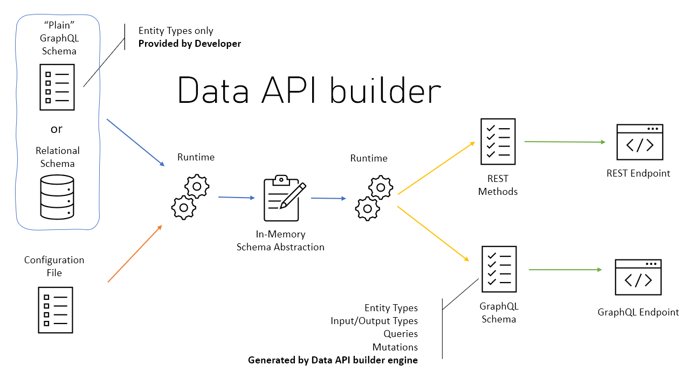
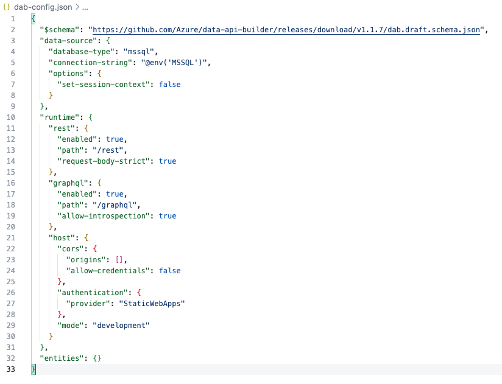
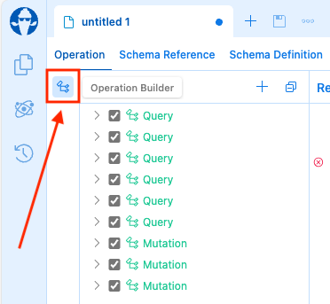
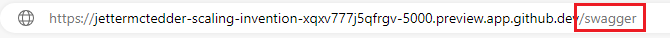

# Data API Builder

## What is Data API builder?

In modern application development, developers want to spend their time and effort on the front-end frameworks; crafting the best user experience possible. Having to deal with backed APIs and database development is sometimes out of their skill sets or time consuming. It demands that the backend database queries are efficient and employ the highest levels of security.

Data API builder for Azure Databases provides modern REST and GraphQL endpoints to your Azure Databases with minimal to zero coding. With Data API builder, database objects, such as tables and stored procedures, can be securely exposed via REST or GraphQL endpoints. Once these objects are REST/GraphQL enabled, they can be accessed using modern application development techniques on any platform, with any language, and any device.

Also, Data API builder is Open Source and works on any platform; on-premises, in container, or as a Managed Service in Azure. It uses the new Database Connection feature available in Azure Static Web Apps to connect to any supported database.



### Data API builder key features

* Allow collections, tables, views and stored procedures to be accessed via REST and GraphQL
* Support authentication via OAuth2/JWT
* Support for EasyAuth when running in Azure
* Role-based authorization using received claims
* Item-level security via policy expressions
* CRUD operations for REST Endpoints (POST, GET, PUT, PATCH, DELETE)
* GraphQL queries and mutations
* Filtering, sorting and pagination
* Relationship navigation in GraphQL

## Data API builder workshop tasks

### Setting the connect string in a .env file

> [!IMPORTANT]  
> **This section is important. Be sure to be back in the main directory for this section of the workshop.**

1. Back in your codespace, at the terminal at the bottom of the page, **return to the main directory**

    ```bash
    cd /workspaces/azure-sql-db-developers-workshop
    ```

1. Next step is to put our database connection string into a local .env file so it is not hardcoded into the Data API builder init file. You need to get the connection string to connect to the `devDB` database that you created in chapter 2. Since Data API builder is a .NET application, you can get the correct connection string using the following command:

    ```bash
    sqlcmd config connection-strings --database devDB | grep ADO.NET
    ```

    And copy this connect string just as you did in the previous chapter when creating a connection with the SQL Extension.

    Now, since the connection string is using a login/password pair, we're going to use environment variables to avoid storing the connection string in the Data API Builder configuration file.

1. Create an environment file by running the following code in the terminal:

    ```bash
    touch .env
    ```

1. Now find the **.env** file in the file navigator and click it to bring it up in the code editor.

    

1. Add the connection string to the environment file from Visual Studio Code, setting the `MSSQL` variable to the connection string you obtained in a previous step:

    ```text
    MSSQL='THE ADO.NET CONNECTION STRING YOU COPIED'
    ```

    

> [!IMPORTANT]  
> Remeber to use **your** ADO.NET connection string in the .env file.

### Creating the init file

1. Then, you can use the Data API Builder (DAB) CLI to initialize the configuration file:

    ```bash
    dab init --database-type "mssql" --connection-string "@env('MSSQL')" --host-mode "Development" --rest.path "rest"
    ```

    

1. Once the command completes, there will be a new file created named **dab-config.json**.

    

    If you open this file by clicking on it, you will see the connect string for the database but no entities that are REST enabled.

    

### Adding entries for testing

1. To add a table to the dab-config.json file, the **dab add TABLE_NAME** command is used. Run the following 2 commands to add the person and address tables to the dab-config.json file. Have the dab-config.json file opened in the editor so you can see the entries being added as the commands are run.

    For the **person** table:
    ```bash
    dab add Person --source dbo.person --permissions "anonymous:*" --rest "person"
    ```
    ---
    

    For the **address** table:
    ```bash
    dab add Address --source dbo.address --permissions "anonymous:*" --rest "address"
    ```
    ---
    
    As seen in the above 2 screenshots, the tables are added to the entities section in the dab-config.json file.

### Adding entries for the Todo Application

1. Run the following command to add the todo table to the dab-config.json file. Have the dab-config.json file opened in the editor so you can see the entry being added as the commands are run.

    For the **todo** table:
    ```bash
    dab add Todo --source dbo.todo --permissions "anonymous:*" --rest "todo"
    ```

1. Now that we have 2 tables added to the file, Data API builder can be started and the endpoints tested. Use the following command to start Data API builder locally in the codespace:

    ```bash
    dab start
    ```

    
    **Note:**
    If you get an error with the user not being able to login, open the dab-config.json file and replace the password with what it there. Once the password is replaced and the file is saved, try the dab start command again.


    If Data API builder has started successfully, codespace will show you that it opened port 5000 in a dialog box in the lower right of the page.

   

### Working with the endpoints

In this next section, you will be working with the endpoints created by Data API builder. The first section uses REST calls, the second section switching to using GraphQL, and the final section using both.

There are a few choices you have when working with the endpoints. There are a series a pre-created worksheets for you to use in the labFiles directory. 

The worksheets included are:
- restWorksheet.rest
- graphqlWorksheet.rest
- bananaCakePopWorksheet.txt
- storeprocedureWorksheet.rest

The `.rest` files all use a VS Code extension that allows you to submit REST/GraphQL resuests right in the editor. The bananaCakePopWorksheet.txt can be used in the GraphQL section if you choose to use the GraphQL Playground, Banana Cake Pop, that gets deployed when using Data API builder. The worksheets allow you to concentrate on the content and structure of the calls executed rather than diverting your attention to copy and paste activities.

1. To start working with the REST endpoints, find the **restWorksheet.rest** file in the labFiles folder and click on it to bring it up in the code editor.

   

1. Above each REST call in the **restWorksheet.rest** file, you will see a **"send request"** link.

   

1. **Clicking** the send request link will issue a request to Data API builder and a response message will appear in a new window to the right in the editor

   

1. For the following REST examples in this exercise, use the **restWorksheet.rest** file for the requests.

---

### REST Examples

#### Get all persons in the table

**Request:**

```bash
GET http://localhost:5000/rest/person
```

**Response:**

```JSON
{
  "value": [
    {
      "person_id": 1,
      "person_name": "Bill",
      "person_email": "bill@contoso.com",
      "pet_preference": "Dogs"
    },
    {
      "person_id": 2,
      "person_name": "Frank",
      "person_email": "frank@contoso.com",
      "pet_preference": "Cats"
    }...
```

---

#### Get person by Primary Key

**Request:**

```bash
GET http://localhost:5000/rest/person/person_id/1
```

**Response:**

```JSON
{
  "value": [
    {
      "person_id": 1,
      "person_name": "Bill",
      "person_email": "bill@contoso.com",
      "pet_preference": "Dogs"
    }
  ]
}
```

---

#### Filter the columns using select

**Request:**

```bash
GET http://localhost:5000/rest/person?$select=person_email
```

**Response:**

```JSON
{
  "value": [
    {
      "person_email": "bill@contoso.com"
    },
    {
      "person_email": "frank@contoso.com"
    },
    {
      "person_email": "Riley@contoso.com"
    }
  ]
}
```

---

#### Using operations: equals and not equals

**Request:**

```bash
GET http://localhost:5000/rest/person?$filter=person_name eq 'bill'
```

**Response:**

```JSON
{
  "value": [
    {
      "person_id": 1,
      "person_name": "Bill",
      "person_email": "bill@contoso.com",
      "pet_preference": "Dogs"
    }
  ]
}
```

**Request:**

```bash
GET http://localhost:5000/rest/person?$filter=person_name ne 'bill'
```

**Response:**

```JSON
{
  "value": [
    {
      "person_id": 2,
      "person_name": "Frank",
      "person_email": "frank@contoso.com",
      "pet_preference": "Cats"
    },
    {
      "person_id": 3,
      "person_name": "Riley",
      "person_email": "Riley@contoso.com",
      "pet_preference": "Cats"
    }
  ]
}
```

---

#### Sort results with orderby

**Request:**

```bash
GET http://localhost:5000/rest/person?$orderby=person_id desc
```

**Response:**

```JSON
{
  "value": [
    {
      "person_id": 3,
      "person_name": "Riley",
      "person_email": "Riley@contoso.com",
      "pet_preference": "Cats"
    },
    {
      "person_id": 2,
      "person_name": "Frank",
      "person_email": "frank@contoso.com",
      "pet_preference": "Cats"
    },
    {
      "person_id": 1,
      "person_name": "Bill",
      "person_email": "bill@contoso.com",
      "pet_preference": "Dogs"
    }
  ]
}
```

---

#### Using POST to create a record

**Request:**

```bash
POST http://localhost:5000/rest/person
content-type: application/json

{
    "person_name": "Joel",
    "person_email": "joel@contoso.com",
    "pet_preference": "Dogs"
}
```

**Response:**

```JSON
{
  "value": [
    {
      "person_id": 4,
      "person_name": "Joel",
      "person_email": "joel@contoso.com",
      "pet_preference": "Dogs"
    }
  ]
}
```

You can double check with the GET commands you learned in the previous section that the new record has been added to the database

---


#### Using PUT/PATCH to create or update a record

NOTE: When you are using a primary key with managed identity, PUT will result in an error. In this case, it is best to use PATCH instead.

**Request:**

```bash
PATCH http://localhost:5000/rest/person/person_id/3
content-type: application/json

{
    "person_email": "Riley@contososales.com"
}
```

**Response:**

```JSON
{
  "value": [
    {
      "person_id": 3,
      "person_name": "Riley",
      "person_email": "riley@contososales.com",
      "pet_preference": "Cats"
    }
  ]
}
```

---

#### Using DELETE to delete a record

**Request:**

```bash
DELETE http://localhost:5000/rest/person/person_id/3
```

**Response:**

```HTTP
HTTP/1.1 204 No Content
Connection: close
Date: Thu, 15 Jun 2023 19:51:15 GMT
Server: Kestrel
x-ms-correlation-id: 383d79b4-1646-4828-b66d-60fb0afcc14b
```

---

### GraphQL Endpoints

To test the GraphQL endpoints you can either use the `graphqlWorksheet.rest` file or you can use the GraphQL interactive playground, Banana Cake Pop.  This playground is enabled as Data API builder has been configured to run in `development` mode (The playground will not be enabled when running DAB in other modes).

#### Using the graphqlWorksheet.rest file

1. To start working with the GraphQL endpoints, find the **graphqlWorksheet.rest** file in the labFiles folder and click on it to bring it up in the code editor.

   

1. Above each GraphQL call in the **graphqlWorksheet.rest** file, you will see a **"send request"** link.

   

1. **Clicking** the send request link will issue a request to Data API builder and a response message will appear in a new window to the right in the editor

   

1. For the following GraphQL examples in this exercise, use the **graphqlWorksheet.rest** file for the requests.

#### Using Banana Cake Pop

1. To use Banana Cake Pop, start by clicking on the Ports tab on the bottom of the codespace page.

    

1. Next, hover over the local address for port 5000 where Data API builder is running. Then left click the world icon to open the URL in a new browser tab.

    

1. Once the new tab is opened, append `/graphql/` at the end of the URL and then press enter/return.

    

  > [!NOTE]  
  > Your URL will be different than the one in the above image excepting for the appending of `/graphql/` at the end.

  > [!WARNING]
  > If you are running from Codespaces and you get an error like `This <your-app-name>.app.github.dev page can’t be found`, check the URL to see if `:5000` has been automatically added before `/graphql/`. If yes, remove it: Codespaces port redirection will automatically take care of directing request to the correct port.

1. You will now see the GraphQL playground, Banana Cake Pop:

    

1. On the welcome page, click the **Create Document** blue button.

    

1. Next, find the **bananaCakePopWorksheet.txt** file in the labFiles folder and click on it to bring it up in the code editor.

   

1. Copy the contents of the **bananaCakePopWorksheet.txt** file and paste it into the newly created Banana Cake Pop Document

   

1. To give yourself a bit more space on the document, you can click the **Operation Builder** icon to hide the swim lane area.

   

1. Submitting requests in Bana Cake Pop is done by clicking the **run link** above each request or highlighting the request and clicking the **blue run button**.

   

1. For the following GraphQL examples in this exercise, you can use Banana Cake Pop if you wish.

--

### GraphQL Examples

#### Get the first 5 records

**Request:**

```graphql 
POST http://localhost:5000/graphql/
Content-Type: application/json
X-Request-Type: GraphQL

{
  people(first: 5) {
    items {
      person_id
      person_name
      person_email
    }
  }
}
```

**Response:**

```JSON
{
  "data": {
    "people": {
      "items": [
        {
          "person_id": 1,
          "person_name": "Bill",
          "person_email": "bill@contoso.com"
        },
        {
          "person_id": 2,
          "person_name": "Frank",
          "person_email": "frank@contoso.com"
        },
        {
          "person_id": 4,
          "person_name": "Joel",
          "person_email": "joel@contoso.com"
        }
      ]
    }
  }
}
```

---

#### Using an orderBy to sort the results

**Request:**

```graphql
POST http://localhost:5000/graphql/
Content-Type: application/json
X-Request-Type: GraphQL

{
  people(orderBy: { person_id: DESC } )
  {
    items {
      person_id
      person_name
      person_email
    }
  }
}
```

**Response:**

```JSON
{
  "data": {
    "people": {
      "items": [
        {
          "person_id": 4,
          "person_name": "Joel",
          "person_email": "joel@contoso.com"
        },
        {
          "person_id": 2,
          "person_name": "Frank",
          "person_email": "frank@contoso.com"
        },
        {
          "person_id": 1,
          "person_name": "Bill",
          "person_email": "bill@contoso.com"
        }
      ]
    }
  }
}
```

---

#### Get a record by primary key. Data API builder will automatically create the person_by_pk function.

**Request:**

```graphql
POST http://localhost:5000/graphql/
Content-Type: application/json
X-Request-Type: GraphQL

{
  person_by_pk(person_id: 1) {
    person_id
    person_name
    person_email
    pet_preference
  }
}
```

**Response:**

```JSON
{
  "data": {
    "person_by_pk": {
      "person_id": 1,
      "person_name": "Bill",
      "person_email": "bill@contoso.com",
      "pet_preference": "Dogs"
    }
  }
}
```

---

#### Create a relationship - one to many 
To create a GraphQL relationship, first stop DAB via the terminal in codespace. This can be done by issuing a Ctrl-C in the terminal window where Data API builder was started.


Next, issue the following command in the same terminal window.

```bash
dab update Person --relationship "addresses" --cardinality "many" --target.entity "Address"
```


After running the command, the dab-config.json file will contain a new relationship section under person:

```JSON
"entities": {
  "Person": {
    "source": "dbo.person",
    "permissions": [
      {
        "role": "anonymous",
        "actions": [
          "*"
        ]
      }
    ],
    "relationships": {
      "Addresses": {
        "cardinality": "many",
        "target.entity": "Address"
      }
    }
  },
```

Finally, restart DAB with the following command and continue with the examples.

```bash
dab start
```

---

#### Get the person and address entities using the GraphQL relationship

**Request:**

```graphql
POST http://localhost:5000/graphql/
Content-Type: application/json
X-Request-Type: GraphQL

{ 
 people
 { 
   items { 
     person_id 
     person_name 
     person_email
     pet_preference 
     addresses {
       items { 
         address
       } 
      }
    } 
  } 
}
```

**Response:**

```JSON
{
  "data": {
    "people": {
      "items": [
        {
          "person_id": 1,
          "person_name": "Bill",
          "person_email": "bill@contoso.com",
          "pet_preference": "Dogs",
          "addresses": {
            "items": [
              {
                "address": "Lincoln, MA"
              }
            ]
          }
        },
        {
          "person_id": 2,
          "person_name": "Frank",
          "person_email": "frank@contoso.com",
          "pet_preference": "Cats",
          "addresses": {
            "items": [
              {
                "address": "Baltimore, MD"
              }
            ]
          }
        },
        {
          "person_id": 4,
          "person_name": "Joel",
          "person_email": "joel@contoso.com",
          "pet_preference": "Dogs",
          "addresses": {
            "items": []
          }
        }
      ]
    }
  }
}
```

---


#### Limit results using a filter

**Request:**

```graphql
POST http://localhost:5000/graphql/
Content-Type: application/json
X-Request-Type: GraphQL

{
  people(filter: { person_name: { contains: "l" } })
  {
    items {
      person_id
      person_name
      pet_preference
    }
  }
}
```

**Response:**

```JSON
{
  "data": {
    "people": {
      "items": [
        {
          "person_id": 1,
          "person_name": "Bill",
          "pet_preference": "Dogs"
        },
        {
          "person_id": 4,
          "person_name": "Joel",
          "pet_preference": "Dogs"
        }
      ]
    }
  }
}
```

---

#### Limit results with a filter and using relationships

**Request:**

```graphql
POST http://localhost:5000/graphql/
Content-Type: application/json
X-Request-Type: GraphQL

{
  people(filter: { person_name: { contains: "l" } })
  {
    items {
      person_id
      person_name
      pet_preference
      addresses {
        items {
            address
        }
      }
    }
  }
}
```

**Response:**

```JSON
{
  "data": {
    "people": {
      "items": [
        {
          "person_id": 1,
          "person_name": "Bill",
          "pet_preference": "Dogs",
          "addresses": {
            "items": [
              {
                "address": "Lincoln, MA"
              }
            ]
          }
        },
        {
          "person_id": 4,
          "person_name": "Joel",
          "pet_preference": "Dogs",
          "addresses": {
            "items": []
          }
        }
      ]
    }
  }
}
```

---

#### Create person with a mutation

**Request:**

```graphql
POST http://localhost:5000/graphql/
Content-Type: application/json
X-Request-Type: GraphQL

mutation {
  createPerson(item: {
    person_name: "Elle",
    person_email: "elle@contoso.com"
    pet_preference: "Cats"
  }) {
    person_id
    person_name
    person_email
    pet_preference
  }  
}
```

**Response:**

```JSON
{
  "data": {
    "createPerson": {
      "person_id": 5,
      "person_name": "Elle",
      "person_email": "elle@contoso.com",
      "pet_preference": "Cats"
    }
  }
}
```

---

#### Update person using mutation and GraphQL

**Request:**

```graphql
POST http://localhost:5000/graphql/
Content-Type: application/json
X-Request-Type: GraphQL

mutation {
  updatePerson(person_id: 4, item: {
    person_email: "joel22@contoso.com"
  }) {
    person_id
    person_name
    person_email
  }
}
```

**Response:**

```JSON
{
  "data": {
    "updatePerson": {
      "person_id": 4,
      "person_name": "Joel",
      "person_email": "joel22@contoso.com"
    }
  }
}
```

---

#### Delete person using mutation and GraphQL

**Request:**

```graphql
POST http://localhost:5000/graphql/
Content-Type: application/json
X-Request-Type: GraphQL

mutation {
  deletePerson(person_id: 5)
  {
    person_id
  }  
}
```

**Response:**

```JSON
{
  "data": {
    "deletePerson": {
      "person_id": 5
    }
  }
}
```

---

### Stored Procedures

Data API builder can also REST/GraphQL enable stored procedures in the database. To enable the get_person_by_pet stored procedure, again stop Data API builder in the terminal with Ctrl-C.


#### Adding stored procedures for testing

Next, issue the following command in the same terminal window.

```bash
dab add GetPersonByPet --source dbo.get_person_by_pet --source.type "stored-procedure" --source.params "pet:" --permissions "anonymous:execute" --rest.methods "get" --graphql.operation "query"
```


After running the command, the dab-config.json file will contain the new entity:

```JSON
"GetPersonByPet": {
  "source": {
    "type": "stored-procedure",
    "object": "dbo.get_person_by_pet",
    "parameters": {
      "pet": ""
    }
  },
  "permissions": [
    {
      "role": "anonymous",
      "actions": [
        "execute"
      ]
    }
  ],
  "rest": {
    "methods": [
      "get"
    ]
  },
  "graphql": {
    "operation": "query"
  }
}
```

#### Adding stored procedures for the Todo Application

Issue the following commands in the same terminal window.

```bash
dab add InsertTodo --source dbo.insert_todo --source.type "stored-procedure" --source.params "title:,owner_id:,order:" --permissions "anonymous:execute" --rest "insert_todo" --rest.methods "post" --graphql false
```

```bash
dab add UpdateTodo --source dbo.update_todo --source.type "stored-procedure" --source.params "id:,title:,owner_id:,completed:false,order:" --permissions "anonymous:execute" --rest "update_todo" --rest.methods "post" --graphql false 
```

```bash
dab add DeleteTodo --source dbo.delete_todo --source.type "stored-procedure" --source.params "id:,owner_id:" --permissions "anonymous:execute" --rest "delete_todo" --rest.methods "delete" --graphql false
```

### Testing the stored procedures

Finally, restart DAB with the following command and continue with the examples.

```bash
dab start
```

---

#### Call a stored procedure using REST and GraphQL

Seeing there are only 2 calls to try the stored procedures, you can use the **storedprocedureWorksheet.rest** file provided for you in the labFiles folder.

1. To start working with the stored procedure endpoints, find the **storedprocedureWorksheet.rest** file in the labFiles folder and click on it to bring it up in the code editor.

   

1. Above the REST and GraphQL calls in the **storedprocedureWorksheet.rest** file, you will see a **"send request"** link.

   

1. **Clicking** the send request link will issue a request to Data API builder and a response message will appear in a new window to the right in the editor

   

---

#### Use the procedure’s REST endpoint and pass "Dogs" into the pet parameter.

**Request:**

```bash
http://localhost:5000/rest/GetPersonByPet?pet=Dogs
```

**Response:**

```JSON
{
  "value": [
    {
      "person_id": 1,
      "person_name": "Bill",
      "person_email": "bill@contoso.com",
      "pet_preference": "Dogs"
    },
    {
      "person_id": 4,
      "person_name": "Joel",
      "person_email": "joel22@contoso.com",
      "pet_preference": "Dogs"
    }
  ]
}
```

---


#### Use the procedure’s GraphQL endpoint and pass "Cats" into the pet parameter.

**Request:**

```graphql
POST http://localhost:5000/graphql/
Content-Type: application/json
X-Request-Type: GraphQL

query {
  executeGetPersonByPet(pet:"Cats")
   {
    person_id
    person_name
    person_email
    pet_preference
  }
}
```

**Response:**

```JSON
{
  "data": {
    "executeGetPersonByPet": [
      {
        "person_id": 2,
        "person_name": "Frank",
        "person_email": "frank@contoso.com",
        "pet_preference": "Cats"
      }
    ]
  }
}
```

---

### OpenAPI

Now that the APIs have been created, they might be handed off to a development team. To aid in this, Data API builder has built in swagger support that will render all APIs in a graphical user interface to be discovered and used.

1. To see this interface, start by clicking on the Ports tab on the bottom of the codespace page.

    

1. Next, hover over the local address for port 5000 where Data API builder is running. Then left click the world icon to open the URL in a new browser tab.

    

1. Once the new tab is opened, append "swagger" at the end of the URL and then press enter/return.

    

1. This is the swagger user interface where you can browse and try out all the APIs that were just created.

    

1. Stop Data API builder in the terminal with Ctrl-C.

## Continue to chapter 4

Click [here](./4-swa-cli.md) to continue to chapter 4, Static Web Apps!