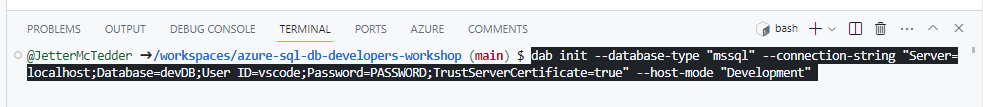
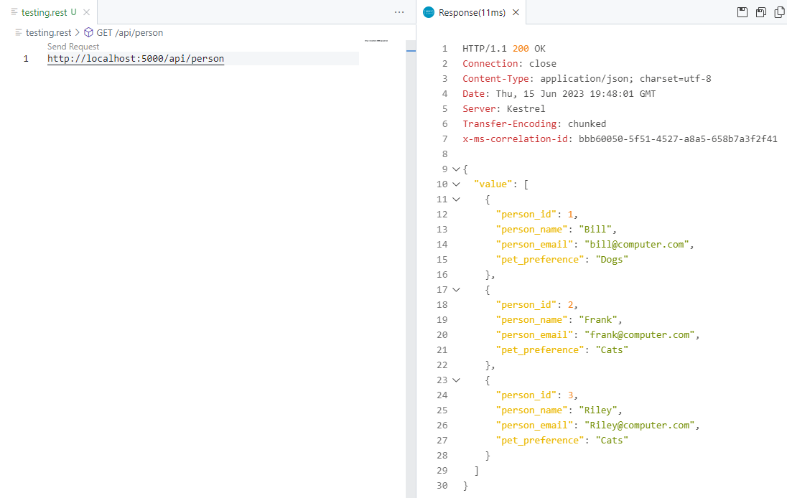

# Data API Builder

## What is Data API builder?

In modern application development, developers want to spend their time and effort on the front end frameworks; crafting the best user experience possible. Having to deal with backed APIs and database development is sometimes out of their skill sets or time consuming. It demands that the backend database queries are efficient and employ the highest levels of security.

Data API builder for Azure Databases provides modern REST and GraphQL endpoints to your Azure Databases with minimal to zero coding. With Data API builder, database objects, such as tables and stored procedures, can be securely exposed via REST or GraphQL endpoints. Once these objects are REST/GraphQL enabled, they can be accessed using modern application development techniques on any platform, with any language, and any device.

Also, Data API builder is Open Source and works on any platform; on-premises, in container, or as a Managed Service in Azure. It uses the new Database Connection feature available in Azure Static Web Apps to connect to any supported database.


### Data API builder key features

* Allow collections, tables, views and stored procedures to be accessed via REST and GraphQL
* Support authentication via OAuth2/JWT
* Support for EasyAuth when running in Azure
* Role-based authorization using received claims
* Item-level security via policy expressions
* CRUD operations for REST Endpoints (POST, GET, PUT, PATCH, DELETE)
* GraphQL queries and mutations
* filtering, sorting and pagination
* relationship navigation in GraphQL

## Data API builder workshop tasks

### REST/GraphQL enable a table

> **Step one is important. Be sure to be back in the main directory for this section of the workshop.**

1. Back in your code space, at the terminal at the bottom of the page, **return to the main directory**

    ```bash
    cd /workspaces/azure-sql-db-developers-workshop
    ```
1. Next step is to create the Data API Builder initialization file. Be sure to replace **PASSWORD** with the password of your database. If you need to find the password again, you can run the
    ```bash
    sqlcmd config connection-strings
    ``` 
    command again. Once you have your database password, replace **PASSWORD** in the following command and then run it at the terminal prompt:

    ```bash
    dab init --database-type "mssql" --connection-string "Server=localhost;Database=devDB;User ID=vscode;Password="'PASSWORD'";TrustServerCertificate=true" --host-mode "Development"
    ```

    

1. Once the command completes, there will be a new file created named **dab-config.json**.

    

    If you open this file by clicking on it, you will see the connect string for the database but no entities that are REST enabled.

    

1. To add a table to the dab-config.json file, the **dab add TABLE_NAME** command is used. Run the following 2 commands to add the person and address tables to the dab-config.json file. Have the dab-config.json file opened in the editor so you can see the entries being added as the commands are run.

    For the **person** table:
    ```bash
    dab add person --source dbo.person --permissions "anonymous:*"
    ```
    ---
    

    For the **address** table:
    ```bash
    dab add address --source dbo.address --permissions "anonymous:*"
    ```
    ---
    

    As seen in the above 2 screenshots, the tables are added to the entities section in the dab-config.json file.

1. Now that we have 2 tables added to the file, Data API builder can be started and the endpoints tested. Use the following command to start Data API builder locally in the code space:

    ```bash
    dab start
    ```

    
    **Note:**
    If you get an error with the user not being able to login, open the dab-config.json file and replace the password with what it there. Once the password is replaced and the file is saved, try the dab start command again.


    If Data API builder has started successfully, code space will show you that it opened up port 5000 in a dialog box in the lower right of the page.

   

### Working with the endpoints 

In this next section, you will be working with the endpoints created by Data API builder. The first section uses REST calls with the second section switching to using GraphQL.

1. The endpoints will be tested in a .rest file right in the code space editor. Start by **right clicking** under your files in the Explorer extension and selecting **New File...**.

   

    A blank test field will appear amongst your files in the explorer extension

   

    Enter **testing.rest** as the file name and press enter/return.

   

    Now left click the file if it is not already opened in the code space editor

   

    By using the .rest file extension and the REST VS Code extension, you can use this file to make calls directly to Data API builder right in the editor.

1. For testing the REST endpoints, 2 URLs will be used:

    ```
    http://localhost:5000/api/person
    http://localhost:5000/api/address
    ```

1. To start, in the **testing.rest file**, add the following text:

    ```
    http://localhost:5000/api/person
    ```

    and you will see a **"send request"** link appear just above it.

   

    **Click** the send request link and a response message will appear in a new window to the right in the editor

   

1. For the following REST examples in this exercise, use the testing.rest file for the requests. Replace the existing text in the file with each example because the extension can only have one endpoint in the file at any one time.

   

---

#### Get person by Primary Key
**Request:**

```bash
http://localhost:5000/api/person/person_id/1
```

**Response:**

```JSON
{
  "value": [
    {
      "person_id": 1,
      "person_name": "Bill",
      "person_email": "bill@contoso.com",
      "pet_preference": "Dogs"
    }
  ]
}
```

---

#### Filter the columns using select
**Request:**

```bash
http://localhost:5000/api/person?$select=person_email
```

**Response:**

```JSON
{
  "value": [
    {
      "person_email": "bill@contoso.com",
      "person_id": 1
    },
    {
      "person_email": "frank@contoso.com",
      "person_id": 2
    },
    {
      "person_email": "Riley@contoso.com",
      "person_id": 3
    }
  ]
}
```

---

#### Using operations: equals and not equals

**Request:**

```bash
http://localhost:5000/api/person?$filter=person_name eq 'bill'
```

**Response:**

```JSON
{
  "value": [
    {
      "person_id": 1,
      "person_name": "Bill",
      "person_email": "bill@contoso.com",
      "pet_preference": "Dogs"
    }
  ]
}
```

**Request:**

```bash
http://localhost:5000/api/person?$filter=person_name ne 'bill'
```

**Response:**

```JSON
{
  "value": [
    {
      "person_id": 2,
      "person_name": "Frank",
      "person_email": "frank@contoso.com",
      "pet_preference": "Cats"
    },
    {
      "person_id": 3,
      "person_name": "Riley",
      "person_email": "Riley@contoso.com",
      "pet_preference": "Cats"
    }
  ]
}
```

---

#### Sort results with orderby

**Request:**

```bash
http://localhost:5000/api/person?$orderby=person_id desc
```

**Response:**

```JSON
{
  "value": [
    {
      "person_id": 3,
      "person_name": "Riley",
      "person_email": "Riley@contoso.com",
      "pet_preference": "Cats"
    },
    {
      "person_id": 2,
      "person_name": "Frank",
      "person_email": "frank@contoso.com",
      "pet_preference": "Cats"
    },
    {
      "person_id": 1,
      "person_name": "Bill",
      "person_email": "bill@contoso.com",
      "pet_preference": "Dogs"
    }
  ]
}
```

---

#### Using POST to create a record
(POST will precede the URL)

**Request:**

```bash
POST http://localhost:5000/api/person
content-type: application/json

{
    "person_name": "Joel",
    "person_email": "joel@contoso.com",
    "pet_preference": "Dogs"
}
```

**Response:**

```JSON
{
  "value": [
    {
      "person_id": 4,
      "person_name": "Joel",
      "person_email": "joel@contoso.com",
      "pet_preference": "Dogs"
    }
  ]
}
```

---


#### Using PUT/PATCH to create or update a record

NOTE: When you are using a primary key with managed identity, PUT will result in an error. In this case, it is best to use PATCH instead.

**Request:**

```bash
PATCH http://localhost:5000/api/person/person_id/3
content-type: application/json

{
    "person_email": "Riley@contososales.com"
}
```

**Response:**

```JSON
{
  "value": [
    {
      "person_id": 2,
      "person_name": "Riley",
      "person_email": "riley@contososales.com",
      "pet_preference": "Cats"
    }
  ]
}
```

---

#### Using DELETE to delete a record

**Request:**

```bash
DELETE http://localhost:5000/api/person/person_id/3
```

**Response:**

```HTTP
HTTP/1.1 204 No Content
Connection: close
Date: Thu, 15 Jun 2023 19:51:15 GMT
Server: Kestrel
x-ms-correlation-id: 383d79b4-1646-4828-b66d-60fb0afcc14b
```

---

### GraphQL Endpoints

#### Get the first 5 records

**Request:**

```bash
POST http://localhost:5000/graphql/
Content-Type: application/json
X-Request-Type: GraphQL

{
  people(first: 5) {
    items {
      person_id
      person_name
      person_email
    }
  }
}
```

**Response:**

```JSON
{
  "data": {
    "people": {
      "items": [
        {
          "person_id": 1,
          "person_name": "Bill",
          "person_email": "bill@contoso.com"
        },
        {
          "person_id": 2,
          "person_name": "Frank",
          "person_email": "frank@contoso.com"
        },
        {
          "person_id": 4,
          "person_name": "Joel",
          "person_email": "joel@contoso.com"
        }
      ]
    }
  }
}
```

---

#### Using an orderBy to sort the results

**Request:**

```bash
POST http://localhost:5000/graphql/
Content-Type: application/json
X-Request-Type: GraphQL

{
  people(orderBy: {person_id: DESC} )
  {
    items {
      person_id
      person_name
      person_email
    }
  }
}
```

**Response:**

```JSON
{
  "data": {
    "people": {
      "items": [
        {
          "person_id": 4,
          "person_name": "Joel",
          "person_email": "joel@contoso.com"
        },
        {
          "person_id": 2,
          "person_name": "Frank",
          "person_email": "frank@contoso.com"
        },
        {
          "person_id": 1,
          "person_name": "Bill",
          "person_email": "bill@contoso.com"
        }
      ]
    }
  }
}
```

---

#### Get a record by primary key. Data API builder will automatically create the person_by_pk function.

**Request:**

```bash
POST http://localhost:5000/graphql/
Content-Type: application/json
X-Request-Type: GraphQL

{
  person_by_pk(person_id: 1) {
      person_id
      person_name
      person_email
      pet_preference
    }
}
```

**Response:**

```JSON
{
  "data": {
    "person_by_pk": {
      "person_id": 1,
      "person_name": "Bill",
      "person_email": "bill@contoso.com",
      "pet_preference": "Dogs"
    }
  }
}
```

---

#### Create a relationship - one to many 
To create a GraphQL relationship, first stop DAB via the terminal in code spaces. This can be done by issuing a Ctrl-C in the terminal window where Data API builder was started.


Next, issue the following command in the same terminal window.

```bash
dab update person --relationship "address" --cardinality "many" --target.entity "address"
```


After running the command, the dab-config.json file will contain a new relationship section under person:

```JSON
"entities": {
  "person": {
    "source": "dbo.person",
    "permissions": [
      {
        "role": "anonymous",
        "actions": [
          "*"
        ]
      }
    ],
    "relationships": {
      "address": {
        "cardinality": "many",
        "target.entity": "address"
      }
    }
  },
```

Finally, restart DAB with the following command and continue with the examples.

```bash
dab start
```

---

#### Get the person and address entities using the GraphQL relationship

**Request:**

```bash
POST http://localhost:5000/graphql/
Content-Type: application/json
X-Request-Type: GraphQL

{ 
 people
 { 
   items { 
     person_id 
     person_name 
     person_email
     pet_preference 
     address {
       items { 
         address
       } 
      }
    } 
  } 
}
```

**Response:**

```JSON
{
  "data": {
    "people": {
      "items": [
        {
          "person_id": 1,
          "person_name": "Bill",
          "person_email": "bill@contoso.com",
          "pet_preference": "Dogs",
          "address": {
            "items": [
              {
                "address": "Lincoln, MA"
              }
            ]
          }
        },
        {
          "person_id": 2,
          "person_name": "Frank",
          "person_email": "frank@contoso.com",
          "pet_preference": "Cats",
          "address": {
            "items": [
              {
                "address": "Baltimore, MD"
              }
            ]
          }
        },
        {
          "person_id": 4,
          "person_name": "Joel",
          "person_email": "joel@contoso.com",
          "pet_preference": "Dogs",
          "address": {
            "items": []
          }
        }
      ]
    }
  }
}
```

---


#### Limit results using a filter

**Request:**

```bash
POST http://localhost:5000/graphql/
Content-Type: application/json
X-Request-Type: GraphQL

{
  people(filter: { person_name: { contains: "l" } })
  {
    items {
      person_id
      person_name
      pet_preference
    }
  }
}
```

**Response:**

```JSON
{
  "data": {
    "people": {
      "items": [
        {
          "person_id": 1,
          "person_name": "Bill",
          "pet_preference": "Dogs"
        },
        {
          "person_id": 4,
          "person_name": "Joel",
          "pet_preference": "Dogs"
        }
      ]
    }
  }
}
```

---

#### Limit results with a filter and using relationships

**Request:**

```bash
POST http://localhost:5000/graphql/
Content-Type: application/json
X-Request-Type: GraphQL

{
  people(filter: { person_name: { contains: "l" } })
  {
    items {
      person_id
      person_name
      pet_preference
      address {
        items {
            address
        }
      }
    }
  }
}
```

**Response:**

```JSON
{
  "data": {
    "people": {
      "items": [
        {
          "person_id": 1,
          "person_name": "Bill",
          "pet_preference": "Dogs",
          "address": {
            "items": [
              {
                "address": "Lincoln, MA"
              }
            ]
          }
        },
        {
          "person_id": 4,
          "person_name": "Joel",
          "pet_preference": "Dogs",
          "address": {
            "items": []
          }
        }
      ]
    }
  }
}
```

---

#### Create person with a mutation

**Request:**

```bash
POST http://localhost:5000/graphql/
Content-Type: application/json
X-Request-Type: GraphQL

mutation {
  createperson(item: {
    person_name: "Elle",
    person_email: "elle@contoso.com"
    pet_preference: "Cats"
  }) {
    person_id
    person_name
    person_email
    pet_preference
  }  
}
```

**Response:**

```JSON
{
  "data": {
    "createperson": {
      "person_id": 5,
      "person_name": "Elle",
      "person_email": "elle@contoso.com",
      "pet_preference": "Cats"
    }
  }
}
```

---

#### Update person using mutation and GraphQL

**Request:**

```bash
POST http://localhost:5000/graphql/
Content-Type: application/json
X-Request-Type: GraphQL

mutation {
  updateperson(person_id: 4, item: {
    person_email: "joel22@contoso.com"
  }) {
    person_id
    person_name
    person_email
  }
}
```

**Response:**

```JSON
{
  "data": {
    "updateperson": {
      "person_id": 4,
      "person_name": "Joel",
      "person_email": "joel22@contoso.com"
    }
  }
}
```

---

#### Delete person using mutation and GraphQL

**Request:**

```bash
POST http://localhost:5000/graphql/
Content-Type: application/json
X-Request-Type: GraphQL

mutation {
  deleteperson(person_id: 5)
  {
    person_id
  }  
}
```

**Response:**

```JSON
{
  "data": {
    "deleteperson": {
      "person_id": 5
    }
  }
}
```

---

### Stored Procedures

Data API builder can also REST/GraphQL enable stored procedures in the database. To enable the get_person_by_pet stored procedure, again stop Data API builder in the terminal with Ctrl-C.


Next, issue the following command in the same terminal window.

```bash
dab add getPersonByPet --source dbo.get_person_by_pet --source.type "stored-procedure" --source.params "pet:" --permissions "anonymous:execute" --rest.methods "get" --graphql.operation "query"
```


After running the command, the dab-config.json file will contain the new entity:

```JSON
"getPersonByPet": {
  "source": {
    "type": "stored-procedure",
    "object": "dbo.get_person_by_pet",
    "parameters": {
      "pet": ""
    }
  },
  "permissions": [
    {
      "role": "anonymous",
      "actions": [
        "execute"
      ]
    }
  ],
  "rest": {
    "methods": [
      "get"
    ]
  },
  "graphql": {
    "operation": "query"
  }
}
```

Finally, restart DAB with the following command and continue with the examples.

```bash
dab start
```

---

#### Call a stored procedure using REST and GraphQL

Use the procedure’s REST endpoint and pass "Dogs" into the pet parameter.

**Request:**

```bash
http://localhost:5000/api/getPersonByPet?pet=Dogs
```

**Response:**

```JSON
{
  "value": [
    {
      "person_id": 1,
      "person_name": "Bill",
      "person_email": "bill@contoso.com",
      "pet_preference": "Dogs"
    },
    {
      "person_id": 4,
      "person_name": "Joel",
      "person_email": "joel22@contoso.com",
      "pet_preference": "Dogs"
    }
  ]
}
```

---


Use the procedure’s GraphQL endpoint and pass "Cats" into the pet parameter.

**Request:**

```bash
POST http://localhost:5000/graphql/
Content-Type: application/json
X-Request-Type: GraphQL

query {
  executegetPersonByPet(pet:"Cats")
   {
    person_id
    person_name
    person_email
    pet_preference
  }
}
```

**Response:**

```JSON
{
  "data": {
    "executegetPersonByPet": [
      {
        "person_id": 2,
        "person_name": "Frank",
        "person_email": "frank@contoso.com",
        "pet_preference": "Cats"
      }
    ]
  }
}
```

---

### OpenAPI

Now that the APIs have been created, they might be handed off to a development team. To aid in this, Data API builder has built in swagger support that will render all APIs in a graphical user interface to be discovered and used.

1. To see this interface, start by clicking on the Ports tab on the bottom of the code space page.

    

1. Next, hover over the local address for port 5000 where Data API builder is running. Then left click the world icon to open the URL in a new browser tab.

    

1. Once the new tab is opened, append "swagger" at the end of the URL and then press enter/return.

    

1. This is the swagger user interface where you can browse and try out all the APIs that were just created.

    

1. Stop Data API builder in the terminal with Ctrl-C.
