# Static Web Apps CLI

## What is Azure Static Web Apps?

Azure Static Web Apps is a service that automatically builds and deploys full stack web apps to Azure from a code repository or can be used locally using SWA CLI. The workflow of Azure Static Web Apps is tailored to a developer's daily workflow; apps are built and deployed based on code changes to the repository for a complete CI/CD experience. When you create an Azure Static Web Apps resource, Azure interacts directly with GitHub or Azure DevOps, to monitor a branch of your choice. Every time you push commits or accept pull requests into the watched branch, a build automatically runs and your app and API deploys to Azure.


Static web apps are commonly built using libraries and web frameworks like Angular, React, Svelte, Vue, or Blazor where server side rendering isn't required. These apps include HTML, CSS, JavaScript, and image assets that make up the application. With a traditional web server, these assets are served from a single server alongside any required API endpoints.

With Static Web Apps, static assets are separated from a traditional web server and are instead served from points geographically distributed around the world. This distribution makes serving files much faster as files are physically closer to end users. In addition, API endpoints are hosted using a serverless architecture, which avoids the need for a full back-end server altogether.

### SWA CLI

The Static Web Apps CLI, also known as SWA CLI, serves as a local development tool for Azure Static Web Apps. It can:

* Serve static app assets, or proxy to your app dev server
* Serve API requests, or proxy to APIs running in Azure Functions Core Tools
* Emulate authentication and authorization
* Emulate Static Web Apps configuration, including routing and ACL roles
* Deploy your app to Azure Static Web Apps

This workshop will use SWA CLI for Data API builder and authentication.

### How SWA works locally

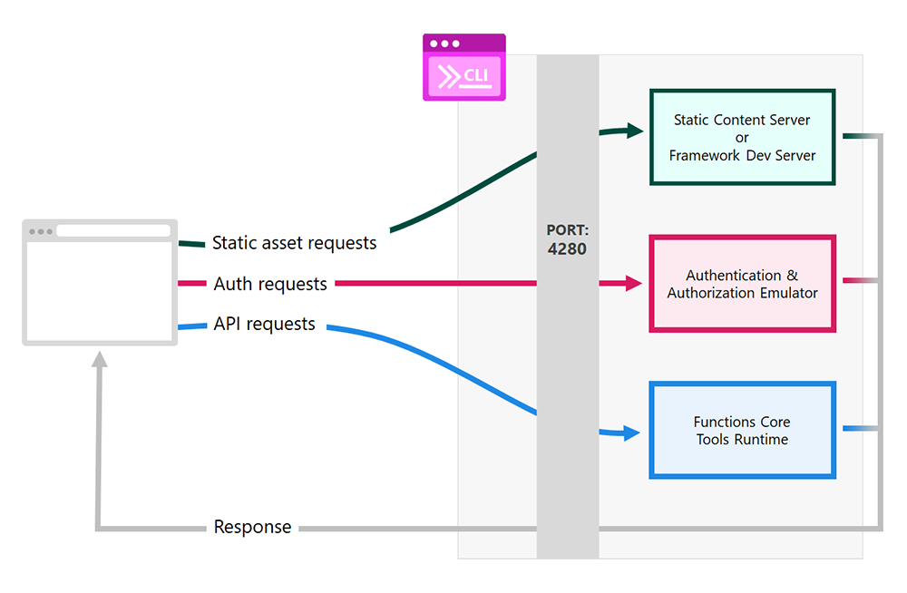

**Requests** made to port 4280 are forwarded to the appropriate server depending on the type of request.

**Static content** requests, such as HTML or CSS, are either handled by the internal CLI static content server, or by the front-end framework server for debugging.

**Authentication and authorization** requests are handled by an emulator, which provides a fake identity profile to your app.

**Functions Core Tools runtime** handles requests to the site's API.

**Responses** from all services are returned to the browser as if they were all a single application.

## SWA CLI workshop tasks

The following tasks will show you how to integrate a local Static Web Apps environment right in the codespace.

Static Web Apps has built in [integration with the Azure SQL Database/Local SQL Server (and other Azure Databases)](https://learn.microsoft.com/en-us/azure/static-web-apps/database-overview). SWA CLI uses a config file located in the swa-db-connections directory. Seeing Static Web Apps utilizes Data API builder, we can just copy the dab-config.json file right into that directory and have all the entities we added just work on startup.

> [!IMPORTANT]  
> Please do this section first!

1. The first task to perform is adding a mapping to our dab-config.json file. The scenario is that you want to expose a field in an application but use a different name. Maybe the database field is an internal complex name and you wanted to make it easier for the developers to use. We can use the **map** option in dba cli to add a mapping. In this example, we are going to expose the **position database column** to the application as **order**.

    Run the following command:

    **return to the main directory**

    ```bash
    cd /workspaces/azure-sql-db-developers-workshop
    ```

    update the dab config file

    ```bash
    dab update Todo --map "position:order" 
    ```

    and looking at the dab-config.json file, we can see the added mapping to our configuration.

    ```JSON
    "mappings": {
      "position": "order"
    } 
    ```

1. Next, create a directory called swa-db-connections in the top level directory. Use the following commands:

    Be at the top level directory for the project

    ```bash
    cd /workspaces/azure-sql-db-developers-workshop
    ```

    Now, create the directory

    ```bash
    mkdir swa-db-connections
    ```

1. As was stated before, we can use the dab-config.json file for Static Web Apps database connections. Use the following command to copy the Data API builder config file into the newly created directory for Static Web Apps. The file will be named staticwebapp.database.config.json

    ```bash
    cp dab-config.json ./swa-db-connections/staticwebapp.database.config.json
    ```

### Working with the sample JavaScript Application

1. Start Static Web Apps in your codespace. The following command indicates that our app location is at /app and the database connections are located in the swa-db-connections directory.

    ```bash
    swa start --app-location ./app --data-api-location ./swa-db-connections
    ```
 
1. Once Static Web Apps has started, you will get a message in the codespace on the bottom right indicating that it's running on port 4280.

    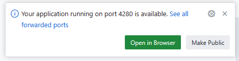

1. Click the **Open in Browser** green button to access the sample application in the same dialog box

    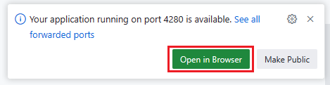

1. The sample JavaScript application uses Static Web Apps for the HTML and CSS files as well as uses the built in Data API builder integration for all the REST calls. 

    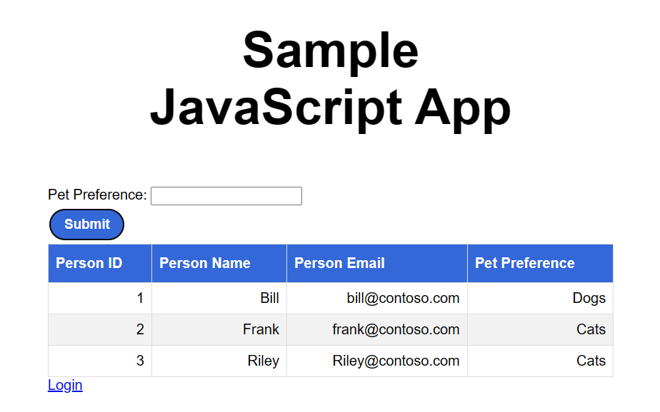

    Give the application a try by **entering Cats into the Pet Preference** field and **clicking Submit**.

    

    This uses the stored procedure that was REST enabled in the previous chapter.


> [!IMPORTANT]
> The following section is informational and does not require you to copy and paste any code. This section just walks you through what the web app is doing in preperation for authentication.

5. Back in the codespace, open the `index.html` file located in the app directory and click on it.

    

6. Looking at this file in the editor, first there is a call to the Static Web Apps authentication service at /.auth/me

    ```javascript
    fetch('/.auth/me')
      .then(res => {
        return res.json()
      })
      .then(payload => {
        const { clientPrincipal } = payload;
        this.userDetails = clientPrincipal?.userDetails;
        this.userId = clientPrincipal?.userId;
      });
    ```

    Calling this endpoint after logging in will return a JSON object with user information that can be used for authentication and authorization using mock credentials. Here is an example of that JSON object.

    ```JSON
    {
        "clientPrincipal": {
            "userId": "7a60dbe0d0935cc300bb85ed47e27441",
            "userRoles": [
                "anonymous",
                "authenticated"
            ],
            "claims": [],
            "identityProvider": "github",
            "userDetails": "Brian"
        }
    }
    ```

    Next in the `index.html` file is a simple JavaScript fetch to the REST endpoint that was made on the person table. Once it gets the data from the REST endpoint, it loops through the rows and creates the HTML table seen on the page.

    ```javascript
    fetch('/data-api/api/person')
        .then(res => res.text())
        .then((out) => {
          let jsonData = JSON.parse(out);
          for (let i = 0; i < jsonData.value.length; i++) {
            let person = jsonData.value[i];
            peopleData.innerHTML +=
              "<tr align='right'><td>" + person.person_id + "</td>" +
              "<td>" + person.person_name + "</td>" +
              "<td>" + person.person_email + "</td>" +
              "<td>" + person.pet_preference + "</td></tr>";
          };
        })
    ```

    To note, this initial calling of the person endpoint and the call to get the authentication object occurs on page load.

    The next section of JavaScript in the `index.html` file is a function. This function is called when the Submit button is pressed and passes the text you enter into the Pet Preference text field to the REST enabled stored procedure that replaces the HTML table with a new one based on the result of the REST response.

    ```javascript
      function getPref(ppref) {
        fetch('/data-api/api/GetPersonByPet?pet=' + ppref)
        .then(res => {
          if (res.status== '403') {
            alert('403 - forbidden, try logging in')
          }
            return res.text()}
          )    
        .then((out) => {
          peopleData.innerHTML = "";
          let jsonData = JSON.parse(out);
          for (let i = 0; i < jsonData.value.length; i++) {
            let person = jsonData.value[i];
            peopleData.innerHTML +=
              "<tr align='right'><td>" + person.person_id + "</td>" +
              "<td>" + person.person_name + "</td>" +
              "<td>" + person.person_email + "</td>" +
              "<td>" + person.pet_preference + "</td></tr>";
          };
        })
      }
    ```

    You may notice that we catch 403 HTTP Status codes. This will be used in the next section.

> [!IMPORTANT]  
> End of informational section

7. Open the staticwebapp.database.config.json in the swa-db-connections directory in the code editor by clicking on it.

    

1. Scroll down in the code editor to find the getPersonByPet section.


    ```JSON
    "GetPersonByPet": {
      "source": {
        "object": "dbo.get_person_by_pet",
        "type": "stored-procedure",
        "parameters": {
          "pet": ""
        }
      },
      "graphql": {
        "enabled": true,
        "operation": "query",
        "type": {
          "singular": "GetPersonByPet",
          "plural": "GetPersonByPets"
        }
      },
      "rest": {
        "enabled": true,
        "methods": [
          "get"
        ]
      },
      "permissions": [
        {
          "role": "anonymous",
          "actions": [
            {
              "action": "execute"
            }
          ]
        }
      ]
    },
    ```

1. In the permissions section, change the role from **anonymous**

    ```JSON
      "permissions": [
        {
          "role": "anonymous",
          "actions": [
            {
              "action": "execute"
            }
          ]
        }
      ]
    ```

    to **authenticated**

    ```JSON
      "permissions": [
        {
          "role": "authenticated",
          "actions": [
            {
              "action": "execute"
            }
          ]
        }
      ]
    ```

    and **save the file**.

1. If you didn't already, **save the file**.

1. Stop SWA CLI in the terminal in the codespace with a Ctrl-C.

    Then restart with the command:

    ```bash
    swa start --app-location ./app --data-api-location ./swa-db-connections
    ```

1. Back in the browser where the sample application is, reload the page. Now, enter Dogs into the Pet Preference text field and click submit.

    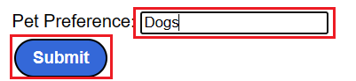

    A browser pop-up will appear indicating a 403 status error and suggesting you log into the application.

    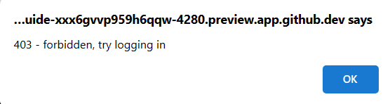

1. Close the dialog and click the login link on the bottom of the application

    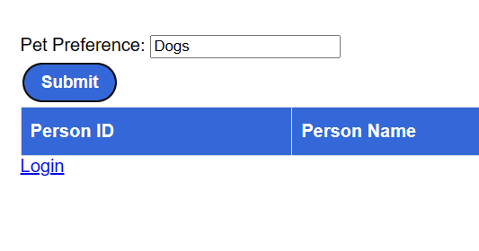

1. On the Azure Static Web Apps Auth page, give yourself a username in the Username text field.

    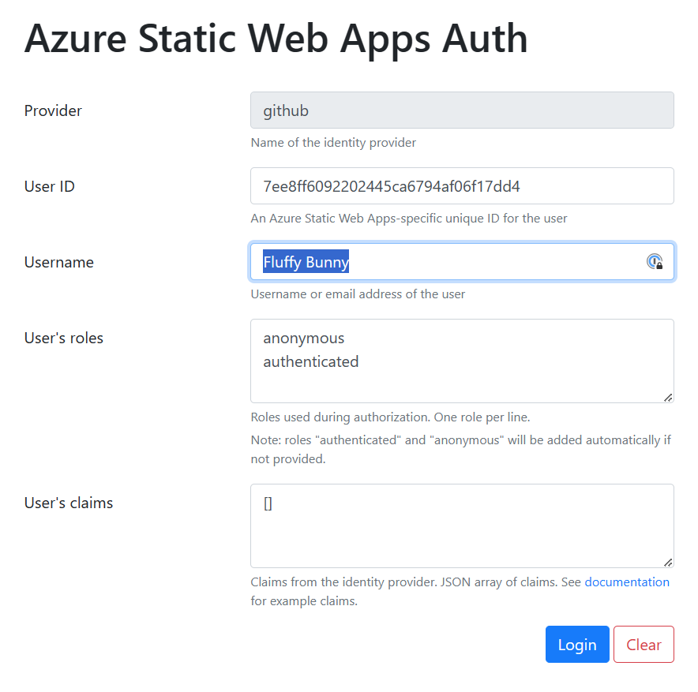

1. Click the Login button on the bottom right of the page.

    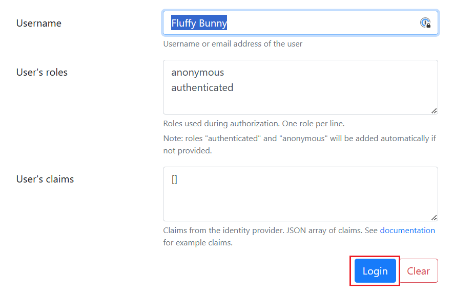

    This will take you back to the sample application.

1. In the sample application, again, enter Dogs into the Pet Preference text field and click submit. There will no longer be a 403 Status Error and the table will contain data returned by the REST enabled stored procedure.

    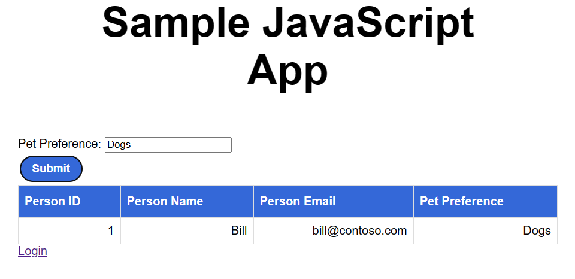

1. Click the Logoff link

    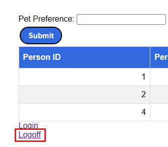

1. Stop SWA CLI in the terminal in the codespace with a Ctrl-C.

### Working with the ToDo Application

1. Now that you see how SWA CLI works, it's time to try the more complex Todo application. We are going to use 2 versions of this. The first one will use only the `/rest/todo` REST endpoint with the second one adding the stored procedure table APIs for inserts, updates, and deletes. This using of these table API/Stored procedures will become more clear once we deploy onto Azure SQL Database in the Azure Cloud.

1. With SWA CLI stopped, the **swa-cli.config.json** file needs to be swapped with the one in the labFiles folder. Run the following commands at the terminal to do just that.

    Start in the /workspaces/azure-sql-db-developers-workshop directory

    ```bash
    cd /workspaces/azure-sql-db-developers-workshop
    ```

    Then, move the original file into the labFiles directory

    ```bash
    mv swa-cli.config.json labFiles/swa-cli.config.json.sampleJSapp
    ```

    Now, move the new file from the labFiles directory into the home directory

    ```bash
    mv labFiles/swa-cli.config.json.todo ./swa-cli.config.json
    ```

1. Next, build the project with the following command at the terminal

    ```bash
    swa build
    ```

1. And start swa cli, again at the terminal

    ```bash
    swa start 
    ```

1. As with the sample JavaScript application, once Static Web Apps has started, you will get a message in the codespace on the bottom right indicating that it's running on port 4280.

    

1. Click the **Open in Browser** green button to access the sample application in the same dialog box

    

1. The ToDo application is now running in the browser

    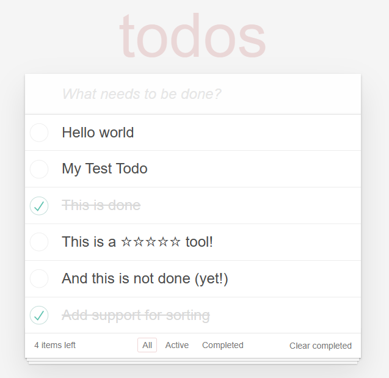

1. In the ToDo application, you can mark tasks completed

    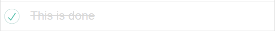

    add tasks

    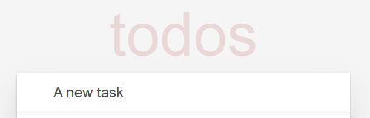

    delete tasks

    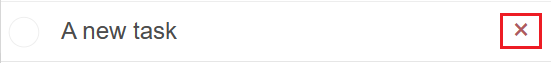

    edit task titles by double clicking on the title

    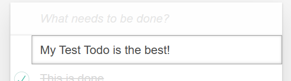

    and reposition tasks by dragging and dropping

    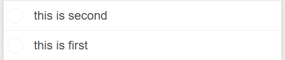

    in the terminal, you can watch as the REST endpoints are called for each of these activities

    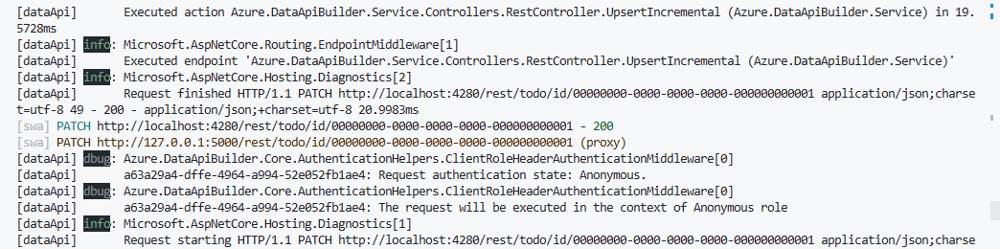

#### Authentication and the Todo application

1. Stop SWA CLI in the terminal in the codespace with a Ctrl-C.

1. Open the **staticwebapp.database.config.json** file (in the swa-db-connections folder) and replace the permissions section for the Todo table

    ```JSON
      "permissions": [
        {
          "role": "anonymous",
          "actions": [
            {
              "action": "*"
            }
          ]
        }
      ],
    ```

    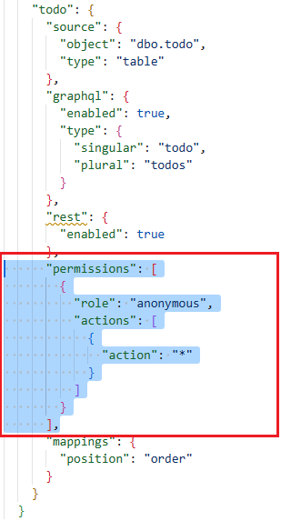

    with the following code:

    ```JSON
      "permissions": [
        {
          "role": "anonymous",
          "actions": [
            {
              "action": "*",
              "policy": {
                "database": "@item.owner_id eq 'public'"
              }
            }            
          ]
        },
        {
          "role": "authenticated",
          "actions": [
            {
              "action": "*",
              "policy": {
                "database": "@item.owner_id eq @claims.userId"
              }
            }            
          ]
        }        
      ],
    ```

    and **save the file**.

    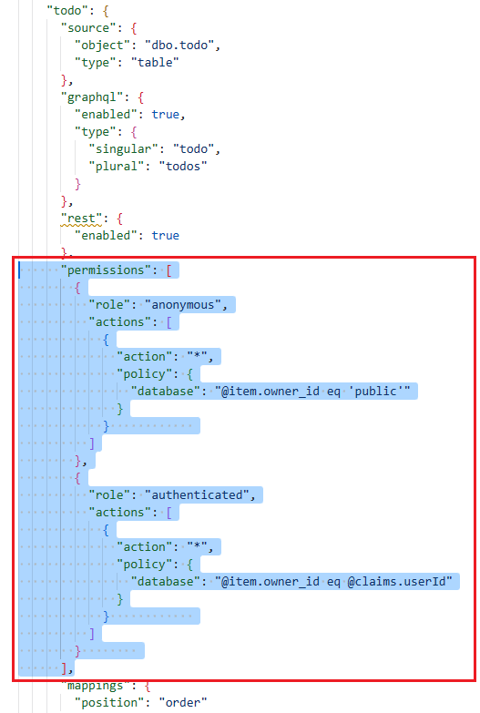

1. If you didn't already, **save the file**.

1. Start swa cli, again at the terminal

    ```bash
    swa start
    ```

1. Open the Todo application in the browser if not already open. If opened, refresh the page.

1. You can use the login link to authenticate

    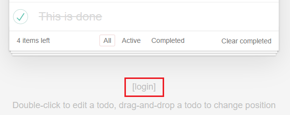

    and create tasks that are specific to the user logged in.

    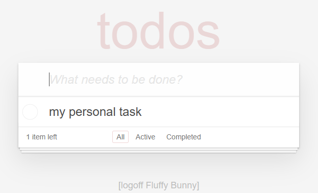

    And you can see the owner_id in the Todo table in the database as the tasks are created

    

#### Using REST enabled stored procedures with the Todo application

1. Start by logging out of the Todo application with the logoff link.

    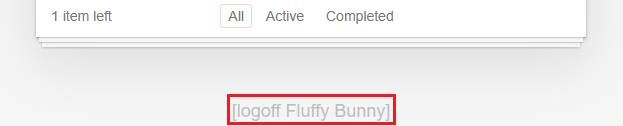

1. Stop SWA CLI in the terminal in the codespace with a Ctrl-C.

1. For this next step, we are going to swap out the `ToDoList.vue` file in the client/src/components directory with the one in the labFiles folder. Run the following commands at the terminal to swap the files.

    ```bash
    cd /workspaces/azure-sql-db-developers-workshop
    ```

    Then, move the original file into the labFiles directory

    ```bash
    mv client/src/components/ToDoList.vue labFiles/ToDoList.vue.DAB1
    ```

    Now, move the new file from the labFiles directory into the components directory

    ```bash
    mv labFiles/ToDoList.vue.SP client/src/components/ToDoList.vue
    ```

    This new `ToDoList.vue` file has moved away from using the table endpoint we created with Data API builder to using the REST enabled stored procedures. This can be seen in the section here:

    ```vue
    const API_INSERT = "/data-api/rest/insert_todo";
    const API_UPDATE = "/data-api/rest/update_todo";
    const API_DELETE = "/data-api/rest/delete_todo";
    ```

1. Start swa cli, again at the terminal. This will now use the new `ToDoList.vue` file.

    ```bash
    swa start 
    ```

1. Once swa cli has started, you can go back to the application in the browser and refresh the page. All the features of the application should function normally but are now using REST enabled stored procedures.

    You can see the new calls in the terminal to the REST enabled stored procedure endpoints

    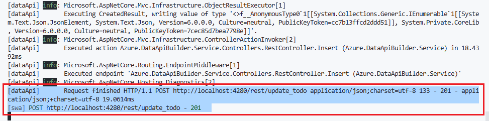

    Moving to stored procedures/table APIs will allow us to insert some logic before or after DML in the code. More on this in a later chapter.

1. Stop SWA CLI in the terminal in the codespace with a Ctrl-C.
