# Deploy the database objects to the Azure SQL Database

The next section of the workshop will be using an Azure SQL Database. To move our development environment into the cloud, all that is needed to be done is use SQL Database Projects and point it at an Azure SQL Database. The deploy feature will then create the objects in the selected cloud database just as it did with the local SQL Server database in the code space.

## Deploy to Azure workshop tasks

### Create a free Azure SQL Database

1. Ensure you have an Azure account to log into the Azure Portal. Need a free account? Sign up for one [here](https://azure.microsoft.com/en-us/free).

1. Navigate to the [Azure Portal](https://portal.azure.com/#home), and in the upper left corner, click the menu button.

    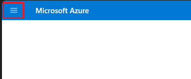

1. Then, select **Create a Resource**.

    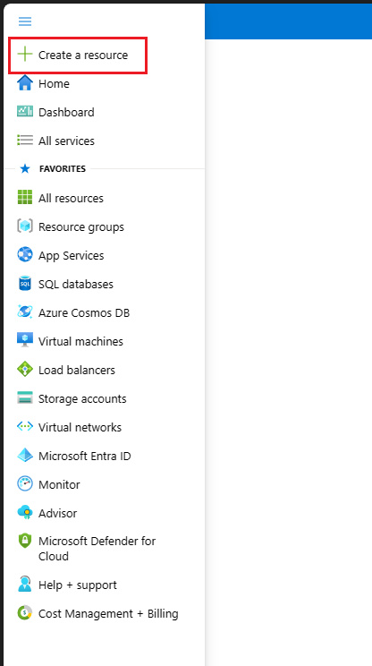

1. In the category menu, select **Databases**.

    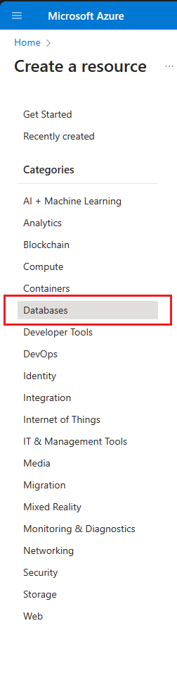

1. Then click **create** for **SQL Database**.

    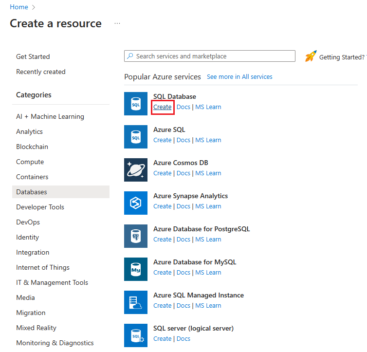

1. On the **Create SQL Database** page, click the **Apply offer (Preview)** button for the free Azure SQL Database.

    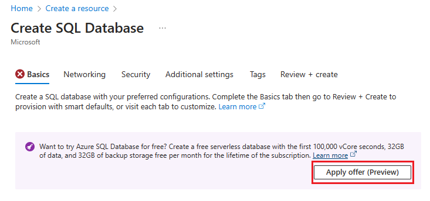

1. In the **Project details** section of the page, select a subscription and a Resource group if you have an existing one. 

    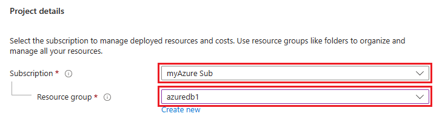

    Otherwise you can create a Resource group by clicking the **Create new** button.

    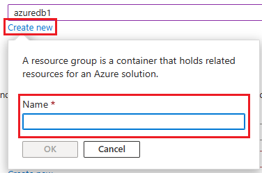

1. Next, in the **Database details** section of the page, name your database **freedb** with the **Database name** field.

    

1. For the **Server**, click the **Create new** button.

    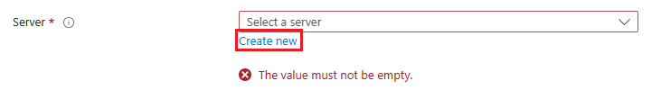

1. On the **Create SQL Database Server** page, enter a **server name** and choose a **Location** using the dropdown menu.

    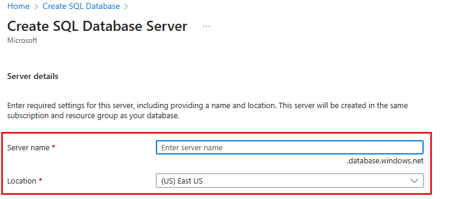

1. Now, in the **Authentication** section, select the **radio button** for **Use both SQL and Microsoft Entra authentication**.

    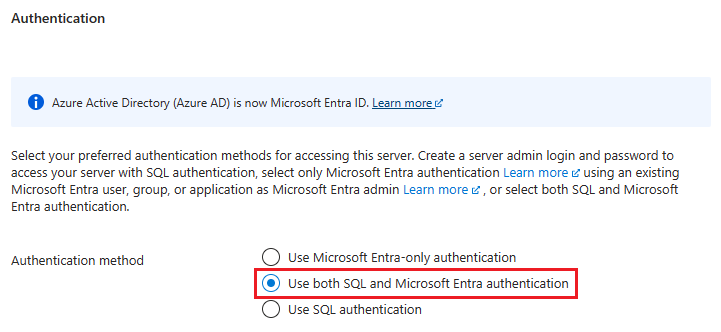

1. Click the **Set admin** link in the **Set Microsoft Entra admin** section. 

    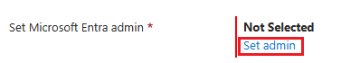

1. Using the **Microsoft Entra ID** blade, find your user account and select it as an admin. Then click the **Select** button on the bottom left.

    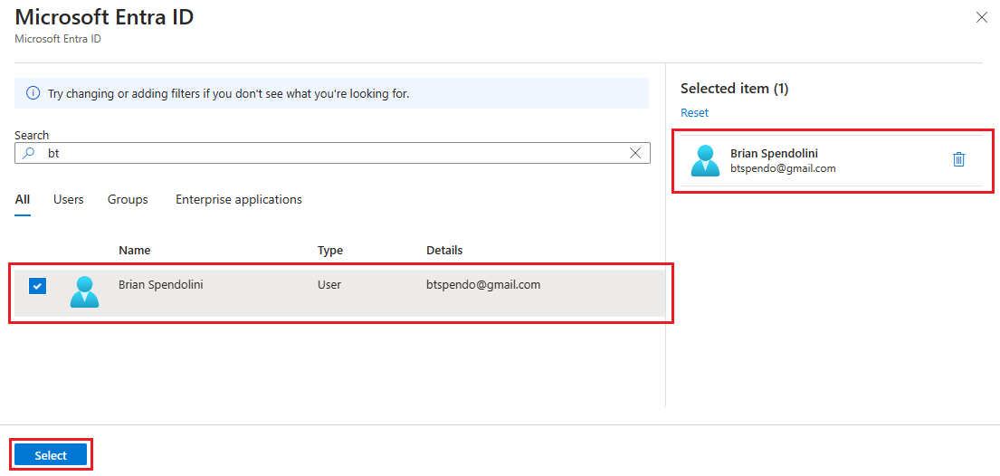

1. Set the **Server admin login** as sqladmin and then enter a strong password for the password fields.

    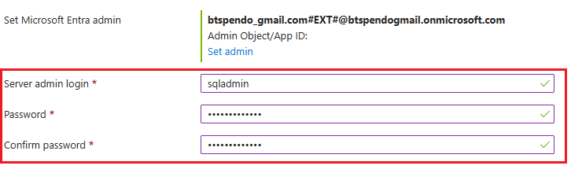

1. Click the **OK** button on the bottom left of the page.

1. Back on the **Create a SQL Database** page, verify the values you entered and that the free database offer has been applied. Then click the **Review + create** button in the lower left of the page.

    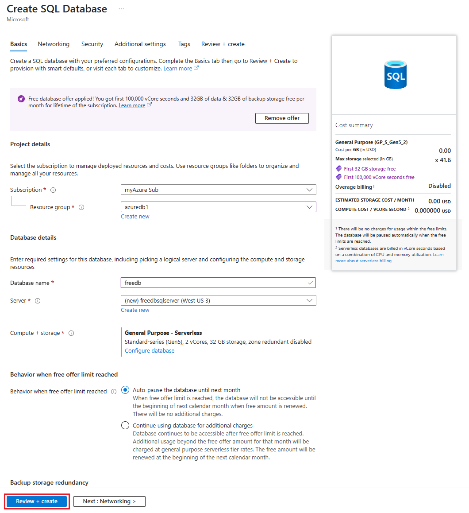

1. On the following page, click the **Create** button in the lower left.

    

1. The following page will detail the deployments progress.

    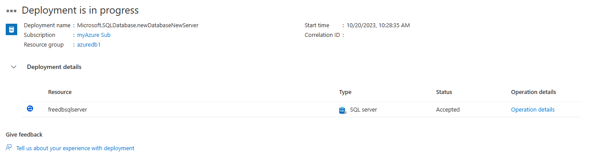

1. Once the deployment is done, click the blue **Go to resource** button to see your database details.

    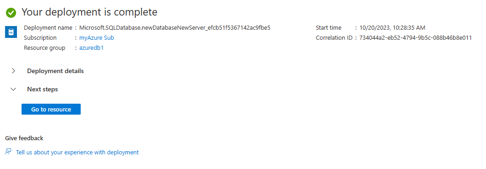

#### Network access to the database

1. On the database details page, the right hand side, you will see the **Server name** field with a link the your database server. Click the server name link.

    

1. Click the **Networking** link on the left hand side menu in the **Security** section.

    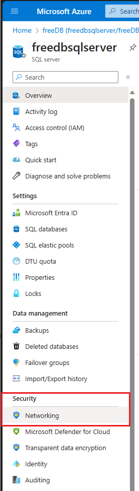

1. On the **Networking** page, click the **radio button** next to **Selected networks**.

    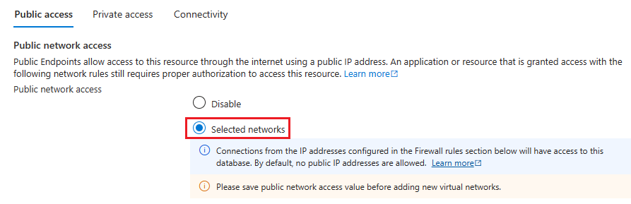

1. In the **Firewall rules** section, click the button labeled **"Add your client IPv4 address (X.X.X.X)"** to add your local IP address for database access.

    

1. Finally, click the **Save** button in the lower left of the page.

    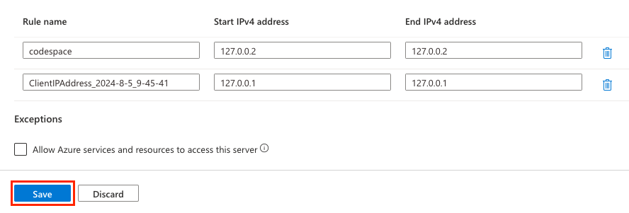

### Create a connection profile to the free Azure SQL Database

1. While still in the Azure Portal, using the menu on the left side, open the menu items under **Settings** if not already opened. Then select **SQL Databases** by clicking on it.

    

1. Next, on the main page, find the freedb you created and click on it navigate to the database details page.

    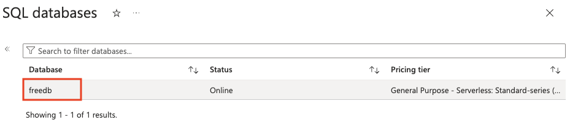

1. On the database details page, using the menu bar on the left, find and click on **Connection strings** under the **Settings** menu. You may have to expand settings to find Connection strings under it.

    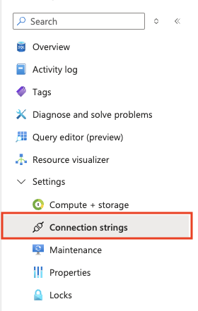

1. On the **ADO.NET** tab, find the **ADO.NET (SQL authentication)** entry and copy that connect string.

    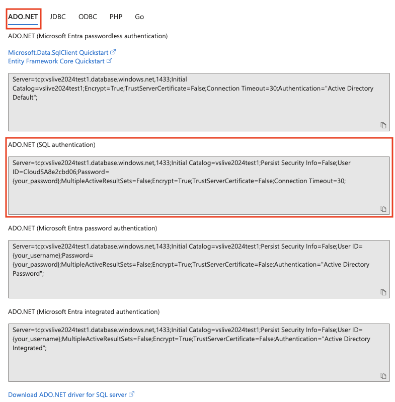

1. Back in the codespace, using the extensions panel, select the **SQL Server connections extension**

    

    and create a new connection by clicking the plus sign on the upper right in the extension.

    

1. In the Create Connection dialog box, **paste** in the **ADO.NET (SQL authentication)** connect string you copied. **Make sure you change the username and password to be the values you used when creating the database. (sqladmin and password)**

    

1. Provide the profile name of "Free Azure Database" in the last dialog box for this step. Press Enter to finish the connection profile process.

    

    * After pressing Enter and the connection profile is verified, a warning box **may** appear on the lower right of the screen. This warning is indicating that due to new security features within the database, you need to enable the self-signed certificate.
        Click the Enable Trust Server Certificate green button to continue.

        

    * There is now a connection to the Azure SQL Database running in the cloud in the code space you can use for deployment and further development.

        

### Publish to an Azure SQL Database

1. To publish the database code to the Free Azure SQL Database, **right click** on the project and select **Publish**.

    

1. Select "Publish to an existing Azure SQL logical server" on the first step

    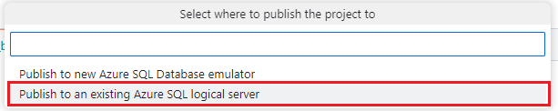

1. Next, select "Don't use profile"

    

1. Choose the **Free Azure Database** connection you created previously for the connection profile step

    

1. Choose **freedb** as the database.

    

1. And finally, for the action, choose **Publish**.

    

1. Once the dacpac is published into the database,

    

    you can go to the SQL Server Connection extension, reload the database objects by right clicking it and selecting refresh,

    

     then open the Tables and Programmability folders to see the deployed objects.

    

### Verify the deployed database objects and data

1. While still on the **SQL Server Connections extension**, right click the database profile name,**Free Azure Database**, and select **New Query**. This will bring up a new query sheet.

    

1. Run the following code in the query sheet:

    ```SQL
    select * from dbo.person;

    select p.person_name, a.address
    from dbo.person p inner join dbo.[address] a
    on p.person_id = a.person_id;
    
    select * from dbo.todo;
    go
    ```

1. You can also test out the stored procedure with the following code:

    ```SQL
    exec get_person_by_pet 'Dogs';
    ```

## Would you like to know more?

### Azure SQL migration extension for Azure Data Studio

The Azure SQL migration extension for Azure Data Studio enables you to assess, get right-sized Azure recommendations and migrate your SQL Server databases to Azure. You can use the Azure SQL Migration extension to assess SQL Server databases running on Windows or Linux.

The Azure SQL Migration extension for Azure Data Studio offers these key benefits:

* A responsive UI for an end-to-end migration experience. The extension starts with a migration readiness assessment and SKU recommendation (preview) (based on performance data).
* An enhanced assessment mechanism that can evaluate SQL Server instances. The extension identifies databases that are ready to migrate to Azure SQL targets.
* An SKU recommendation engine that collects performance data from the on-premises source SQL Server instance and then generates right-sized SKU recommendations based on your Azure SQL target.
* A reliable Azure service powered by Azure Database Migration Service that orchestrates data movement activities to deliver a seamless migration experience.
* You can run your migration online (for migrations that require minimal downtime) or offline (for migrations where downtime persists throughout the migration) depending on your business requirements.
* You can configure a self-hosted integration runtime to use your own compute resources to access the source SQL Server instance backup files in your on-premises environment.
* Provides a secure and improved user experience for migrating TDE databases and SQL/Windows logins to Azure SQL.

### Proof of concepts and samples

* [SQL Server migration one-click PoC to Azure SQL](https://aka.ms/SQLMigrationPoC)
* [Migrate databases at scale using Azure Database Migration automation](https://github.com/Azure-Samples/data-migration-sql)

## Continue to chapter 6

Click [here](./6-JSON-in-the-db.md) to continue to chapter 6, JSON in the database!