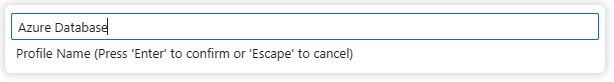

# Deploy the database objects to the Azure SQL Database

The next section of the workshop will be using an Azure SQL Database. To move our development environment into the cloud, all that is needed to be done is use SQL Database Projects and point it at an Azure SQL Database. The deploy feature will then create the objects in the selected cloud database just as it did with the local SQL Server database in the code space.

## Deploy to Azure workshop tasks

### Create a connection profile

1. Using the extensions panel, select the **SQL Server connections extension**

    

    and create a new connection by clicking the plus sign on the upper right in the extension.

    

1. Use the following values for the Create Connection dialog boxes:

    * Use “**vslivedemo.database.windows.net**” as the server name, then press Enter.
        

    * Use “**vslivedemo**” as the database name, then press Enter.
        

    * In the Authentication Type dialog box, select “SQL Login“.
        

    * Refer back to the credentials supplied to you for the username and password. It would be in the format of “vsliveuser**X**” as the user name, **replacing X with the number of the database user you were given**

        In the User name (SQL Login) dialog box, enter the user from the supplied credentials, then press Enter.
        

        and provide the password from the supplied credentials in the Password (SQL Login) dialog box, then press Enter.
        

    * Select “Yes” so that the password is saved (encrypted) on the connection profile
        

    * Provide the profile name of "Azure Database" in the last dialog box for this step. Press Enter to finish the connection profile process.
        

    * After pressing Enter and the connection profile is verified, a warning box **may** appear on the lower right of the screen. This warning is indicating that due to new security features within the database, you need to enable the self-signed certificate.
        Click the Enable Trust Server Certificate green button to continue.

        

    * There is now a connection to the Azure SQL Database running in the cloud in the code space you can use for deployment and further development.

        

### Create a post deployment script

1. Return to the Database Projects extension, 

    


    and right click the project name (devDB) and select **Add Post-Deployment Script**

    

1. Keep the default name of **Script.PostDeployment1** and press enter/return.

    


1. Replace the files contents with the following SQL statements

    ```SQL
    insert into dbo.person(person_name, person_email, pet_preference) values('Bill','bill@computer.com','Dogs');
    insert into dbo.person(person_name, person_email, pet_preference) values('Frank', 'frank@computer.com','Cats');
    insert into dbo.person(person_name, person_email, pet_preference) values('Riley', 'Riley@computer.com','Cats');
    insert into address (person_id, address) values (1, 'Lincoln, MA');
    insert into address (person_id, address) values (2, 'Baltimore, MD');
    GO
    ```

    and **SAVE** the file.

    

### Publish to an Azure SQL Database

1. To publish the database code to the local database, **right click** on the project and select **Publish**.

    

1. Select "Publish to an existing Azure SQL logical server" on the first step

    

1. Next, select "Don't use profile"

    

1. Choose the **Azure Database** connection you created previously for the connection profile step

    

1. Choose **vslivedemo** as the database.

    

1. And finally, for the action, choose **Publish**.

    

1. Once the dacpac is published into the database,

    

    you can go to the SQL Server Connection extension, reload the database objects by right clicking it and selecting refresh,

    

     then open the Tables and Programmability folders to see the deployed objects.

    

### Verify the deployed database objects and data

1. While still on the **SQL Server Connections extension**, right click the database profile name,** Azure Database**, and select **New Query**. This will bring up a new query sheet.

    

1. Run the following code in the query sheet:

    ```SQL
    select * from person;
    select p.person_name, a.address
    from person p, address a
    where p.person_id = a.person_id;
    go
    ```

1. You can also test out the stored procedure with the following code:

    ```SQL
    exec dbo.get_person_by_pet 'Dogs';
    ```
