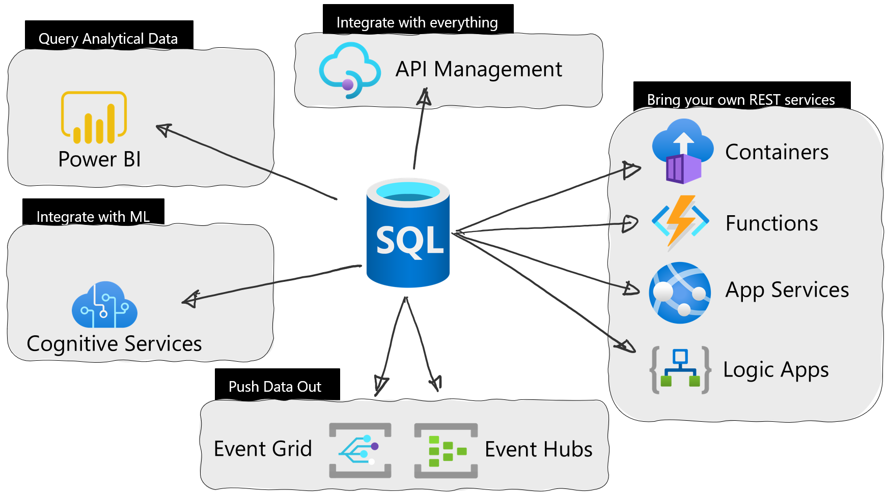
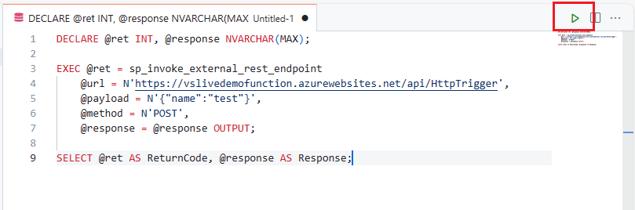
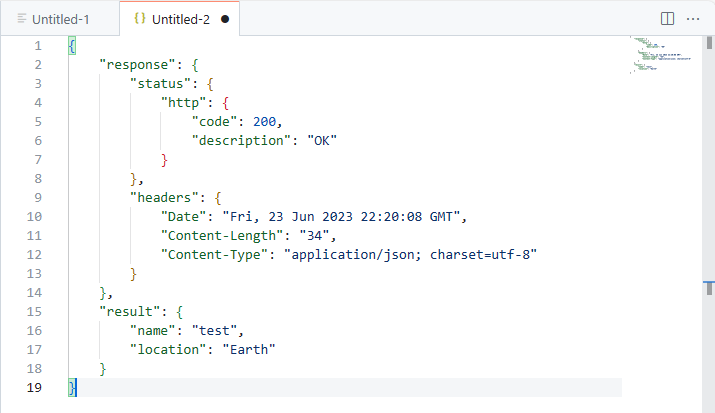

# Call REST services from the Azure SQL Database with External REST Endpoint Invocation



## External REST Endpoint Invocation

Azure SQL Database External REST Endpoint Invocation provides the ability to call REST endpoints from other Azure services such as OpenAI, communications, Azure Functions, PowerBI and more. Common use cases for developers to use External REST Endpoint Invocation are:

* Ability to push business logic out of the database and into Azure Functions
* Pull/push data to/from external sources (including Azure Blob Storage) for ETL or derived data stores
* Participate in event based architectures with Azure Event Hub or Kafka

External REST Endpoint Invocation can be called in an Azure SQL Database using the sp_invoke_external_rest_endpoint stored procedure. The following exercises and examples will guide you through calling various Azure Services and seeing how you can integrate REST into your applications and database development implementations.

## External REST Endpoint Invocation workshop tasks

### Call an Azure Function with External REST Endpoint Invocation

In the first example, a sample Azure Function has been created to be used. The function takes in a JSON payload with a currency type and responds with a conversion rate. This example illustrates how External REST Endpoint Invocation can use a web service in queries and reporting.

By default, External REST Endpoint Invocation expects a JSON payload in the response but this can be overridden to be XML or text.

The pre-created function is as follows:

```C#
#r "Newtonsoft.Json"

using System.Net;
using Microsoft.AspNetCore.Mvc;
using Microsoft.Extensions.Primitives;
using Newtonsoft.Json;
using System.Text;

public static async Task<HttpResponseMessage> Run(HttpRequest req, ILogger log)
{
    log.LogInformation("C# HTTP trigger function processed a request.");

    string currency = req.Query["currency"];
    double conversion = 1;
    string requestBody = await new StreamReader(req.Body).ReadToEndAsync();
    dynamic data = JsonConvert.DeserializeObject(requestBody);
    currency = currency ?? data?.currency ?? "USD";

    
    if (currency == "JPY")
        {
            conversion = 147.81;
        }
    else if (currency == "EUR")
        {
            conversion = 0.93;
        }
    else
        {
            conversion = 1;
        }

    var myObj = new {currency = $"{currency}", priceConversion = $"{conversion}"};
    var jsonToReturn = JsonConvert.SerializeObject(myObj);
    return new HttpResponseMessage(HttpStatusCode.OK) {
        Content = new StringContent(jsonToReturn, Encoding.UTF8, "application/json")
    };
}
```

1. Start in the **SQL Server Connections extension** and right click the database profile name, **Azure Database**, and select **New Query**. This will bring up a new query sheet.

    

1. We are going to start by creating a sample table. Copy and paste the following code into the query sheet

    ```SQL
    CREATE TABLE [dbo].[products]
    (
        [product_id] [int] NOT NULL,
        [product_name] [nvarchar](1000) NOT NULL,
        [ListPrice] [money] NOT NULL
    ) 
    GO
    
    insert into dbo.products (product_id, product_name, ListPrice)
    values 
        (1,N'Candy',1.99),
        (2,N'Bike',100.00),
        (3,N'Doll',15.99),
        (4,N'Goo',189.50);
    GO

    select * from dbo.products;
    GO
    ```

> [!NOTE]
> The server name in the URL parameter on the next example is functionsdemo. Please change this value to align with your server name in your account.
> 

1. To execute the code, **left click the green arrow** on the top right of the query sheet.

    

1. Next, in the query sheet, copy and paste the following SQL code:

    ```SQL
    DECLARE @ret INT, @response NVARCHAR(MAX), @priceConversion float;
    
    EXEC @ret = sp_invoke_external_rest_endpoint
      @url = N'https://functionsdemo.azurewebsites.net/api/HttpTriggerFunction',
      @payload = N'{"currency":"JPY"}',
      @method = N'POST',
      @response = @response OUTPUT;
    
    SELECT @ret AS ReturnCode, @response AS Response;
    
    -- Select JSON values
    select 
        JSON_VALUE( @response,'$.result.currency') AS currency,
        JSON_VALUE( @response,'$.result.priceConversion') AS priceConversion;

    -- Use in a query
    set @priceConversion = (select JSON_VALUE( @response,'$.result.priceConversion') AS priceConversion);
    
    select product_id, product_name, ListPrice, cast(round(ListPrice*@priceConversion,2,1) as money) AS convertedPriceInYen
    from dbo.products
    ```

    This T-SQL code calls the External REST Endpoint Invocation stored procedure (sp_invoke_external_rest_endpoint) and passes it the following values:

    * **ret**: The **return value** of the REST call. It will be 0 if the call is a success (status 200), or the status code if not successful. If the call to the endpoint cannot by done, it will throw an exception.
    * **url**: This is the URL endpoint of the REST service we want to use
    * **payload**: The JSON payload we are POSTing into the service endpoint. Here is contains a single attribute name with a value of test.
    * **method**: This is the HTTP method we are calling. It can be GET, POST, PATCH, PUT or DELETE. By default, if you do not pass this value it will use POST.
    * **response**: The REST endpoint's response to the call.

    Not used in this call:

    * **headers**: These are name and value pairs that represent meta-data for a request.  Headers can contain information for content type of the request, authentication and authorization, character sets and even cache control.
    * **credentials**: Indicates which **DATABASE SCOPED CREDENTIAL** object is used to inject authentication info in the HTTPS request. These are placed in the header of the request.
    * **timeout**: Time in seconds allowed for the HTTPS call to run. The default value 30 and accepted values are 1 through 230.

1. To execute the code, **left click the green arrow** on the top right of the query sheet.

    

1. The result will appear in a new editor tab just to the right of the one that was used to execute the T-SQL code.

    

1. Click on the response text in the Results table

    

1. A new editor sheet will open with the results of the REST call which will look similar to this JSON:

    ```JSON
    {
        "response": {
            "status": {
                "http": {
                    "code": 200,
                    "description": "OK"
                }
            },
            "headers": {
                "Date": "Tue, 24 Oct 2023 19:08:50 GMT",
                "Content-Length": "45",
                "Content-Type": "application/json; charset=utf-8"
            }
        },
        "result": {
            "currency": "JPY",
            "priceConversion": "147.81"
        }
    }
    ```

1. Looking at the 2 returned tables,

    

    the first one contains the extracted JSON values from the SQL

    ```SQL
    -- Select JSON values
    select 
        JSON_VALUE( @response,'$.result.currency') AS currency,
        JSON_VALUE( @response,'$.result.priceConversion') AS priceConversion;
    ```

    And the last table shows how you can use extracted values from a REST endpoint response in queries and reports to augment values.
    
    ```SQL
    -- Use in a query
    set @priceConversion = (select JSON_VALUE( @response,'$.result.priceConversion') AS priceConversion);
    
    select product_id, product_name, ListPrice, cast(round(ListPrice*@priceConversion,2,1) as money) AS convertedPriceInYen
    from dbo.products
    ```

### Using Azure OpenAI Service and External REST Endpoint Invocation

Azure OpenAI Service provides REST API access to OpenAI's powerful language models including ChatGPT, Codex and Embeddings model series. These new services can be accessed through REST APIs, Python SDK, or our web-based interface in the Azure OpenAI Studio. GPT-3, GPT-3.5, and GPT-4 models from OpenAI are prompt-based; the user interacts with the model by entering a text prompt, to which the model responds with a text completion. The following examples will use the chat service REST APIs.

The scenario is as follows: using the data we have in the person table, we will ask ChatGPT to provide us some marketing material for switching a pet preference. If a person indicated they like cats, the example will prompt ChatGPT to create ad copy from a marketing executive on why they should love dogs. If they indicated dogs, this will provide copy for loving cats. The example will provide the prompt with Cues and Supporting Content to help guide the response to what was asked.  Cues act as the "jumpstart" for the output of the model, helping to direct the model to the desired output. Supporting content is information that the model can utilize to influence the output in some way such as the current date, the name of the user, and user preferences.

Additional Best Practices from the documentation:

* **Be Specific**. Leave as little to interpretation as possible. Restrict the operational space.
* **Be Descriptive**. Use analogies.
* **Double Down**. Sometimes you may need to repeat yourself to the model. Give instructions before and after your primary content, use an instruction and a cue, etc.
* **Order Matters**. The order in which you present information to the model may impact the output. Whether you put instructions before your content (“summarize the following…”) or after (“summarize the above…”) can make a difference in output. Even the order of few-shot examples can matter. This is referred to as recency bias.
* **Give the model an "out"**. It can sometimes be helpful to give the model an alternative path if it is unable to complete the assigned task. For example, when asking a question over a piece of text you might include something like "respond with ‘not found’ if the answer is not present". This can help the model avoid generating false responses.

### What prompt text will be sent

1. The chat REST API is expecting some text for the prompt so ChatGPT knows how to respond. The following query will dynamically create this prompt based on the person_id we supply it. Looking at the adcopy variable, this is used to dynamically create the prompt text by using the person's name and pet perference.

    ```SQL
    select 'You are an experienced marketing expert named Don Chase Katz. Generate 200 letters of ad copy to '
    + person_name + 
    ' to convince them to love ' + 
    case when pet_preference = 'Cats' then 'Dogs' 
         when pet_preference = 'Dogs' then 'Cats' 
    end
    from person
    where person_id = 1;
    ```

    The resulting prompt is the following for person_id 1, which is Bill whom has a pet preference of Dogs:

    ```quote
    "You are an experienced marketing expert named Don Chase Katz. Generate 200 letters of ad copy to Bill to convince them to love Cats"
    ```

### Sending the prompt text with External REST Endpoint Invocation

> [!NOTE]
> The server name in the URL parameter on the next example is `aidemo` and the headers parameter value for api-key is `1234567890`.
> Please change this name and key to align with the values in your account.
> 

1. Open a new query sheet

    

    and paste the following T-SQL code into a new query editor sheet in the codespace.

    ```SQL
    declare @adcopy VARCHAR(500);
    
    set @adcopy =
    (select 'You are an experienced marketing expert named Don Chase Katz. Generate 200 letters of ad copy to '
    + person_name + 
    ' to convince them to love ' + 
    case when pet_preference = 'Cats' then 'Dogs' 
         when pet_preference = 'Dogs' then 'Cats' 
    end
    from person
    where person_id = 1);
    
    declare @url nvarchar(4000) = N'https://aidemo.openai.azure.com/openai/deployments/chattycathy/chat/completions?api-version=2023-07-01-preview';
    declare @headers nvarchar(102) = N'{"api-key":"1234567890"}'
    declare @payload nvarchar(max) = N'{"messages":[{"role":"system","content":"'+(@adcopy)+'"}]}'
    declare @ret int, @response nvarchar(max);
    
    exec @ret = sp_invoke_external_rest_endpoint 
    	@url = @url,
    	@method = 'POST',
    	@headers = @headers,
    	@payload = @payload,
        @timeout = 230,
    	@response = @response output;
    	
    select @ret as ReturnCode, @response as Response;

    select json_value(@response, '$.result.choices[0].message.content') as [Message];
    ```

1. Once the code is in the codespace query editor sheet, run it with the green run arrow in the upper right.

    

    The response message will be similar to the following:

    ```JSON
    {
        "response": {
            "status": {
                "http": {
                    "code": 200,
                    "description": ""
                }
            },
            "headers": {
                "Cache-Control": "no-cache, must-revalidate",
                "Date": "Fri, 23 Jun 2023 23:11:30 GMT",
                "Content-Length": "2316",
                "Content-Type": "application/json",
                "access-control-allow-origin": "*",
                "apim-request-id": "a310d17f-427b-43ea-b34a-b80511715cfd",
                "openai-model": "gpt-35-turbo",
                "x-content-type-options": "nosniff",
                "openai-processing-ms": "9617.2848",
                "x-ms-region": "East US",
                "x-accel-buffering": "no",
                "x-request-id": "7300e59f-f78b-4f4c-97f2-f006374dbcba",
                "x-ms-client-request-id": "a310d17f-427b-43ea-b34a-b80511715cfd",
                "strict-transport-security": "max-age=31536000; includeSubDomains; preload",
                "azureml-model-session": "aoai-gpt35-05242023-2",
                "azureml-model-group": "online"
            }
        },
        "result": {
            "id": "chatcmpl-7UkDxMvX7fVNdepjViHIkpahuNsQv",
            "object": "chat.completion",
            "created": 1687561881,
            "model": "gpt-35-turbo",
            "prompt_annotations": [
                {
                    "prompt_index": 0,
                    "content_filter_results": {
                        "hate": {
                            "filtered": false,
                            "severity": "safe"
                        },
                        "self_harm": {
                            "filtered": false,
                            "severity": "safe"
                        },
                        "sexual": {
                            "filtered": false,
                            "severity": "safe"
                        },
                        "violence": {
                            "filtered": false,
                            "severity": "safe"
                        }
                    }
                }
            ],
            "choices": [
                {
                    "index": 0,
                    "finish_reason": "stop",
                    "message": {
                        "role": "assistant",
                        "content": "Dear Bill,
    As a marketing expert, I know the power of persuasion. So allow me to persuade you about the wonders of cats.
    First off, cats are independent creatures. They don’t require constant attention, like dogs do. This makes them the perfect companion for those leading busy lives. Plus, they’re great for introverted people who prefer the company of a quiet, yet loyal animal.
    Secondly, cats are incredibly clean animals. They groom themselves, eliminating the need for constant baths. Plus, they’re pretty skilled at using the litter box, meaning minimal mess for you.
    Thirdly, cats are incredible hunters. They possess incredible instincts, which allow them to hunt mice and other rodents that might invade your home. This makes them the perfect pest control alternative to toxic chemicals.
    Fourthly, cats are amazing stress-relievers. Petting a cat has been shown to release endorphins in your brain, which produces feelings of calmness and relaxation. Plus, the sound of a purring cat has a soothing effect on one's psyche.
    Fifthly, cats are low-maintenance. Unlike dogs, they don’t require you to take them on walks. They are happy to lounge in the sun, in your lap, or on their own.
    Finally, cats are adorable creatures. Their playful antics, cute meows, and affectionate nature will make your heart melt.
    In conclusion, Bill, I urge you to give cats a chance. They are low-maintenance, great hunters, calming, and beautiful creatures. They will fill your life with love and companionship. 
    Sincerely,
    Don Chase Katz"
                    },
                    "content_filter_results": {
                        "hate": {
                            "filtered": false,
                            "severity": "safe"
                        },
                        "self_harm": {
                            "filtered": false,
                            "severity": "safe"
                        },
                        "sexual": {
                            "filtered": false,
                            "severity": "safe"
                        },
                        "violence": {
                            "filtered": false,
                            "severity": "safe"
                        }
                    }
                }
            ],
            "usage": {
                "completion_tokens": 325,
                "prompt_tokens": 34,
                "total_tokens": 359
            }
        }
    }

    ```

### The Todo application, SWA, and External REST Endpoint Invocation

> [!NOTE]
> The server name in the URL parameter on the next example is `aidemo` and the headers parameter value for api-key is `1234567890`.
> Please change this name and key to align with the values in your account.
> 

In this next section, we will be using the Todo application against our Free Azure SQL Database. Then, we will be adding to the insert_todo stored procedure to call OpenAI via External REST endpoint invocation. We will be asking OpenAI to translate the Todo task's title into german and then insert that value into the table.

1. Back in the **SQL Server Connections extension**, right click the database profile name,**Free Azure Database**, and select **New Query**. This will bring up a new query sheet.

    

1. To avoid using an administrative account to allow the application to access the database, we will create a new user and grant it the necessary permissions. Copy and paste the following code into the query sheet, replacing `PASSWORD` with a password of your choice, then run it in the Query editor.

    ```SQL
    CREATE USER [swaappuser] WITH PASSWORD = 'PASSWORD';

    ALTER ROLE db_datareader ADD MEMBER [swaappuser];
    ALTER ROLE db_datawriter ADD MEMBER [swaappuser];
    GRANT EXECUTE ON SCHEMA::dbo TO [swaappuser];

    GRANT EXECUTE ANY EXTERNAL ENDPOINT TO [swaappuser];
    ```

1. Then, copy and paste the following code, then run it in the Query editor.

    ```SQL
    ALTER PROCEDURE dbo.insert_todo
        @title nvarchar(1000),
        @owner_id [varchar](128),
        @order int
    AS
    
        declare @translated_task VARCHAR(1000);
        declare @url nvarchar(4000) = N'https://aidemo.openai.azure.com/openai/deployments/chattycathy/chat/completions?api-version=2023-07-01-preview';
        declare @headers nvarchar(102) = N'{"api-key":"1234567890"}'
        declare @payload nvarchar(max) = N'{"messages":[{"role":"system","content":"Translate \"'+(@title)+'\" into german, only respond with the translation"}]}'
        declare @ret int, @response nvarchar(max);
    
    BEGIN
    
        exec @ret = sp_invoke_external_rest_endpoint 
            @url = @url,
            @headers = @headers,
            @method = 'POST',
            @payload = @payload,
            @timeout = 230,
            @response = @response output;
    
        set @translated_task = 
        (SELECT [translated_task]
        FROM OPENJSON(@response,'$.result.choices')
        WITH ([translated_task] NVARCHAR(100) '$.message.content'));
    
        insert into dbo.todo (title, owner_id, position)
        OUTPUT INSERTED.*
        values (ISNULL(@translated_task,@title), @owner_id, @order);
    
    END;
    GO
    ```

1. Now we need to change the database connection in the **.env** file to use our Free Azure SQL Database. Select the file in codespace and on the top, find the **MSSQL** variable that contains the connection string.

    

1. Change the connection string value to reflect the server name, database name of `freeDB`, User ID of `swaappuser` (if you used a different user name in the previous step), and the password you used when you created the database. It should look similar to the following:

    ```bash
    MSSQL='Server=freedbsqlserver.database.windows.net;Initial Catalog=freeDB;User ID=swaappuser;Password=PASSWORD;'
    ```

    and **save the file**.

    


1. Next, start swa cli again at the terminal

    ```bash
    swa start
    ```

1. Open the Todo application in a browser if not already opened, or refresh the current browser page where it was running.

1. Enter a task name and see the title instantly transformed into german.
 
    
