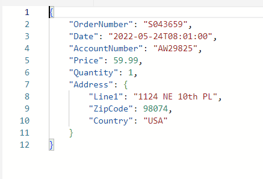
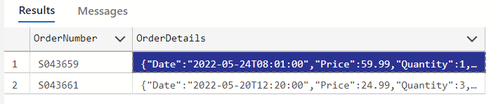

# Azure SQL Database Preview - JSON in the database

## JSON in the Azure SQL Database

Along with the the new JSON data type, transact-SQL supports various functions and operators that can be used to work with JSON documents in the Azure SQL database. The available functions are:

1. **[ISJSON](https://learn.microsoft.com/sql/t-sql/functions/isjson-transact-sql)**: Tests whether a string contains valid JSON.
1. **[JSON_PATH_EXISTS](https://learn.microsoft.com/sql/t-sql/functions/json-path-exists-transact-sql)**: Tests whether a specified SQL/JSON path exists in the input JSON string.
1. **[JSON_MODIFY](https://learn.microsoft.com/sql/t-sql/functions/json-modify-transact-sql)**: Updates the value of a property in a JSON string and returns the updated JSON string.
1. ANSI SQL JSON functions
    * **[JSON_VALUE](https://learn.microsoft.com/sql/t-sql/functions/json-value-transact-sql)**: Extracts a scalar value from a JSON string.
    * **[JSON_QUERY](https://learn.microsoft.com/sql/t-sql/functions/json-query-transact-sql)**: Extracts an object or an array from a JSON string.
1. ANSI SQL JSON constructors
    * **[JSON_OBJECT](https://learn.microsoft.com/sql/t-sql/functions/json-object-transact-sql)**: Constructs JSON object text from zero or more expressions.
    * **[JSON_ARRAY](https://learn.microsoft.com/sql/t-sql/functions/json-array-transact-sql)**: Constructs JSON array text from zero or more expressions.

The available operators are:

1. **[FOR JSON](https://learn.microsoft.com/sql/relational-databases/json/how-for-json-converts-sql-server-data-types-to-json-data-types-sql-server)**: Converts SQL Server data types to JSON types.
1. **[OPENJSON](https://learn.microsoft.com/sql/relational-databases/json/convert-json-data-to-rows-and-columns-with-openjson-sql-server)**: Converts JSON text into a set of rows and columns.

**New** in the Azure SQL Database:

1. **JSON_OBJECTAGG**: Construct a JSON object value from relational data
1. **JSON_ARRAYAGG**: Construct a JSON array value from relational data

## JSON in the Azure SQL Database workshop tasks

1. Start in the **SQL Server Connections extension** and right click the database profile name, **Azure Database**, and select **New Query**. This will bring up a new query sheet.

    

1. In the empty query sheet, enter the following SQL code. This statement creates the **Orders** table with the new **JSON** data type.

    ```SQL
    CREATE TABLE dbo.Orders (
        order_id int NOT NULL IDENTITY,
        order_info JSON NOT NULL
    );
    ```

1. Next, issue the following insert statements. They will be inserting JSON into the JSON type columns:

    ```SQL
    INSERT INTO dbo.Orders (order_info)
    VALUES ('
    {
        "OrderNumber":"S043659",
        "Date":"2022-05-24T08:01:00",
        "AccountNumber":"AW29825",
        "Price":59.99,
        "Quantity":1,
        "Address": {"Line1":"1124 NE 10th PL", "ZipCode":98074, "Country":"USA"}
    }'), ('
    {
        "OrderNumber": "S043661",
        "Date":"2022-05-20T12:20:00",
        "AccountNumber":"AW73565",
        "Price":24.99,
        "Quantity":3,
        "Address": {"Line1":"2145 145th SE Ave", "ZipCode":98052, "Country":"USA"}
    }');
    ```

### Querying JSON Data

1. Issue this select statement to see the inserted rows

    ```SQL
    SELECT * FROM dbo.Orders;
    ```

    

1. Click the order_info data cell 

    

    to see the JSON in the order_info column in a new window.

    

1. Using [JSON_VALUE](https://learn.microsoft.com/sql/t-sql/functions/json-value-transact-sql) and [JSON_QUERY](https://learn.microsoft.com/sql/t-sql/functions/json-query-transact-sql), JSON stored in the database can be extracted as a relational result set. Using the query sheet, issue the following command:

    ```SQL
    SELECT o.order_id
        , JSON_VALUE(o.order_info, '$.AccountNumber') AS account_number
        , JSON_VALUE(o.order_info, '$.Address.Line1') AS address_line1
        , JSON_QUERY(o.order_info, '$.Address') AS address_info
    FROM dbo.Orders as o;
    ```

1. With the next query, [JSON_VALUE](https://learn.microsoft.com/sql/t-sql/functions/json-value-transact-sql) is combined with the aggregate function [sum](https://learn.microsoft.com/sql/t-sql/functions/sum-transact-sql), to total values that are found within a JSON document stored in the database. Using the query sheet, issue the following command:

    ```SQL
    SELECT SUM(CAST(JSON_VALUE(o.order_info, '$.Price') as float)) AS total_price
         , SUM(CAST(JSON_VALUE(o.order_info, '$.Quantity') as int)) AS total_orders
      FROM dbo.Orders as o;
    ```

1. JSON can also be used as a parameter or variable with T-SQL. In the following example, JSON is used as a parameter to query. The function [JSON_PATH_EXISTS](https://learn.microsoft.com/sql/t-sql/functions/json-path-exists-transact-sql) is also used to check if a value/path exists in a JSON document. Using the query sheet, issue the following command:

    ```SQL
    DECLARE @json JSON = N'
    [
        {
            "OrderNumber": "S043659",
            "Date":"2022-05-24T08:01:00",
            "AccountNumber":"AW29825",
            "Price":59.99,
            "Quantity":1
        },
        {
            "OrderNumber": "S043661",
            "Date":"2022-05-20T12:20:00",
            "AccountNumber":"AW73565",
            "Price":24.99,
            "Quantity":3
        }
    ]';
    SELECT @json, JSON_PATH_EXISTS(@json, '$[0].OrderNumber') AS OrderNumberExists
        , JSON_QUERY(@json, '$[0]') as FirstOrder, JSON_Value(@json, '$[0].AccountNumber') as Account#;
    ```

### Working with JSON Data

1. For this next section, 2 tables need to be created first. Using the query sheet, issue the following command:

    ```SQL
    CREATE TABLE Accounts (
    	AccountNumber varchar(10) NOT NULL PRIMARY KEY,
    	Phone1 varchar(20) NULL,
    	Phone2 varchar(20) NULL,
    	Phone3 varchar(20) NULL
    );
    INSERT INTO Accounts (AccountNumber, Phone1, Phone2, Phone3)
    VALUES('AW29825', '(123)456-7890', '(123)567-8901', NULL),
    	('AW73565', '(234)0987-654', NULL, NULL);
    
    CREATE TABLE OrdersR (
    	OrderNumber varchar(10) NOT NULL PRIMARY KEY,
    	OrderTime datetime2 NOT NULL,
    	AccountNumber varchar(10) NOT NULL,
    	Price decimal(10, 2) NOT NULL,
    	Quantity int NOT NULL
    );
    GO
    ```

1. Next, while using a JSON document as a variable as was done in the previous step, this T-SQL statement will insert values into the OrdersR table. This example will transform the JSON string into relational data using the [OPENJSON](https://learn.microsoft.com/sql/relational-databases/json/convert-json-data-to-rows-and-columns-with-openjson-sql-server) operator. It then inserts the rows into the OrdersR table and displays the inserted rows. Using the query sheet, issue the following command:

    ```SQL
    DECLARE @json nvarchar(1000) = N'
    [
        {
            "OrderNumber": "S043659",
            "Date":"2022-05-24T08:01:00",
            "AccountNumber":"AW29825",
            "Price":59.99,
            "Quantity":1
        },
        {
            "OrderNumber": "S043661",
            "Date":"2022-05-20T12:20:00",
            "AccountNumber":"AW73565",
            "Price":24.99,
            "Quantity":3
        }
    ]';
    
    INSERT INTO OrdersR (OrderNumber, OrderTime, AccountNumber, Price, Quantity)
    OUTPUT inserted.*
    SELECT T.OrderNumber, T.OrderTime, T.AccountNumber, T.Price, T.Quantity
        FROM OPENJSON(@json)
        WITH (
            OrderNumber varchar(10) '$.OrderNumber', -- Use SQL/JSON path to extract a specific property from the JSON document and convert to a SQL value
            OrderTime datetime2 '$.Date',
            AccountNumber varchar(10) '$.AccountNumber',
            Price decimal(10, 2) '$.Price',
            Quantity int '$.Quantity'
        ) AS T;
    ```

1. Relational data can bw transformed into a JSON string using the new JSON_OBJECT and JSON_ARRAY functions. The new JSON_ARRAY function takes N values that can be specified as a constant, expression, variable, or column reference and formats them into a JSON array value. Using the query sheet, issue the following command:

    ```SQL
    SELECT o.OrderNumber,
    		JSON_OBJECT('Date':o.OrderTime, 'Price':o.Price, 'Quantity':o.Quantity, 
    			'AccountDetails':JSON_OBJECT('AccountNumber':o.AccountNumber,
                'PhoneNumbers':JSON_ARRAY(a.Phone1, a.Phone2, a.Phone3))) AS OrderDetails
      FROM OrdersR AS o
      JOIN Accounts AS a
        ON a.AccountNumber = o.AccountNumber;
    ```

1. Click the OrderDetails data cell 

    

    to see the JSON in the OrderDetails column in a new window.

      

1. Using JSON_OBJECTAGG with JSON_OBJECT/JSON_ARRAY constructors, relation data can be returned from multiple tables as a complete JSON document. Using the query sheet, issue the following command:

    ```SQL
    SELECT JSON_OBJECTAGG(
                    OrderNumber:JSON_OBJECT(
                            'Date':o.OrderTime, 'Price':o.Price, 'Quantity':o.Quantity,
                            'AccountDetails':JSON_OBJECT('AccountNumber':o.AccountNumber,
                            'PhoneNumbers':JSON_ARRAY(a.Phone1, a.Phone2, a.Phone3)))) 
            AS Orders
    FROM OrdersR AS o
        JOIN Accounts AS a
        ON a.AccountNumber = o.AccountNumber;
    ```
1. Click the Orders data cell

    

    to see the JSON in the Orders column in a new window.

      

1. In this example, JSON_ARRAYAGG is used with the JSON_ARRAY constructor to create a nested JSON array in an array. Using the query sheet, issue the following command:

    ```SQL
    SELECT JSON_ARRAYAGG(JSON_ARRAY(a.Phone1, a.Phone2, a.Phone3)) AS Phones
      FROM OrdersR AS o
      JOIN Accounts AS a
        ON a.AccountNumber = o.AccountNumber;
    ```

1. In the last example,  a JSON aggregates is used with a GROUP BY clause like any aggregate that exists in Azure SQL Database today. Using the query sheet, issue the following command:

    ```SQL
    SELECT schema_id, JSON_OBJECTAGG(name:object_id), JSON_ARRAYAGG(object_id), COUNT(*)
    FROM sys.all_objects
    GROUP BY schema_id;
    ```
