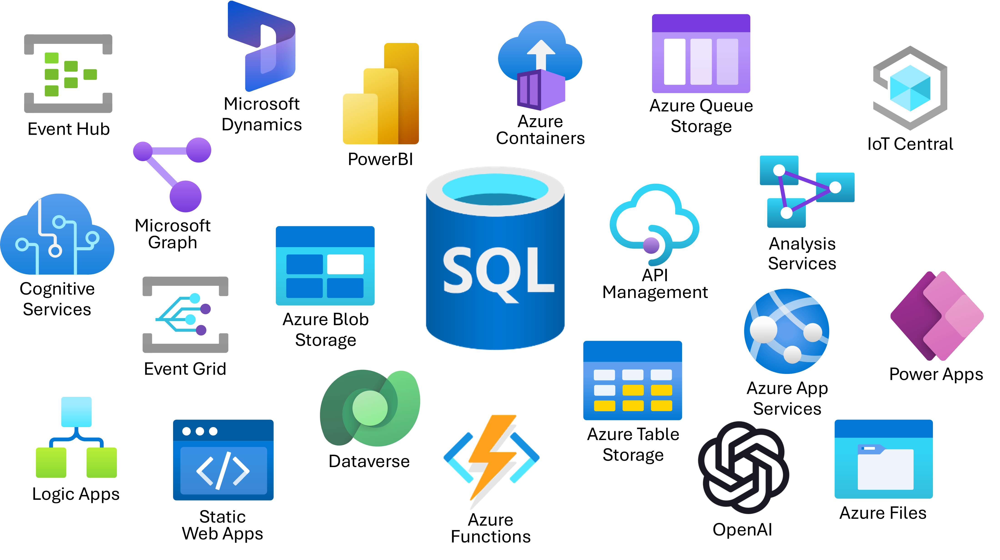

# Call REST services from the Azure SQL Database with External REST Endpoint Invocation



## External REST Endpoint Invocation

Azure SQL Database External REST Endpoint Invocation provides the ability to call REST endpoints from other Azure services such as OpenAI, communications, Azure Functions, PowerBI and more. Common use cases for developers to use External REST Endpoint Invocation are:

* Ability to push business logic out of the database and into Azure Functions
* Pull/push data to/from external sources (including Azure Blob Storage) for ETL or derived data stores
* Participate in event-based architectures with Azure Event Hub or Kafka

External REST Endpoint Invocation can be called in an Azure SQL Database using the sp_invoke_external_rest_endpoint stored procedure. The following exercises and examples will guide you through calling various Azure Services and seeing how you can integrate REST into your applications and database development implementations.

## External REST Endpoint Invocation workshop tasks

### Call an Azure Function with External REST Endpoint Invocation

In the first example, a sample Azure Function has been created to be used. The function takes in a JSON payload with a currency type and responds with a conversion rate. This example illustrates how External REST Endpoint Invocation can use a web service in queries and reporting.

By default, External REST Endpoint Invocation expects a JSON payload in the response, but this can be overridden to be XML or text.

The pre-created function is as follows:

```C#
using Microsoft.Azure.Functions.Worker;
using Microsoft.Extensions.Logging;
using Microsoft.AspNetCore.Http;
using Microsoft.AspNetCore.Mvc;

namespace func
{
    public class HttpTriggerFunctionSQL(ILogger<HttpTriggerFunctionSQL> logger)
    {
        private readonly ILogger<HttpTriggerFunctionSQL> _logger = logger;

        [Function(nameof(ConvertCurrency))]
        public IActionResult ConvertCurrency([HttpTrigger(AuthorizationLevel.Anonymous, "get", "post")] HttpRequest req, [FromBody] dynamic data)
        {
            string? currency = req.Query["currency"];
            currency ??= data?.currency ?? "USD";
            
            double conversion = currency switch
            {
                "JPY" => 147.81,
                "EUR" => 0.93,
                _ => 1
            };

            return new OkObjectResult(new {currency = $"{currency}", priceConversion = $"{conversion}"});
        }
    }
}
```

1. Start in the **SQL Server Connections extension** and right click the database profile name, **Azure Database**, and select **New Query**. This will bring up a new query sheet.

    

1. We are going to start by creating a sample table. Copy and paste the following code into the query sheet

    ```SQL
    CREATE TABLE [dbo].[products]
    (
        [product_id] [int] NOT NULL,
        [product_name] [nvarchar](1000) NOT NULL,
        [ListPrice] [money] NOT NULL
    ) 
    GO
    
    insert into dbo.products (product_id, product_name, ListPrice)
    values 
        (1,N'Candy',1.99),
        (2,N'Bike',100.00),
        (3,N'Doll',15.99),
        (4,N'Goo',189.50);
    GO

    select * from dbo.products;
    GO
    ```

1. To execute the code, **left click the green arrow** on the top right of the query sheet.

    

1. Next, in the query sheet, copy and paste the following SQL code:

    ```SQL
    DECLARE @ret INT, @response NVARCHAR(MAX), @priceConversion float;
    
    EXEC @ret = sp_invoke_external_rest_endpoint
      @url = N'https://dm-dev-workshop-func.azurewebsites.net/api/ConvertCurrency',
      @payload = N'{"currency":"JPY"}',
      @method = N'POST',
      @response = @response OUTPUT;
    
    SELECT @ret AS ReturnCode, @response AS Response;
    
    -- Select JSON values
    select 
        JSON_VALUE( @response,'$.result.currency') AS currency,
        JSON_VALUE( @response,'$.result.priceConversion') AS priceConversion;

    -- Use in a query
    set @priceConversion = (select JSON_VALUE( @response,'$.result.priceConversion') AS priceConversion);
    
    select product_id, product_name, ListPrice, cast(round(ListPrice*@priceConversion,2,1) as money) AS convertedPriceInYen
    from dbo.products
    ```

    This T-SQL code calls the External REST Endpoint Invocation stored procedure (sp_invoke_external_rest_endpoint) and passes it the following values:

    * **ret**: The **return value** of the REST call. It will be 0 if the call is a success (status 200), or the status code if not successful. If the call to the endpoint cannot by done, it will throw an exception.
    * **url**: This is the URL endpoint of the REST service we want to use
    * **payload**: The JSON payload we are POSTing into the service endpoint. Here is contains a single attribute name with a value of test.
    * **method**: This is the HTTP method we are calling. It can be GET, POST, PATCH, PUT or DELETE. By default, if you do not pass this value it will use POST.
    * **response**: The REST endpoint's response to the call.

    Not used in this call:

    * **headers**: These are name and value pairs that represent meta-data for a request.  Headers can contain information for content type of the request, authentication and authorization, character sets and even cache control.
    * **credentials**: Indicates which **DATABASE SCOPED CREDENTIAL** object is used to inject authentication info in the HTTPS request. These are placed in the header of the request.
    * **timeout**: Time in seconds allowed for the HTTPS call to run. The default value 30 and accepted values are 1 through 230.

1. To execute the code, **left click the green arrow** on the top right of the query sheet.

    

1. The result will appear in a new editor tab just to the right of the one that was used to execute the T-SQL code.

    

1. Click on the response text in the Results table

    

1. A new editor sheet will open with the results of the REST call which will look similar to this JSON:

    ```JSON
    {
        "response": {
            "status": {
                "http": {
                    "code": 200,
                    "description": "OK"
                }
            },
            "headers": {
                "Date": "Tue, 24 Oct 2023 19:08:50 GMT",
                "Content-Length": "45",
                "Content-Type": "application/json; charset=utf-8"
            }
        },
        "result": {
            "currency": "JPY",
            "priceConversion": "147.81"
        }
    }
    ```

1. Looking at the 2 returned tables,

    

    the first one contains the extracted JSON values from the SQL

    ```SQL
    -- Select JSON values
    select 
        JSON_VALUE( @response,'$.result.currency') AS currency,
        JSON_VALUE( @response,'$.result.priceConversion') AS priceConversion;
    ```

    And the last table shows how you can use extracted values from a REST endpoint response in queries and reports to augment values.
    
    ```SQL
    -- Use in a query
    set @priceConversion = (select JSON_VALUE( @response,'$.result.priceConversion') AS priceConversion);
    
    select product_id, product_name, ListPrice, cast(round(ListPrice*@priceConversion,2,1) as money) AS convertedPriceInYen
    from dbo.products
    ```

### Get your AI Keys

The next few chapters will be using various Azure AI services such as AI Language, OpenAI, and Content Safety. To use these services, we will be sending keys for authentication. They keys you need to use are found by issuing the following command to contact an Azure Function that contains the keys.

1. Copy and paste the following code into the query sheet

    ```SQL
        DECLARE @ret INT, @response NVARCHAR(MAX)
        DECLARE @headers nvarchar(102) = N'{"Accept":"text/*"}'

        EXEC @ret = sp_invoke_external_rest_endpoint
        @url = N'https://dm-dev-workshop-func.azurewebsites.net/api/GetKeys',
        @method = 'GET',
        @headers = @headers,
        @response = @response OUTPUT;
        
        SELECT @ret AS ReturnCode, @response AS Response;
    ```

1. To execute the code, **left click the green arrow** on the top right of the query sheet.

1. The result will appear in a new editor tab just to the right of the one that was used to execute the T-SQL code.

1. Click on the response text in the Results table

    

1. A new editor sheet will open with the results of the REST call which will look similar to this JSON:

    ```JSON
    {
        "response": {
            "status": {
                "http": {
                    "code": 200,
                    "description": "OK"
                }
            },
            "headers": {
                "Date": "Fri, 19 Jul 2024 12:18:03 GMT",
                "Transfer-Encoding": "chunked",
                "Content-Type": "text/plain; charset=utf-8",
                "Request-Context": "appId=cid-v1:084b659d-747a-401e-a1c9-73a5ebb356ee"
            }
        },
        "result": "The key for OpenAI is XXXXXX. The key for AI Language is XXXXXX. The key for Content Safety is XXXXXX."
    }
    ```

1. Copy these keys for use in later chapters.

## Continue to chapter 8

Click [here](./8-ai-language.md) to continue to chapter 8, AI Language!