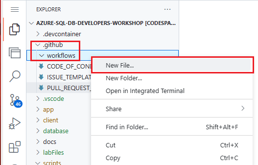
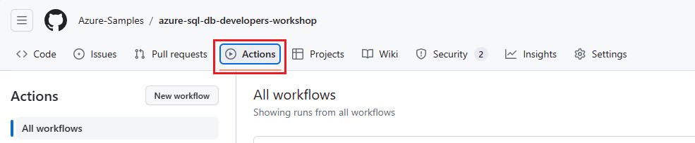
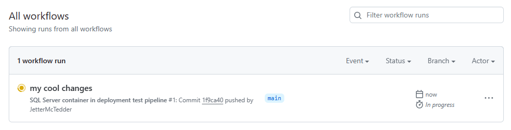
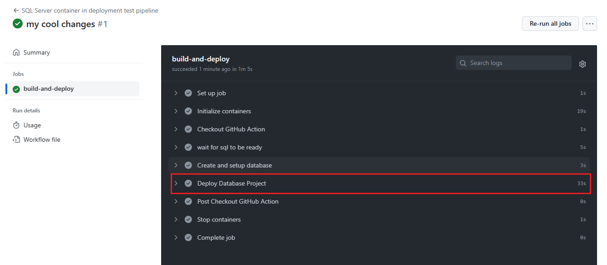
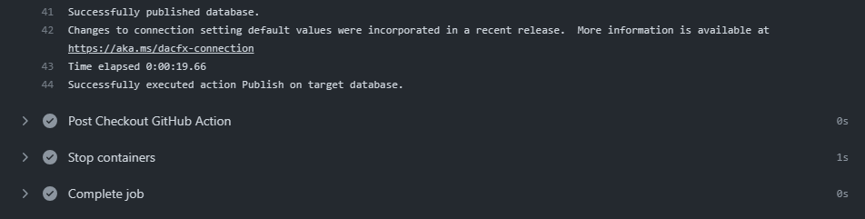

# CI/CD with GitHub Actions

[GitHub Actions]() is a continuous integration and continuous delivery (CI/CD) platform that allows you to automate your build, test, and deployment pipeline. You can create workflows that build and test every pull request to your repository, or deploy merged pull requests to production. GitHub Actions goes beyond just DevOps and lets you run workflows when other events happen in your repository. For example, you can run a workflow to automatically add the appropriate labels whenever someone creates a new issue in your repository.

This chapter will be using the [sql-action GitHub Action](https://github.com/Azure/sql-action) for deploying changes to Azure SQL or SQL Server in a dacpac, SQL scripts, or an SDK-style SQL project. This action will automate a workflow to deploy updates to Azure SQL or SQL Server on a repository push.

More details can be found here:

- [Understanding GitHub Actions](https://docs.github.com/en/actions/learn-github-actions/understanding-github-actions)

The two GitHub Actions that will be used in this chapter are:

- [Checkout GitHub Action](https://github.com/actions/checkout)
- [Azure SQL Deploy](https://github.com/Azure/sql-action)

## GitHub Actions workshop tasks

### Create the workflows directory

1. Back in your codespace, at the terminal at the bottom of the page, **return to the main directory**

    ```bash
    cd /workspaces/azure-sql-db-developers-workshop
    ```

1. Next, create the workflows directory in the .github directory using the following command in the terminal

    ```bash
    mkdir .github/workflows/
    ```

### Create the .yml file

1. Now, we need to create the .yml file that will contain the instructions on what to do everytime you do X in GitHub. In the File Explorer, open the .github -> workflows directory. Then, right click on the workflows directory and select **"New File..."**.

    

1. Name the file **sql-actions.yml**

    

1. Open the file in the code editor by clicking on it if not already opened.

1. Copy and paste the following code into the editor for the sql-actions.yml file

    ```yml
    # .github/workflows/sql-actions.yml
    
    name: SQL Server container in deployment test pipeline
    on: [push]
    
    jobs:
      build-and-deploy:
        # Containers must run in Linux based operating systems
        runs-on: ubuntu-latest
    
        # service/sidecar container for azure-sql-2022
        services:
          mssql:
            image: mcr.microsoft.com/mssql/server:2022-latest
            env:
              ACCEPT_EULA: 1
              SA_PASSWORD: P@ssw0rd
            ports:
              - 1433:1433
    
        steps:
          - name: 'Checkout GitHub Action'
            uses: actions/checkout@v4
    
          - name: 'wait for sql to be ready'
            run: |
              set +o pipefail +e
              for i in {1..60};
              do
                  sqlcmd -S localhost -U sa -P P@ssw0rd -d master -Q "select getdate()"
                  if [ $? -eq 0 ]
                  then
                      echo "sql server ready"
                      break
                  else
                      echo "not ready yet..."
                      sleep 1
                  fi
              done
              set -o pipefail -e
    
          - name: 'Create and setup database'
            uses: azure/sql-action@v2.2
            with:
              connection-string: "Server=localhost;Initial Catalog=master;User ID=sa;Password=P@ssw0rd;Encrypt=False;TrustServerCertificate=False;"  # the local connection string
              path: './labFiles/setupDatabase.sql' # the sql script to create db and configure for clr
    
          - name: 'Deploy Database Project'
            uses: azure/sql-action@v2.2
            with:
              connection-string: "Server=localhost;Initial Catalog=testingDB;User ID=sa;Password=P@ssw0rd;Encrypt=False;TrustServerCertificate=False;"  # the local connection string
              path: './database/devDB/devDB.sqlproj' # the SQLproj file
              action: 'Publish'
    ```

    and **save the file**.

1. If you didn't already, **save the file**.

### Test the workflow with a push

1. To start the workflow, commit and push the changes you have made to the code back to the repository. To do this, run the following commands at the terminal:

    **return to the main directory**

    ```bash
    cd /workspaces/azure-sql-db-developers-workshop
    ```

    Add the changes to the push

    ```bash
    git add .
    ```

    Create a commit

    ```bash
    git commit -m "my cool changes"
    ```

    Add push the code back to the repository

    ```bash
    git push
    ```

1. The GitHub Actions workflow will start which you can follow on the **Actions** tab back in the repository page in your browser.

    

1. You will see the workflow launched from the sql-actions.yml file on a code push running on the page.

    

1. Clicking on the workflow will show the details and progress. Click on the build-and-deploy job in the middle of the page.

    

1. Here, on the job details page, you can look into each step of the workflow and see the progress.

    

1. Once the workflow is done, you can expand the Deploy Database Project section

    

    and see the output and the successful deployment of the database objects to the test SQL Server 2022 in a docker container for this GitHub Workflow.

    
