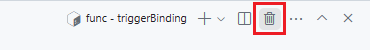
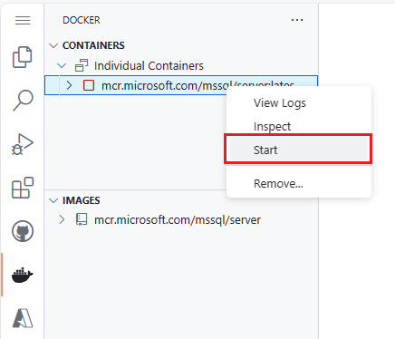
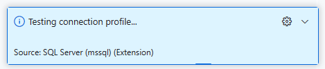
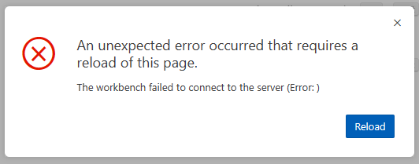
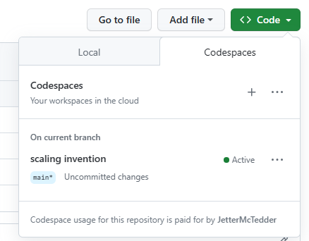
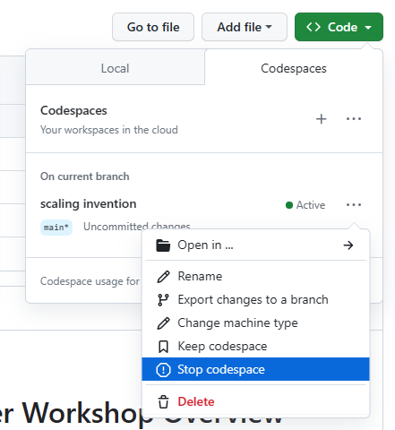
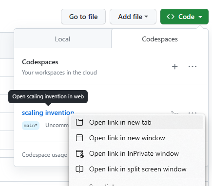

# Known issues and troubleshooting

## codespace terminal is not responding

If the codespace terminal is not responding to typing, delete the session and re-create a new one. Use the kill terminal icon to kill the session and create a new one.

## codespace pauses/shuts down

If your codespace shuts down, you can restart it by refreshing the page. After the codespace comes back up, remember to restart the local database in the docker extension by right clicking on it and selecting start.

## Testing connection profile message on the bottom right of the codespace and an unexpected error message on reload

If you see the testing connection profile message on the bottom right of the codespace constantly running 

and with a page reload, an error message stating:

An unexpected error occurred that requires a reload of this page.
The workbench failed to connect to the server (Error: )

go back to the main repository page and click on the green code button

Find the active codespace you are using and click the pop out menu. Then select **Stop codespace**.

Once it is stopped, you can click on the codespace name and open it in a new tab. This will start the codespace back up and the error will be resolved.

